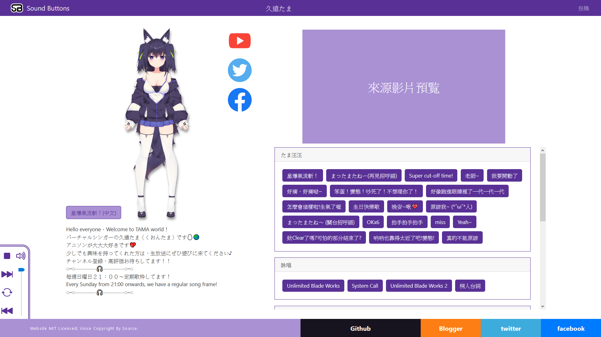
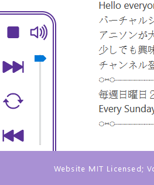

+++
title = "[個人專案] SoundButtons - 聲音按鈕"
description = "Vtuber 聲音按鈕網站。此站特色在於獨家的音檔投稿系統，送出表單後能全自動剪輯音訊、產生按鈕。前端使用 Angular；後端以 Azure Functions 搭配 Azure Blob Storage 實作，在 GitHub 上開源。"
date = 2021-04-30T19:24:00.098Z
updated = 2023-12-04T11:48:19.034Z
draft = false
aliases = [ "/2021/05/soundbuttons.html" ]

[taxonomies]
tags = [
  ".NET Core",
  "Angular",
  "Azure",
  "C#",
  "Cloudflare",
  "JavaScript",
  "Livestream",
  "Youtube"
]
licenses = [ "GFDL 1.3" ]

[extra]
card = "homepage_preview.png"
iscn = "iscn://likecoin-chain/B0HqE3UCC1IwAvozc0YYnBqy4YO4CI8ZJHYYsu4UxAs/1"
+++

     
   

> SoundButtons - 聲音按鈕  
> <https://sound-buttons.click/>

這是一個 Vtuber 聲音按鈕網站，方便聽你老婆怪叫

此站特色在於獨家的音檔投稿系統，送出表單後能全自動剪輯音訊、產生按鈕。

前端使用 Angular；後端以 Azure Functions 搭配 Azure Blob Storage 實作，在 GitHub 上開源。

## 前言

我一直在思考如何把我的專業和興趣結合。我是個軟體工程師，我喜歡 ACG、我喜歡 Vtuber。[Koikatu 插件](@/Koikatu/personal-koikatu-plugin/index.md)、[截選歌單](@/SideProject/chrome-extension-youtube-clip-playlist/index.md)都是成果；而這也是。

今年 (2021) 年後轉職為網站後端工程師，加入了 多奇 —— 一間以技術為主的專案公司。  
Sound Buttons 專案算是我的個人練習台，練習的同時我也盡力要求自己按照標準實做。Angular 規定很多，要求你把 code 寫在對應的地方。很繁瑣難學，但這就是它的價值。當你的 code 都能寫在預期的位置，其它寫 Angular 的工程師就能容易讀懂你的專案。

說句心裡話，  
我是個後端工程師，我不喜歡寫 js，js 很難做架構；但 Angular typescript 寫起來就是舒服 ww

此文前半段是寫給大眾的操作說明；後半段是[技術介紹](#technical)，說說這次我用了什麼酷玩意
<!-- more -->
## 功能介紹

### 首頁

> <https://sound-buttons.click/>

進入首頁會來到 Vtuber 總覽。  
這頁的重點在於動態載入內容，此站內容全是 json 設定檔，要加人物只需要寫新設定檔就行。

也就是說，內容的擴充很簡單，歡迎各位[聯絡我](https://github.com/jim60105/sound-buttons%5Fconfigs/discussions/2)添加你婆

另外 RWD 很好玩，請看看這個

{{ youtube(id="2_Q25beLZZw") }}

### 人物頁

> <https://sound-buttons.click/yoruka>

左半邊是人物介紹；右半邊是 Youtube 來源和聲音按鈕

最左下角為 AudioControl，有「音量調整」、「全部停止」、「語速調整」功能

本頁也有做 RWD，尤其是在 AudioControl 的表現上，我自認做得還不差\~

### 投稿功能

> <https://sound-buttons.click/yoruka/upload>

在人物頁的右上角有個「投稿」連結，點此開啟該人物專用的投稿表單

投稿功能支援兩種方式來提供音檔

1. Youtube 網址：  
   填入 Youtube 影片 ID，在表單上測試起始、結束秒，送出表單由後台系統剪輯  
   
2. 上傳音檔：  
   直接上傳音檔，此種方式不用等待系統作業，也不用擔心作業失敗，上傳完畢能立刻看到結果。  
   此方式適合擁有現成音檔的人使用。  
   以此方式仍推薦填上 Youtube 來源，以便將人流導向回 Vtuber  
   

兩種方式可以擇一，也能同時填寫  
同時填寫時會使用上傳之音檔，並在 Youtube 預覽區顯示填入的 Youtube 影片來源

### 投稿預覽

> <https://sound-buttons.click/yoruka?liveUpdate=1>

在投稿頁的右上角有「待審核預覽」連結，點此開啟投稿後的成果預覽

投稿時系統會全自動產生聲音按鈕，能在運算完成後即時看到成果，這是本站賣點  
由於投稿功能並沒有防白目機制，仍需由我手動整理至正式版。

要重整內容時請按左下角的「重新整理本頁內容」  
本站使用 Angular，為 SPA 架構，只要不按 F5，在站內瀏覽時都能保持狀態

如果內容有錯需要刪修，可以透過 [GitHub](https://github.com/jim60105/sound-buttons%5Fconfigs/discussions/3) 連絡我

### FAQ

* Q: 這網站能幹嘛?  
  A: 能聽你老婆怪叫
* Q: 請問按哪裡投稿?  
  A: 人物頁面的右上角
* Q: 為什麼投稿會失敗?  
  A: 請在直播結束後幾個小時再試，Youtube 完成轉檔前的下載速度可能奇慢無比
* Q: 我想加人  
  A:[GitHub Discussion](https://github.com/jim60105/sound-buttons%5Fconfigs/discussions/2)
* Q: 我寫錯了  
  A:[GitHub Discussion](https://github.com/jim60105/sound-buttons%5Fconfigs/discussions/3)
* Q: 網站有 Bug  
  A:[GitHub Issues](https://github.com/jim60105/sound-buttons/issues)
* Q: 我想請你喝奶茶  
  A: 謝謝，[綠界](https://p.ecpay.com.tw/78C6D)

## 技術介紹 {#technical}

### 專案架構

* sound-buttons  
    
  主專案，為 Angular 網頁，目前直接 Host 在 GitHub Page
* sound-buttons\_configs  
    
  網頁內容是以 json 檔管理，預期會頻繁更新，把這些 config 檔抽離為 git submodule
* sound-buttons\_upload-backend  
    
  這是 Azure Function，用來接 form post 後剪音檔、上傳至 Blob Storage、更新 json config

### 技術細節

#### sound-buttons

##### [首頁](https://github.com/jim60105/sound-buttons/tree/master/src/app/home-page)

首頁結構很簡單，一個 ng-for 就寫完，但 css 很複雜。卡片動畫是魔改自網路範例，同時也學到 RWD 調整。這是我第一次寫 SASS、也是我第一次用 CSS Variables。

{{ youtube(id="2_Q25beLZZw") }}

##### [人物頁面](https://github.com/jim60105/sound-buttons/tree/master/src/app/container)

人物頁是自己重頭做的切版，很好的練習到了。尤其是左下角的 [AudioControl](https://github.com/jim60105/sound-buttons/blob/master/src/app/audio-control/audio-control.component.scss)，以 display grid 使之能在 RWD 改變時正確流動。

##### [上傳表單](https://github.com/jim60105/sound-buttons/tree/master/src/app/upload)

在上傳表單中有 youtube ID、Start、End 和 file upload 的交叉驗證，用到比較細微的表單狀態操作、ValidatorFn 撰寫等

File Upload 後的音檔長度驗證，然後修改表單中 End 參數

表單送出的 multipart/form-data 如何做組合；form post 狀態管理等等。

##### 多國語系 i18n

本專案有做多國語系 i18n，我嘗試了三種解決方案

* 自製的 i18n  
  我自己做了一個簡單的 service 來處理 json 檔內的多國語系，並自己寫了 i18n pipe，[這裡有 git 記錄](https://github.com/jim60105/sound-buttons/compare/56e9f138529736265b055333999562b2f27454ce...%E8%87%AA%E8%A3%BD-i18n)
* [Angular 內建的 i18n](https://angular.tw/guide/i18n)  
  但因為它是預編譯至個別資料夾，這不方便用在我的 GitHub Page 部屬架構中，[這裡也有記錄](https://github.com/jim60105/sound-buttons/compare/56e9f138529736265b055333999562b2f27454ce...Built-in-i18n)
* [ngx-translate](https://github.com/ngx-translate/core)  
  最後我採用 ngx-translate，它的用法多元，且專案架構不會改變，[這裡是 git compare](https://github.com/jim60105/sound-buttons/compare/56e9f138529736265b055333999562b2f27454ce...47a01385923aaeacacd315a644319b851488a77d)。

ngx-translate 和我的自製 i18n 相比之最大好處在於它有[工具](https://github.com/biesbjerg/ngx-translate-extract)可以 extract 所有需要翻譯的字串

##### [按鈕](https://github.com/jim60105/sound-buttons/blob/master/src/app/sound-buttons/Buttons.ts)

得益於 Angular、ES6 和 Typescript，我可以很好的把按鈕給封裝起來。

在這裡我遇到一個小坑：由 json 以 Button 型別接進來的物件，並不會帶有我在 Button 型別上定義的方法。我知道 ts 在執行時期沒有型別，但我預期 Angular 在 http.get () 進來時會以對應的型別 new 出來接，應該會過我的 ctor。但並沒有... [所以我寫了 pipe map 自己 new](https://github.com/jim60105/sound-buttons/blob/master/src/app/services/config.service.ts#L97-L108)

#### sound-buttons\_upload-backend

後端選用 Azure Functions 的原因有下

* 網站後端很適合 Azure Functions 的耗用量方案 (Consumption plan)
  * 每月免費送 1 百萬個 request，以及每月 400,000 GB 的資源耗用量
  * 後端只用來接上傳表單，運行時間不長足夠我用，就算超過也很便宜 (每百萬次執行 NT$6.011)
  * 對，它就便宜
* 我的音檔是存放在 Azure Blob Storage，這兩個產品的整合度很高
* 雖說是 Serverless，但 C# 原生的 Path、File、Directory 都能使用，我在剪音檔時需要暫存檔案

##### 流程圖

##### [YoutubeDLSharp](https://github.com/Bluegrams/YoutubeDLSharp)

這是一個 C# 的 youtube-dl wrapper。寫法算直覺，內建不少 snippet 可以抄。  
我對 youtube-dl 略懂略懂，在以前的[這個專案](@/Livestream/youtube-dl-auto-recording-live-dl/index.md)使用過，之後可能會寫一篇專文介紹?

另外一提，youtube-dl 的 windows binary 使用的是舊版 python 打包，有個[已被關閉但未修復](https://github.com/ytdl-org/youtube-dl/issues/10766)的 issue  
有以下方式解決

1. 用新版 python 重新打包 youtube-dl
2. 在 Azure Functions 主機上安裝新版 python，然後傳入 wrapper
3. 改用 yt-dlp

我選 3 ༼ つ ◕\_◕ ༽つ

##### [Xabe.FFmpeg](https://ffmpeg.xabe.net/)

這是一個 C# 的 FFmpeg wrapper，我使用 FFmpeg 來剪音檔。  
用法有點特別，要讀 [doc](https://ffmpeg.xabe.net/docs.html)，但能 work 得很好。

##### Azure Blob Storage

在 Azure Function 觸發時可以直接 DI 拿到 [BlobContainerClient](https://learn.microsoft.com/en-us/dotnet/api/azure.storage.blobs.blobcontainerclient?view=azure-dotnet)，直接拿這個做存取即可  
說實話 Azure Functions 對 Blob Storage 的[官方文件](https://docs.microsoft.com/zh-tw/azure/azure-functions/functions-bindings-storage-blob)寫得不怎麼樣，也幾乎沒有什麼中文資源，只能多 Google  
Azure Blob Storage 的.NET Core [文件](https://docs.microsoft.com/zh-tw/azure/storage/blobs/storage-quickstart-blobs-dotnet)就寫得不錯，值得閱讀

## 版權申明

本作品使用 AGPLv3 授權  
原出處擁有所有聲音和角色圖片的版權。尊照他們的衍生作品指南（二次創作指南）使用素材資料。 若希望通過 DMCA Takedown 刪除您的資料，請在[此處](https://github.com/sound-buttons/sound-buttons%5Fconfigs/discussions/3)回報
