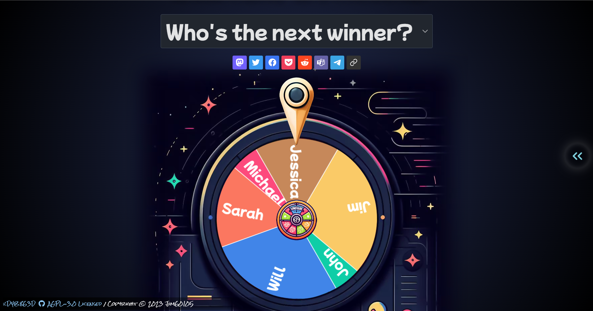

+++
title = "[個人專案] Unfair Spin Wheel - 不公平轉盤"
description = "世界是不公平的，轉盤也是如此。一個可以讓你控制機率的轉盤遊戲。專案的初衷是提供給 Vtuber 進行「投入固定金額就有一次抽獎機會，投注次數越多，中獎率也會越高！」的直播抽獎活動。然而，現有的網路轉盤設計都是讓選項的倍率相同，操作起來不太方便。因此，我們需要一個不公平的轉盤來反映這個不公平的世界。"
date = 2023-10-30T19:43:00.013Z
updated = 2023-10-31T14:42:11.812Z
draft = false
aliases = [ "/2023/10/unfair-spin-wheel.html" ]

[taxonomies]
tags = [ "JavaScript", "Vue.js" ]
licenses = [ "GFDL 1.3" ]

[extra]
banner = "preview.png"
iscn = "iscn://likecoin-chain/TN9L2gESOgpnhq7nrU3HvZ5UT9BimIn0fTxo-e27ZaE/1"
featured = true

  [extra.comments]
  id = "111325748147311930"
+++
> 世界是不公平的，轉盤也是如此。
>
> <https://unfair.spin-wheel.click>

介紹我的新作品 —— 不公平轉盤！

這是我的第一個 Vue.js 專案，和過往一樣，可以在 [GitHub](https://github.com/jim60105/UnfairSpinWheel) 上找到此專案的開源程式碼。

專案的初衷是提供給 Vtuber 進行 **「投入固定金額就有一次抽獎機會，投注次數越多，中獎率也會越高！」** 的直播抽獎活動。然而，現有的網路轉盤設計都是讓選項的倍率相同，操作起來不太方便。因此，我們需要一個不公平的轉盤來反映這個不公平的世界。

這是一個{{cg(body="開源、免費、無廣告")}}的轉盤網站，**歡迎各位直播主自由使用🎉**。

以下是本專案 Readme 的中文版本，由於是以英文撰寫再翻回中文，文句有奇怪的地方請多包涵。

<!-- more -->

## 👀 特色 ✨

### ⚖️ 權重轉輪

你可以設定每個項目在轉盤上的權重。

雖然轉動是隨機的，但你的設定可以影響機率，使遊戲有點「不公平」。

### 📝 大量編輯模式

使用大量編輯模式，導入大量項目變得輕而易舉。

此外，不必擔心漏打權重資料 —— 我會為你自動添加「,1」。

### 🔊 可自訂音效

通過調整音效來自定義您的遊戲體驗！  
雖然我們提供了一系列預載的聲音，但您也可以上傳自己的音效，使其真正獨一無二。

好吧，我不應該說「上傳」。  
實際上，您的音效檔並不會上傳到任何伺服器之類的地方。它只是保存在您的瀏覽器中，就跟您的轉盤資料一樣。

### 💾 自動儲存資料

我使用強大的 **[PouchDB](https://pouchdb.com/)** 來處理你的所有資料！

這些都會自動保存在瀏覽器中，確保在下一次開啟網頁時仍然可用。

### 🔗 與朋友分享

與朋友分享你的有趣轉盤！

值得一提的是，你的轉盤資料是儲存在網址中。  
這是一個純前端應用程式，我不會存儲你的資料。

## 🎲 如何玩

1. 要玩不公平轉盤遊戲，請前往網站 [unfair.spin-wheel.click](https://unfair.spin-wheel.click/)
2. 一旦進入網站，點擊頁面右側的「<<」按鈕，即可打開側欄。
3. 您可以根據自己的喜好調整每個項目的權重。
4. 如果您想增加一些額外的趣味，別忘了在「設置」頁籤下自定義音效。
5. 最後，當你準備好時只需點擊轉盤中央即可旋轉旋轉它。
6. 享受遊戲吧！

## 📎 使用場景

### 今天晚餐吃啥？

讓我來解決這個世紀難題：**今天晚餐吃啥？**

對於選擇困難症患者(我)，為什麼不讓老天來決定呢？  
讓我隆重介紹「輪盤晚餐決策器」，非常適合在你猶豫不決時使用！  
但是人都是偏心的，也許今晚最終還是吃麥當勞。

### Youtuber 直播抽獎

想要讓你的線上抽獎活動更具互動性和吸引力嗎？  
不用再找了，就是不公平轉盤！

這個工具完全免費並且能為你的直播內容增添趣味。  
發揮你的創意，讓它為你的觀眾帶來更豐富的參與體驗。

### 世界人口轉盤

如果你重生了，你會被老天爺分配到哪個國家呢？

點擊這裡獲取此人口轉盤的資料。

👉[世界人口轉盤](https://unfair.spin-wheel.click/?group=%E4%B8%96%E7%95%8C%E4%BA%BA%E5%8F%A3&data=eJxdWNlWIzsSfPdX3Mfpc2rOKalKtfwda4MxxgbTZjNbN4buy2JsNrO0-ZixyuWn-wsTkZKhZ3iTrJJSkZERKWz91r6cBypWSaZD%5FFXGw-uy0Ru%5FvBS3m3a5b7fWbafGBSo1smAy2uBMFJkolgkre9jbt7L7Pn45CnSa-qX26d4evxTtnj08D3SsZBbT3VXbWLOrv2S1StJstho7BDqMwsRNXB%5FbtZOiVg1UkmeRC-99aTJaxpYIKYldyPb7T3xoW91A6Vy7M4qdbtG5wkTsoywbAzuqlXetQKkwyd2Hx4sIJFChid1X5emPyf33orfNyDCtXCDl45qt7wR5HvvAqgfFUQcAjYevnxjlBleUnzvH5dydXX4MMqPd3cZva0VnB2OlMlkyeuInWRyZXMK9-8ZxkoWZjMtaX8ZpqBP3-62MEy0gVgCovd0H5gw0Uak%5FuL4zPcQY-BmXql%5F27AJAByZLBcDK5Olqsj0MjNG5mX1y3AqMirXbotW1c5ceAaPC2IWzuzIePgdxpkKMkwrgnjSuJ9W9IE4TF1G50OMncWoSglmZ7r4XJ8%5F29SkAaLHxU5PV0Wfq4xnsk8WGfR5M57eDWGdZMgOsVrXLtQDMy9Vs1XKt3L3mlGOD0OMddwy4k0fyO5dEaQrwON78VdwfkBxRkmXGb1SuD-xql9tHSehORHS2t170d4Io1onOYnw72OOhnVteplYdv%5FXwm1IOqJsqNiU5QbBcrjy52J1eY0kU5XJ0uVmdtucwTtx4en41Hn31VRLpJJeMlBuX42EViEs02nO6fD-f3NeDKMwiLeP-KeAuHp7sYBjoPHI0AQGKuzWAiikl1K%5FYC2x0Mdk8YmgaSdf-aMBLuFCMayf4QUnVVYrRXXE%5FCHQSOaLZdeGDNpkv4fbc9KU73f8asJKy2aE7XdazZMErBuUCDNVRlMps8W13VuGR1mmoYgZBLmptHF6IZbqyjmzZ-ilmVeaAHS7aZhWXR02gGAMy3mV274WfqzzT7vKt1bL9i6ipPM18aPuz4s0TlyeoBc91laJyV-oVu7E0aXXs2X6gMu04bk-PABzAIZwqTSPH%5FPoT6aRAcxybVxCRu4Zsl5o88%5FCSrT%5FnOeX4z-1BHPkBs5FxcB9f2eNt2%5FuJqTCnhGGqCzWAxGVOGsrRAXWTexmVutCeRwhNTkSatK9bX5SY8sJ8cAFSsoowJUpVKbcGSB3igBCa1NXp4JBahrGobGWy8YrbTB6vZXvs7Wb%5Fnv8UdGqWSxjox72gNy7HIO3qr2JvgVMOr8n9UrEDQ1GxY7dtnOE2GHuyAPJidwN7k4VQ2MjJW%5F1J8hgaLZUC-trloYzdbYfr5couxrF2NbN5WjaXqD8qjJy4IFBksKh1JkuPmFVuI3vTmC7-RgroGHmSU20r49duWUX9Q9GTjNoC1q9iM7Ird24ENmyDhQwq90BBA8p5bKJBGIa49%5FvTi3JtjPGGN1xEKJP75mfScuWitt0LwCenwIKUv-ePywDiTIUgOBSq1GvgpL5sr5u23w9SE9OKwLO9YtgL0jjPlDuOtOtcB6kW5Cq2d8MqRLlFntNgs09ukidRJhZ6CPA9hZNchL%5FCkoM2NwWoxOjIuEp3BgwyB3BbiZkZdzUGkSRlK6hCntI6Zz3BoWg-UIVnCAeMR6fGFRw-tEcL4itpFhtnlPblsjh4w4wDuWjfMrbDU86QG5Vy7YoFCMNKeNb0dYMgX8LSYmfiCBgCP35rMlkmlvKjJsEJP7z5LzcOQLeMPxfrf7PAMEyTDz%5F%5FdHKjQ9mFAg-9PLvgqeAr3JsVImmubfm-Js7FacD8JupF7Ck39MRKsXQAXNyM-LaYIm6LshdQPsRE1vjuqLy7B75ghlgkFgrbLjYR8KQKD4ZBfOT-HZ%5FDM1UmaVhfJsQgrhO7OEwpxRXgApqi1%5FHljP3ILzolyOcWl6sr5cMlJbDVBV2gvn%5FRSB8uYaSZ41r7qhi8inOljh2wRs--yCjZsdzaQ73DxCKHMg442yd2zaUgUnmUujplB-lCRBOSms%5FOALD6-SxxRXZZm-492psDNJW5o2T9lAqn01juhqotB0%5FiaKmWNMDvudXZPvgIW4PPCdD1Sf%5FO01bHhu7J8IrO9XThB01LZibbu7M1Ok9Tlww2hNVdupZOPugGjGahwvyVN07kcvlxegL7BPScBD7l0uVMXPNQKEyC%5F76WYepSyyMGi7AEwOFTewSJNmEcJeZT%5FUkLGKIyWSz5fjibzrf-8Ab0U5wvDvt2eFj0IYNRJmHY-iKMlg1AYw13Ic5sliPnVLYxYO0OD3EjTKZycXAX3c%5FMNiPtEvrzlIbdfZf-G46dOuWgZdMXwtQtazeL9-Mgy4W65d3vYu%5FG1QuUThS43DxAnjAClzBq1XAKEwHt1VK9dTobulogxCqhibfnJqMze%5FcYpMpdc3TH7ipJleyIoLa20BLQbhNF2yAdUTE0dZB6tAxp0pAU-mTx48aenGId887uloUDV0Snyglmd%5FRUXmxBdjAj%5Fg5SjV%5FbqOTIYI9y%5FhHXwe7F4K4YvLMpixPXpfQfy-YayzR2bgvEePM4zCBYIh2tVZZtlPEB5bemL5yx2GJAULFfb3lR5AcyTmb9D4aotpwhNK8AWXHYYWkZr53o1lbWaSOz-hIN5csKtg91RnuNpl6eG%5F0rWD9Xfz7csjDxjTASiu5qHY1hHKOHxH3bLKnRBsIAN4l2D1WIBkaJ%5FiObjuI5-kaunnYGs-4B2oeLT3c6vBP6I-3aAtqKYzOT7BWgd0wZ-uPZ6cy4WWWgKAvh3ewxgWbb9xZs1nFo0V5hZkHykzcIKOAZD-flvcc7z-akQwoz0BwcOuOTU7nCpC4BFVbrlecaP01oq1-9is7AQiswXThnh5L4kpN-Jpx1ksNrtpGwBm3kqYD81k%5F59JEOgSGgQY3Q%5FR288RxcIMkr0r61-CGUIDLsByBbdGFYW4oiTCrTdg2f-OgQdZqgExkVy9-4JepZp7joMy-VQDK1JG655jjI7c4bDOL2DbckmJDfJPUX%5F0yjSf9QNFTGDdtxf6ZJ5MInb9O9BzFmvJ-UsPj-mV2AXyVljpJiz4O2rNGUfSMTaZIPSM4WghzoqlmmNQQEH7IrfUgiq8utiGESEftwhghi4RGFpAIvvCjQwxXbveLbOZfvvaKm0BqJBdzX5cnHR69%5FXP%5FLkf5jiy8opAgZcBM04csR%5F6uRxlAIJomis4fnm4asyoP8%5F7jBHyI2dYRB56gs9KkHkybbfbk9037t%5Fn2hsrSCVkdI5IhlQOMKdRftFFIDvvdA-TZVUEmvh3D4mvQdR7OJtTIO%5F7gSs4uquLuFNIApX4IcrPrjx8n-TTn3SFCFwHgLfAlMnsqlWWgQlNr7f-bm2Zf8uCkOR4gDufB0OTz%5FNz3jxfcISLVR4vGtAbvxWBz63D%5FKZ6AkiaZHIlrv6FvrRWOfCL8-Uo9yXsx9xfXsXSSav78JLAk4S4vCrzVoBxolNlZoXogY7v39odxasIPTIENh0TqFKv-8rfIfTUc7%5F7xVZ8TKI%5F-vqqJzxUbzrG1vG%5FjFPr7ReyvABlctFz54ln7K%5FPTnBlujzm4Q%5FRdzkiwt)

> 注意
>
> ---
>
> 它沒有被預載在範例中，因為它在效能表現上有點...不太好。  
> 當選項太多時，繪製轉盤會吃掉更多的資源。  
> 而這可能會導致在某些手持設備上的幀率過低。

### 還有更多

讓我知道你如何使用我的轉盤！

在留言跟我分享你的創意玩法，以便我可以在這裡展示它們。

## 📝 License

本專案採用 AGPL-3.0 授權。詳細授權條款和使用條款請見[專案 GitHub](https://github.com/jim60105/UnfairSpinWheel#-license)。
