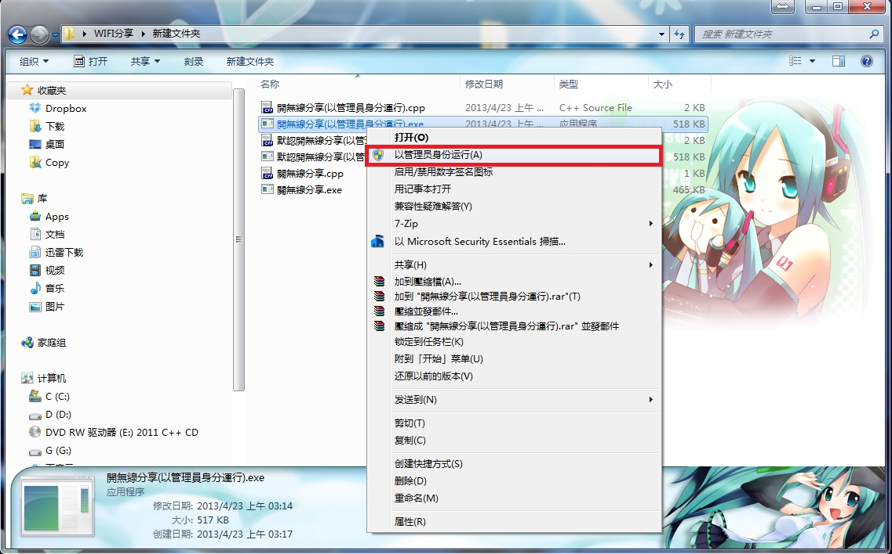
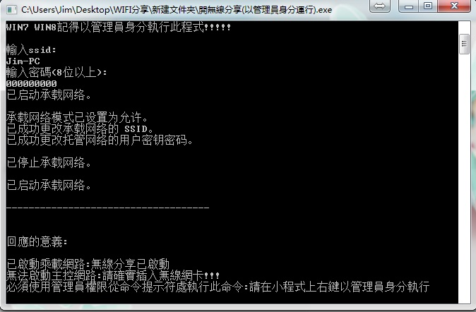
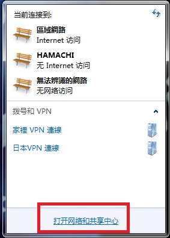
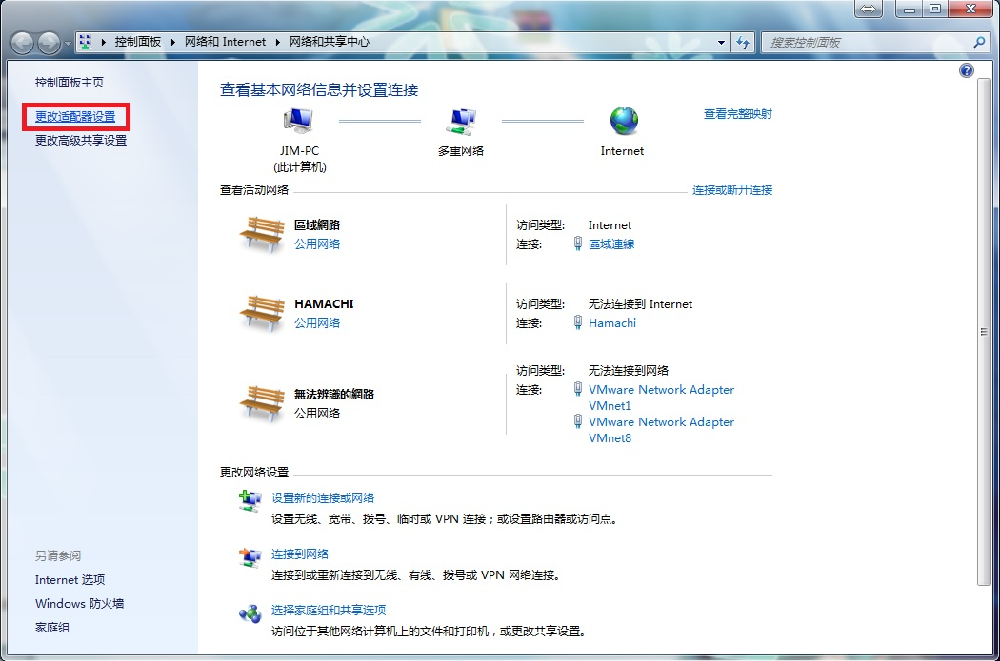
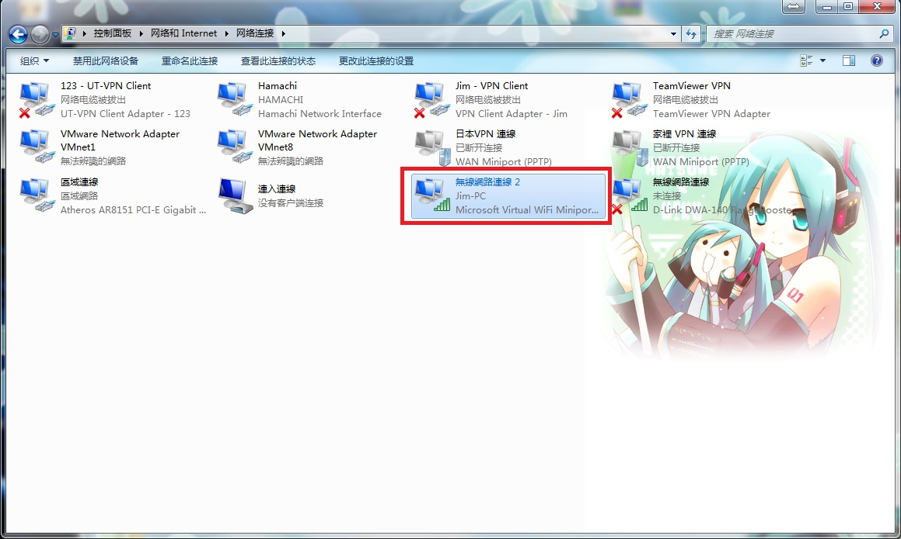
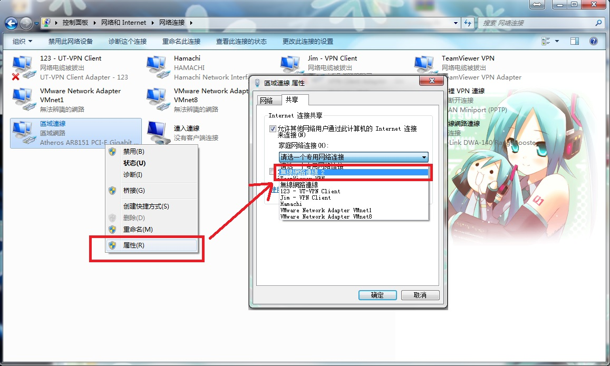

+++
title = "以 WIN7 做為無線分享 AP 讓 PSV & 手機上網"
description = "以 WIN7 做為無線分享 AP 讓 PSV &手機上網"
date = 2013-04-23T00:02:00.009Z
updated = 2013-05-21T00:00:00.000Z
draft = false
aliases = ["/2013/04/win7ap.html"]

[taxonomies]
tags = []

[extra]
card = "preview.jpg"
+++
  
會去搞這個其實是因為我想要給PSV上網，又不想用手機開熱點。畢竟T1的宿網就在面前，玩PSO2不給他用下去實在是非常浪費呢\~\~然後上網估狗找到了Connectify，不過PSV死活就是連不上。用cmd執行"netsh wlan set hostednetwork"的話就可以，後來我有找到問題所在!!!(第6點注目\~\~)
總而言之，Connectify捨棄了。使用netsh wlan的方法每次都得在那裏打一長串指令，記都記不起來，就寫了一個程式。正好這禮拜考要C++((遠目
  <!-- more -->
---

20130510
我把亂碼問題排除了，說起來這並不是問題。前段時間我為了玩 穢翼のユースティア 把WIN7改成了簡體系統跑遊戲，寫出來的程式在繁體系統運行就會亂碼  

---

20130521  
之前竟然放錯連結...((汗  
已更正  

---
  
讓我們開始吧wwwww
  
我寫的小工具載點:
  
<https://www.dropbox.com/s/chm96vz54u9jfdu/WIFI%E5%88%86%E4%BA%ABver.TC.rar?dl=0>

1.將載下來的東西解壓縮  
以系統管理員身分運行"開無線分享(以管理員身分運行).exe"這個程式
  

  
2.請依照提示依序輸入欲設定的無線AP帳號密碼(下圖為成功運行的狀態)
  

  
3.螢幕右下角開始列上網路的圖標點一下，在點擊打開"網路和共享中心"
  

  
4.左上角紅框處點下去
  

  
5.有沒有看到多出來一個原本沒有的網卡阿ww
上面灰字寫著"Micorsoft Virtual...."那個
  

  
6.在"已經可以連線"的網路上點右鍵→內容→共享
第一個打勾 選擇剛剛多出來的網卡
"第二個不要打勾"PSV就能連上了喔!!!!
  

  
7.套用，結束!
  
8.要關掉他就運行"關無線分享.exe"這個程式就行  
((不用管理員權限也可關  
