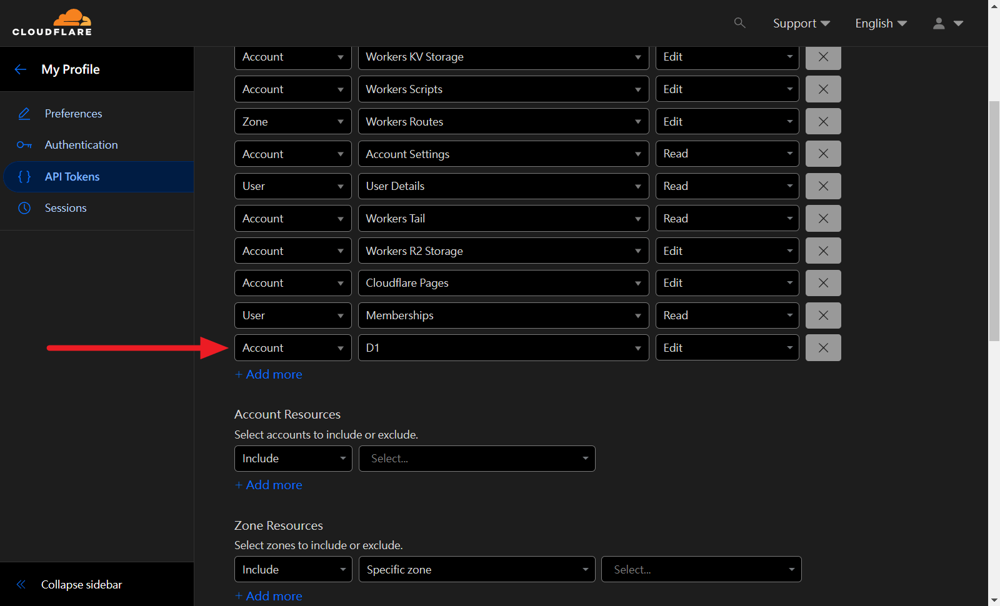

+++
title = "[個人專案] 網頁計數器徽章 View Counter Badge —— 瀏覧數別再送人啦！以 Cloudflare Workers D1 實作適合純前端網頁的計數器"
description = "教你如何在 Cloudflare 上以 Worker 和 D1 實現網頁計數器功能，不用維護伺服器且免費! 你不需要架設任何機器，這是一個純雲端的解決方案。Hit Counter"
date = 2023-11-04T23:37:00.035Z
updated = 2024-01-04T04:02:20.503Z
draft = false
aliases = [ "/2023/11/view-counter-badge-cloudflare-workers-d1.html" ]

[taxonomies]
tags = [ "JavaScript", "Cloudflare" ]
licenses = [ "GFDL 1.3" ]

[extra]
banner = "preview.png"
iscn = "iscn://likecoin-chain/QtqpvBsnP3QM8w-GOALiQOHdgZzkY52bd1vg73Gj3D4/2"

  [extra.comments]
  id = "111355087211175088"

  [extra.preview]
  description = "Image Creator from Microsoft Bing DALL•E 3"
  withAI = true
+++
>   
> 網頁計數器是一個電腦程式，可以顯示特定網頁瀏覽的次數。  
> 當網頁瀏覽器訪問此網頁時，網頁計數器就會加一。

這是一種歷史悠久的小工具，從我十幾年前開始使用部落格時 Blogger 就已經內建了這個功能，網路上也有很多[現成的服務](https://www.google.com/search?q=Web+hit+counter+online)，為什麼我們仍應自己做呢?

## 為什麼你應該停止使用第三方計數器

當有人訪問我的部落格時，它會向 **計數器的伺服器** 發送一個訊息說「blog.maki0419.com 被訪問了，請將訪問數 +1，並將現有數字從資料庫讀出來給我！」這個計數器伺服器會 **保存我的訪問數據**(和用戶數據)，並 **執行一段程式碼** 來顯示數字。通常這段程式的原始碼我看不見它，它也<span class="danger">可能隨時被替換成惡意程式碼</span>。根據我的嵌入型式，或許<span class="danger">人家還能獲得 SEO 加分呢！</span>

你可能會說「**我不想為了這個小功能而多開一台伺服器和資料庫，這是一個<span class="danger">合理的取捨</span>**」

不不不，現在我就告訴你如何在 Cloudflare 上以 Worker 和 D1 Database 實現計數器功能，<span class="success">不用維護伺服器</span>且<span class="success">免費</span>！你將擁有程式碼和數字的控制權，<span class="success">保護你的網站，保護你的用戶</span>。

這是一個純雲端的解決方案，很適合用在純前端應用程式或是任何類型的網頁。  
專案是回傳 SVG badge，但是簡單修改就能變成回傳數字做為 API 使用([範例](https://github.com/sound-buttons/worker-click-counter))，泛用性非常高。

<!-- more -->

不過它並不是完全免費，Free plan 有著每日 _100,000_ 次的上限。  
若你的網站有著超過 _十萬次_ 的日瀏覧量，請訂閱 Paid plan (5 美元/月) 以提升至每日 _五千萬次_。  
請參考[官方文件](https://developers.cloudflare.com/d1/platform/pricing/#billing-metrics)說明。

## 設定步驟

> GitHub
>
> ---
> <https://github.com/jim60105/worker-view-counter-badge>

* 點擊這個按鈕，然後按照步驟部署你的專案。在過程中它會帶著你登入(或註冊) GitHub 和 Cloudflare 帳戶。  

  <figure>
  
  [](https://deploy.workers.cloudflare.com/?url=https://github.com/jim60105/worker-view-counter-badge)  
  <figcaption>超級神奇按鈕！</figcaption>
  </figure>
  
  流程過完後請回到 GitHub，此時的 Action 將會部署失敗，請務必繼續完成以下設定。  

  > 注意  
  >
  > ---
  > 在產生 Cloudflare Token 的步驟中，請先選擇 **Edit Cloudflare Workers** template，然後再加上 **Account - D1 - Edit** 權限
  >
  > [](3.png)
  >
  > Token 複製起來，後面還會用到

* 在 GitHub 上開啟新的 Codespace，等待載入完成  
  [](1.png)
* 在 `wrangler.toml` 中更改第一行的`name` 屬性，這將是小工具的 worker name，關係到子域名。你的 Cloudflare Worker 會被部署在`{worker-name}.{cloudflare-id}.workers.dev`。  
  [](2.png)
* 在終端機匯入 Cloudflare Token (註:[為何這裡不使用 OAuth login](https://github.com/cloudflare/workers-sdk/issues/2874))  

  ```bash
  export CLOUDFLARE_API_TOKEN=一長串token
  ```
  
  [](5.png)
  
  > 為了避免與我現有的資料庫產生衝突，在演示時我使用了 ViewCounter2 做為資料庫名稱，但你應該使用 ViewCounter！

* 建立新的 D1 Database  

  ```bash
  npx wrangler d1 create ViewCounter
  ```

* 由指令的執行結果得到你的 `database_id`，將它填回到`wrangler.toml` 文件中並存檔
* 初始化 D1 資料庫  
  在終端機執行以下指令以建立空資料表  

  ```bash
  npx wrangler d1 execute ViewCounter --file=./init_database.sql
  ```

* 在側欄切換到「原始檔控制」頁籤，寫點什麼上去後 Commit  
  [](6.png)
* 切記 <span class="success">Sync Changes</span>!
* 等待 Action 執行成功  
[](7.png)
* 試試訪問你的 badge，它的網址在`{worker-name}.{cloudflare-id}.workers.dev`  
  例如我的是: <https://view-counter-test.jim60105.workers.dev/>

## 使用你的Counter badge

在你的網頁中加入 img 標籤，src 就是`{worker-name}.{cloudflare-id}.workers.dev`  

```html

```

>   
> 你的徽章是不是長得和我不一樣?  
> 在[說明文件](https://github.com/jim60105/worker-view-counter-badge#customization)中查看更多客制化選項😎

> 延伸閱讀
>
> ---
> [琳的備忘手札: Cloudflare Workers入門 ─ 簡介](@/Cloudflare/cloudflare-workers-introduction/index.md)
