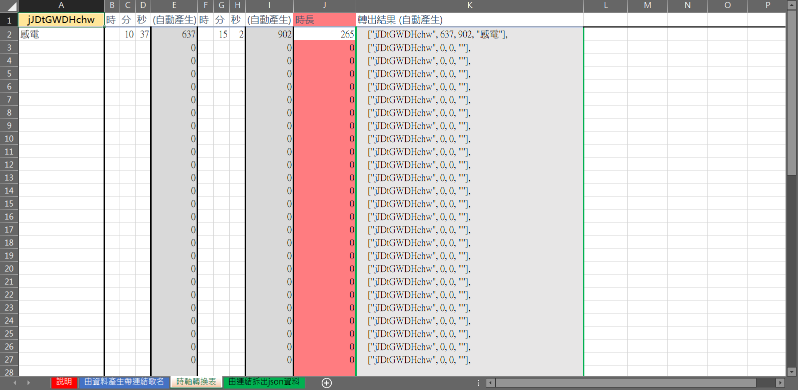

# [Excel & VBA] Youtube 歌單產生工具 (Youtube Timeline Builder)

這是用來編輯 Youtube 歌枠時間軸用的 Excel 工具\
原本只能產出給我另一個專案 Youtube Clip Playlist 專用的 json 格式，現在加上了產出 **「Google Sheet」、「Youtube 留言」** 兩種格式\
我將它公開出來，希望它能提供各位便利，~~讓我有更多的曲目可以白嫖~~

## 打軸時推薦一起製作歌曲結束時間

這能讓播放清單一類的程式自動產生曲目\
包含 Youtube Clip Playlist 和 music.holodex.net\
它們需要知道曲目的結束時間，以切換至下一首歌

## end 參數

此參數是 **Youtube 嵌入播放器** 使用的參數，它能夠反應在網頁嵌入，還有 Discord 內的預覧播放\
end 參數目前在 **Youtube 網頁** ***沒有功能***，請安裝 Chrome 擴充 [Youtube 影片截選播放清單 (Youtube Clip Playlist)](https://blog.maki0419.com/2022/06/chrome-extension-youtube-clip-playlist.html) 以便在 Youtube 網頁上處理此參數，使播放器在指定的時間暫停影片

