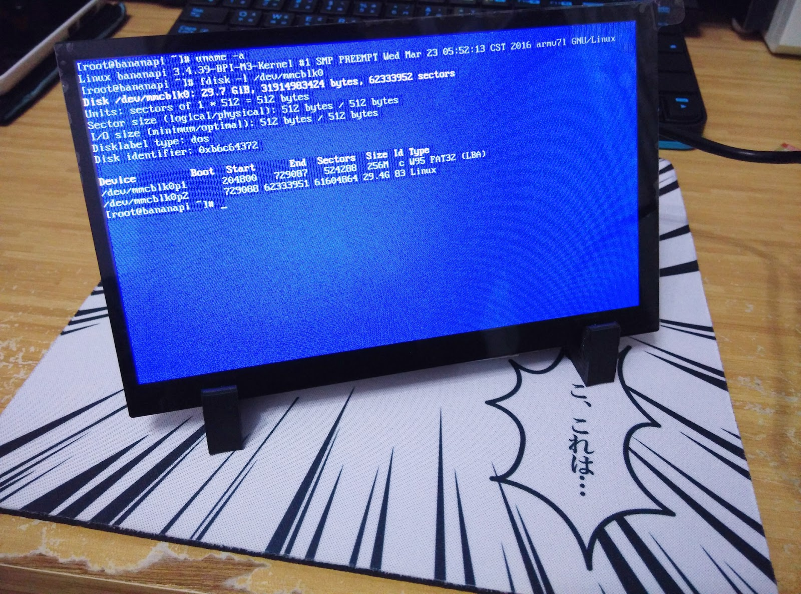
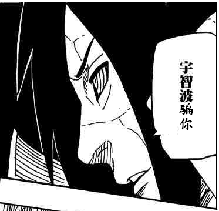

+++
title = "Bananapi 香蕉派 M3 Cross Compile 教學"
description = "Bananapi 香蕉派 M3 Cross Compile 教學"
date = 2016-03-22T18:47:00.002Z
updated = 2020-11-24T14:56:53.456Z
draft = false
aliases = [ "/2016/03/bananapi-m3-cross-compile.html" ]

[taxonomies]
tags = [ "bananapi" ]

[extra]
+++

## 前言

[](IMG%5F20160323%5F091652.jpg)

之前寫了這篇： [Bananapi 香蕉派 M3 ArchLinux 支援 BPI 7 吋 LCD 輸出之鏡像](@/SideProject/bananapi-m3-archlinux-7lcd/index.md)  
想想還是要把步驟記錄下來，不然很快就會忘了 (´-ω-｀)
<!-- more -->
先展示下我的系統配置：

```bash
jim@jim-Ubuntu:~$ uname -a
Linux jim-Ubuntu 4.2.0-34-generic #39-Ubuntu SMP Thu Mar 10 22:13:01 UTC 2016 x86_64 x86_64 x86_64 GNU/Linux
```

開工

## 編譯 BPI-M3-bsp

> BSP 是 “Board Support Package”，板级支持包的意思，包含了编译内核，U-boot 等等所需要的一切工具，至于 U-Boot，你可以理解为 Linux 下的 Grub 或者 Windows 下的 NT OS Loader。
>
> ── 引用自[這裡](http://forum.lemaker.org/cn/thread-426-1-1.html)

建立 bsp 存放資料夾，並 git clone 回來： <https://github.com/BPI-SINOVOIP/BPI-M3-bsp>

```bash
mkdir bananapi
cd bananapi
git clone https://github.com/BPI-SINOVOIP/BPI-M3-bsp.git
```

※本文撰寫時間點：20160323  
官方的 bsp 有一個 bug，我已經提出 issue，目前尚未解決： <https://github.com/BPI-SINOVOIP/BPI-M3-bsp/issues/7>  
程式執行中會存取一個尚未建立的資料夾  
事先手動建立此資料夾即可迴避此 error

```bash
cd BPI-M3-bsp
mkdir -p linux-sunxi/output/lib/firmware
```

---

若是 64 位元系統，必須執行這一段  
因為 bpi 官方在編譯相關套件時是使用 32 位元系統，所以若你使用 64 位元 Ubuntu，必須增加系統支援 32 位元執行檔

```bash
sudo dpkg --add-architecture i386
sudo apt-get update
sudo apt-get upgrade
sudo apt-get install libc6:i386 libncurses5:i386 libstdc++6:i386 zlib1g:i386
```

---

安裝必要之工具 (若是在 64 位元那段執行過那兩條指令，則可省略)

```bash
sudo apt-get update
sudo apt-get upgrade
sudo apt-get install build-essential u-boot-tools binutils-arm-linux-gnueabihf gcc-4.7-arm-linux-gnueabihf-base g++-4.7-arm-linux-gnueabihf gcc-arm-linux-gnueabihf gcc-arm-linux-gnueabi cpp-arm-linux-gnueabihf libusb-1.0-0 libusb-1.0-0-dev git wget fakeroot kernel-package zlib1g-dev libncurses5-dev 
```

開始編譯

```bash
./build.sh
```

接著會出現選擇畫面，這次我的目標是要在 BPI7 吋 LCD 上使用，所以選 3

```bash
==========================================
            BPI-M3 BSP Build Tool         
==========================================
 
This tool support following BPI board(s):
------------------------------------------
 1. BPI_M3_720P
 2. BPI_M3_1080P
 3. BPI_M3_LCD7
 4. BPI_M3_USB_720P
 5. BPI_M3_USB_1080P
 6. BPI_M3_USB_LCD7
------------------------------------------
Please choose a target(1-6): 3
 
 
 Now configuring...
 
BPI_M3_LCD7 configured. Now run `make`
 
 Configure success!
 
```

接著選擇要執行的動作，選 1

```bash
This tool support following building mode(s):
--------------------------------------------------------------------------------
 1. Build all, uboot and kernel and pack to download images.
 2. Build uboot only.
 3. Build kernel only.
 4. kernel configure.
 5. Build rootfs for linux, and copy target files to output
  ROOTFS=/xxx/rootfs.tar.gz
  This is optinal, default using rootfs/linux/default_linux_rootfs.tar.gz.
 6. Pack the builds to target download image, this step must execute after u-boot,
    kernel and rootfs build out
 7. Clean all build.
--------------------------------------------------------------------------------
Please choose a mode(1-6): 1
```

這段會跑蠻久的，視你的電腦效能而定\~\~

當你看到這個畫面就是成功了

[](2016-03-23%2006-08-52%20的螢幕擷圖.png)

沒有出現的話，其他 Build success! 都是騙你w  
那是 Build finish 的意思ww



## 燒錄鏡像至記憶卡

找張記憶卡，把官方鏡像刷進去： <http://www.banana-pi.org/download.html>

接下來的步驟，務必選到正確的裝置


※此記憶卡必定會清空，若有任何遺失本人概不負責※


```bash
sudo fdisk -l
```

此處確認我的裝置是 /dev/sdf

[](2016-03-23%2006-49-30%20的螢幕擷圖.png)

卸載磁碟

```bash
umount /dev/sdf*
```

清空裝置

```bash
sudo fdisk /dev/sdf
p 
d
w
sync
```

請用 d 把 partition 砍光

然後把裝置徹底清掉

```bash
dd if=/dev/zero of=/dev/sdf bs=4M
```


可以到[這裡](https://github.com/Xfennec/progress)安裝 progress 觀看 dd 進度


刷入官方提供之鏡像檔，請選 Android 跟 Berryboot 以外的傢伙  
此處我以 ArchLinux 為例  
至[此網頁](http://forum.banana-pi.org/t/bpi-m3-new-image-archlinuxarm-lite-for-bpi-m3-20151209/850)下載檔案，我載到的檔案是 "2015-12-09-ArchLinuxARM-lite-bpi-m3-sd-emmc.img.zip"

解壓縮並寫入記憶卡

```bash
unzip 2015-12-09-ArchLinuxARM-lite-bpi-m3-sd-emmc.img.zip -d ~
cd ~
sudo dd if=2015-12-09-ArchLinuxARM-lite-bpi-m3-sd-emmc.img of=/dev/sdf bs=4M
```

接著又得等待一段時間～  
不要以為 dd 沒回饋就把他砍掉囉

編譯結束後，系統可能會自動掛載  
若有，則執行卸載

```bash
umount /dev/sdf*
```

檢查 partition

```bash
sudo fsck /dev/sdf1
sudo fsck /dev/sdf2
```

將 /dev/sdf2 降為 ext2，等下順便改大小

```bash
sudo tune2fs -O ^has_journal /dev/sdf2
sudo e2fsck -f /dev/sdf2
```

## 寫入最剛開始編譯好的資料

下一步驟將會清除 partition table，所以我們必須先抄下來

[](2016-03-23%2007-53-26%20的螢幕擷圖.png)

前往我們剛編譯好的東西存放的資料夾

```bash
cd ~/bananapi/BPI-M3-bsp/download/BPI_M3_LCD7
```

底下應該存在這些東西

[](2016-03-23%2007-57-54%20的螢幕擷圖.png)

清空記憶卡前 1M 的空間 (同時會清空 partition table)

```bash
sudo dd if=/dev/zero of=/dev/sdf bs=1M count=1
```

依序寫入編譯好的檔案

```bash
sudo dd if=boot0_sdcard.fex of=/dev/sdf bs=1k seek=8
sudo dd if=u-boot.fex of=/dev/sdf bs=1k seek=19096
sudo dd if=sunxi_mbr.fex of=/dev/sdf bs=1k seek=20480
sudo dd if=boot-resource.fex of=/dev/sdf bs=1k seek=36864
sudo dd if=env.fex of=/dev/sdf bs=1k seek=69632
sudo dd if=boot.fex of=/dev/sdf bs=1k seek=86016
```

復原 partition table，並增大容量至記憶卡最大，再恢復 /dev/sdf2 格式

```bash
sudo fdisk /dev/sdf
p
n
p
1
204800
729087
t
c
n
p
2
729088
#這裡直接Enter，default會取到空間最大
w
sync
sudo fsck /dev/sdf1
sudo fsck /dev/sdf2
sudo resize2fs /dev/sdf2
sudo tune2fs -j /dev/sdf2
sudo e2fsck -f /dev/sdf2
```

至此，所有工作就結束了  
拿到你的 bananapi 上去試試看吧  
ヽ(∀ﾟ )人(ﾟ∀ﾟ)人( ﾟ∀)人(∀ﾟ )人(ﾟ∀ﾟ)人( ﾟ∀)ﾉ

## 參考資料

1. 乐美客轻松编译香蕉派 u-boot 及内核 (适用于 Lubuntu3.0)\_Banana Pro/Pi 常规讨论\_乐美客开发板论坛 | LeMaker  
   <http://forum.lemaker.org/cn/thread-426-1-1.html>
2. Cross－Compile BnnPi's u-boot & kernel - General discussion - LeMaker | The Open Source SBCs Community  
   <http://forum.lemaker.org/thread-1706-1-1-%5Fcopy%5Fthis%5Flink%5Fto%5Fquote%5F.html>
3. BPI-SINOVOIP/BPI-M3-bsp: Supports BananaPi BPI -M3 (Kernel3.4)  
   <https://github.com/BPI-SINOVOIP/BPI-M3-bsp>
4. 放大或縮小 Linux 分割區 – 煎炸熊の記事本  
   <http://note.artchiu.org/2009/12/25/%E6%94%BE%E5%A4%A7%E6%88%96%E7%B8%AE%E5%B0%8F-linux-%E5%88%86%E5%89%B2%E5%8D%80/>
5. Xfennec/progress: Linux tool to show progress for cp, mv, dd, ... (formerly known as cv)  
   <https://github.com/Xfennec/progress>
6. Banana Pi BPI operating system downloads  
   <http://www.banana-pi.org/download.html>
7. Learn-Git-in-30-days/docs at master · doggy8088/Learn-Git-in-30-days  
   <https://github.com/doggy8088/Learn-Git-in-30-days/tree/master/docs>

<iframe src="https://www.facebook.com/plugins/post.php?href=https%3A%2F%2Fwww.facebook.com%2Fjim60105%2Fposts%2Fpfbid0XAgmP8UEqTXpeKSUtyVntt2tp3ikJjfw15y4oLeQCpqapT9L355Zxu6xpjjz9S6Ll&show_text=true&width=500" width="500" height="529" style="border: none; max-width: 500px; overflow: hidden; width: 100%;" scrolling="no" frameborder="0" allowfullscreen="true" allow="autoplay; clipboard-write; encrypted-media; picture-in-picture; web-share"></iframe>
