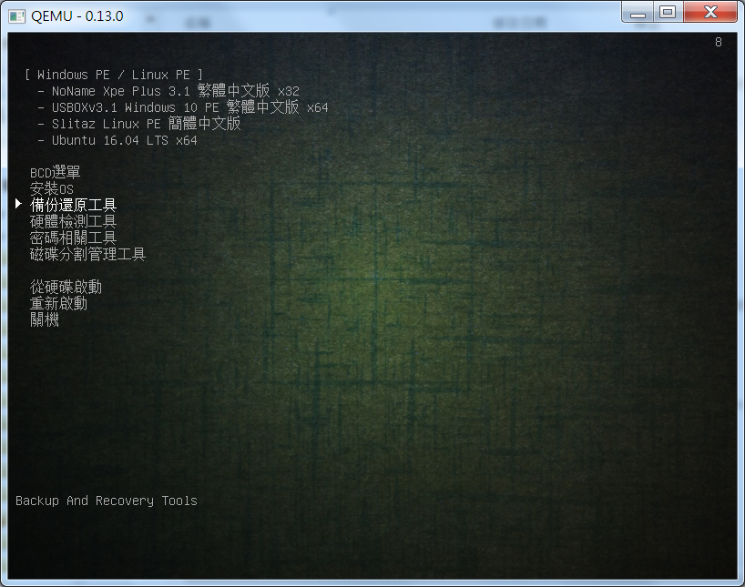
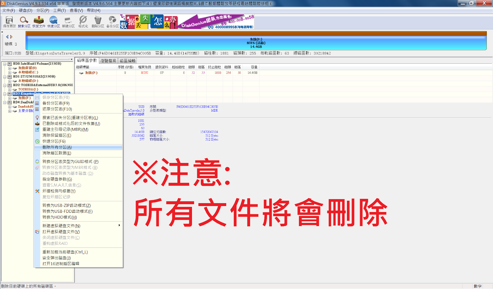
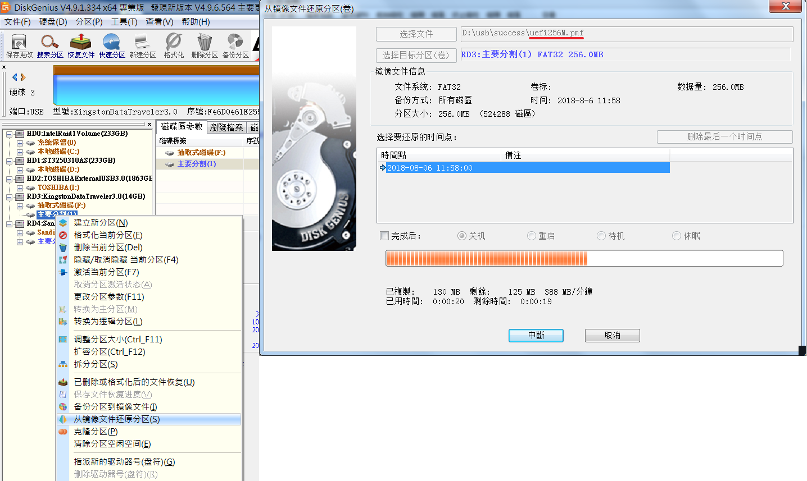
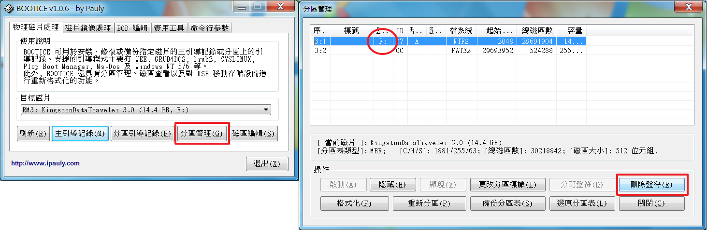
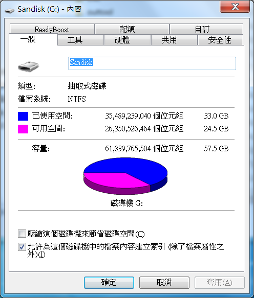

+++
title = "多重開機 USB 製作及開機選單修改(上) - 建立開機 USB"
description = "多重開機 USB 製作及開機選單修改(上) - 建立開機 USB"
date = 2017-07-08T12:47:00.006Z
updated = 2018-08-03T11:12:17.964Z
draft = false
aliases = [ "/2017/07/usb-usb.html" ]

[taxonomies]
tags = [ "System Admin" ]
licenses = [ "GFDL 1.3" ]

[extra]
card = "preview.png"
+++

## 2018/08/03 更新

1. 新增 UEFI 開機支援，修改自: [這裡](https://www.microduo.tw/forum.php?mod=viewthread\&tid=33430)
2. 刪除 Windows 8 PE
3. Windows 10 PE 換成 [USBOX v3.1](http://hsuanthony.pixnet.net/blog/post/220334610-usbox-3.1-2018%E6%96%B0%E5%B9%B4%E9%9A%86%E9%87%8D%E7%99%BB%E5%A0%B4~~-win10pe%E6%94%AF%E6%8C%81%E7%B6%B2%E8%B7%AF-%E5%8A%A0)
4. 修正 Windows 7&10 安裝 ISO 使用 Firadisk 引導，並且自己寫了對應 Windows 10 的 AutoUnattend.xml
5. Arconis True Image 更新至 2018
6. 「記憶體硬體檢測」更名為「硬體檢測工具」
   1. 新增 Lenovo Linux Bootable Diagnostics-4201 聯想電腦硬體檢測工具
   2. Memtest86 更新至 7.5 Pro 版 (UEFI)

## 前言

身為一個電腦維修工程師，一定要有一支開機維護隨身碟。剛入行的時候是拿給同事請他做，去年我重新修改製作了自己的版本。最近公司合約進了一批最新的電腦，預設沒開 Legacy 也不吃 Win7，所以這次我把此工具新增支援 UEFI，ISO 做了一些更新，修正安裝光碟上的引導問題等。
<!-- more -->
此工具主要融合自:

* [SuperUSB v6 – 電腦維護的利器 | 格雷資訊](https://www.grayfree.tw/archives/716)
* [《【原创】主要针对服务器的专业维护人员使用的直接调用 ATI.iso 和 kav\_rescue\_10.iso 的小工具 》](https://www.microduo.tw/forum.php?mod=viewthread\&tid=33430)
* [如何讓 NTFS 也能 UEFI 開機？](https://www.grayfree.tw/archives/728)
* [《把 PE 集成进启动 U 盘的两种不同的集成方式所造成的 PE 在使用上的一点重大差别》](https://www.microduo.tw/thread-34842-1-1.html)
* [Windows 快速装机中心 ——IQI9、OBR、DQI 全家桶](http://bbs.wuyou.net/forum.php?mod=viewthread\&tid=402718\&extra=\&page=1)

## 步驟大綱

本系列分成兩篇敘述，上篇老少皆宜，下篇屬於困難級，請適當斟酌

[上篇 - 建立開機 USB](@/SystemAdmin/creating-multi-boot-usb-and-modifying-boot-menu/index.md):

1. 處理磁碟分割及引導
2. 安裝 Base 模式 (8G)
3. 安裝 Add 模式 (16G)
4. 安裝 Add\_xp 模式 (32G)
5. 安裝 Tools
6. 測試成果
7. 注意事項

[下篇 - 加入 Windows To Go 系統](@/SystemAdmin/creating-multi-boot-usb-and-modifying-boot-menu3/index.md):

1. 製作 Win10 VHD
2. 設置 BCD 引導
3. 安裝 EWF 影子系統
4. TroubleShooting

## 準備

開工前請先備妥以下東西:

1. 載體: USB\*1 (容量及細部規格見後述)
2. 製作平台: Windows 系統 (Mac、Linux 部分工具須找代用品)
3. 工具:
   1. BOOTICE v1.3.3.2  
      <http://www.ipauly.com/2015/11/15/bootice/>  
      
   2. 簡易啟動測試器 v4.0 Beta6  
      <https://edp.idv.tw/wp-content/uploads/2016/10/qmenu.zip>
   3. DiskGenius  
      <http://www.diskgenius.cn/download.php>
   4. IObit SmartDefrag Portable  
      <http://www.azofreeware.com/2007/01/iobit-smartdefrag-beta-201.html>
   5. WinContig Portable  
      <http://www.azofreeware.com/2014/03/wincontig-120b.html>
4. 安裝包: [下載點](https://drive.maki0419.com/d/s/nOb7v9DH1pjl5rbTX5dGRxs3cySx0tC7/QXPkPYgitMwW%5FWeyG6wDrSdTRcIXvyJP-RLEgX4qpRwk)  
   家用 NAS 請愛護它

## USB 的選擇

容量請選擇至少 8G 或以上，USB2.0、USB3.0 建議各做一支。理論上此工具 Base 模式少於 8G，但是我手邊沒有 U2 8G 可以測試，也不想去買垃圾，所以未做測試。U3 速度快，運行較不會 LAG，但是實務上並非所有機器都能適用 U3 (舊硬體、驅動等)，所以建議各做一支。另外，此篇文章所製作之成果為 15.7G，需要 32G USB，若包含下篇之 VHD 全部是 33G，要 64G USB 才裝得下，否則就要適當取捨。

建議:  
USB2.0: 8G、16G  
USB3.0: 32G、64G

實測可用 USB:

1. Kingston DTSE9H (U2 16G)
2. Kingston DT101 G2 (U2 16G)
3. Kingston DT50 (U3.1 16G)
4. ~~ADATA UV128 (U3 32G)~~(開機有時抓不到)
5. SANDISK ULTRA FLAIR USB 3.0 (U3 64G) ←推👍

## 事前

**在開始以前，請先開啟「顯示隱藏檔案」，關閉「隱藏已知檔案類型的副檔名」、「隱藏保護的作業系統檔案」**

## 處理磁碟分割及引導

開啟 DiskGenius，USB 磁碟上右鍵，清除所有分區  


此 USB 所有文件將會刪除


選擇磁碟後，使用快速分區，確認圓圈處沒有選擇錯誤，創建 2 個分區 ，設置分割區如下

1. NTFS，容量自動帶，主要分割
2. FAT32，容量 256MB，主要分割

格式化完成後第一個分區應該會自動掛載如圖  
選擇第二個 FAT32 分區，右鍵「從鏡像檔還原分區 」，倒進這裡提供的 uefi256M.pmf

開啟 BOOTICE，選擇到目標 USB，主引導記錄，選擇 Grub4dos0.4.6a，其餘設置如圖，寫入磁片

BOOTICE 分區管理，將自動掛載的盤符刪除

盤符改變後按下最左側的「刷新」，**注意要選擇到目標 USB**

BOOTICE 分區引導記錄，選擇 Grub4dos 0.4.6a，兩個分區都要修改

將第一分區盤符恢復

## 安裝 Base 模式 (8G)

解壓縮 base.rar，將檔案全部丟進去就是了  
特別注意有沒有忘記開隱藏檔，請比對一下圖片

## 安裝 Add 模式 (16G)

**必須要先安裝 Base 模式**  
Add 模式相比 Base 模式新增了 Windows7、Windows10 安裝光碟  
**需要至少 16G 以上的 USB**  
解壓縮 add.rar，將檔案全部**覆蓋**進去就行

## 安裝 Add\_xp 模式 (32G)

**必須要先安裝 Base 模式**  
Add\_xp 模式又再增加了 xp 安裝光碟  
總共需要**至少 32G 以上的 USB**  
解壓縮 add\_xp.rar，將檔案全部**覆蓋**進去就行

如果未安裝 Add 模式但是要 Add\_xp 的話，修改 os.lst 將 Windows7、Windows10 的引導部分刪除即可

## 安裝 Tools

Tools 資料夾下有分為「Recommend」和「Optional」  
如果是 16G USB，請使用 Recommend 資料夾，若是 32G 以上可再加上 Optional 資料夾

## 測試成果

開機進 BOOT 選單，選擇從 USB 開機，若要使用 UEFI 則選擇第二分割區  
原則上我會建議先試 Legacy，出錯誤再試 UEFI，UEFI 當成備援就好

Base + Tools(Recommend)

[.png)](base+tool\(Re\).png)

Base + Add + Tools(Recommend)

[.png)](base+add+tool\(Re\).png)

Base + Add + Add\_xp + Tools(All)

Base + Add + Add\_xp + Tools(All) + VHD

## 注意事項

* UEFI 模式請**關閉 Secure boot**
* 有些機器無法開啟 UEFI 下的 grub2 文件管理器，應是該機器本身的支援問題  
  (實測 ASUS MD590 可以成功啟動 x64 文件管理器，Lenovo M83 就不行)
* 「簡易啟動測試器 v4.0 Beta6.exe」要用**系統管理員**執行，只能測試 Legacy 開機 Menu
* 若修改了 ISO，可以至 List 資料夾下修改 menu 文件
* XP 安裝完成後會跳出一個亂碼視窗提到「Firadisk」字眼，此為「引導安裝光碟時所需要的驅動」的刪除程式，輸入 Y 即可執行刪除
* **請切記一定要注意：勿遺漏隱藏文件**

本系列分成上下兩篇，請接著閱讀[下篇](/SystemAdmin/creating-multi-boot-usb-and-modifying-boot-menu3/index.md)

## 檔案來源

1. USBOX v3.1 ISO 版  
   <http://hsuanthony.pixnet.net/blog/post/220334610-usbox-3.1-2018%E6%96%B0%E5%B9%B4%E9%9A%86%E9%87%8D%E7%99%BB%E5%A0%B4~~-win10pe%E6%94%AF%E6%8C%81%E7%B6%B2%E8%B7%AF-%E5%8A%A0>
2. Windows 7 多合一安裝光碟 <http://leo160918.pixnet.net/blog/post/178121683-%E3%80%90windows-7-~-windows-10%E3%80%91windows-7-sp1-13in1>
3. Windows 10 安裝光碟  
   <https://briian.com/23608/>
4. Windows XP 安裝光碟 (zh-tw\_windows\_xp\_professional\_with\_service\_pack\_3\_x86\_cd\_vl\_x14-74140)  
   <http://mei881.pixnet.net/blog/post/93696616-windows-xp-professional-with-service-pack3>
5. ubuntu-16.04.4-desktop-i386  
   <http://ftp.ubuntu-tw.org/mirror/ubuntu-releases/16.04/>
6. UEFI 引導:  
   <https://www.microduo.tw/forum.php?mod=viewthread&tid=33430>
7. 其餘:  
   <https://www.grayfree.tw/archives/716>
