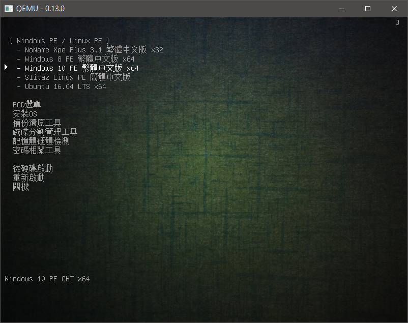
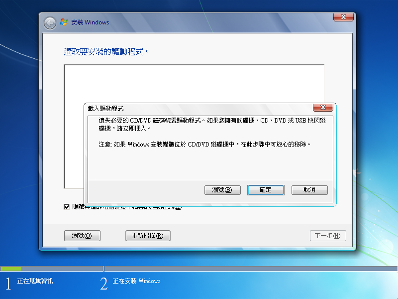

+++
title = "多重開機USB製作 及 開機選單修改(中) - 引導重灌ISO"
description = "多重開機USB製作 及 開機選單修改(中) - 引導重灌ISO"
date = 2017-07-11T15:52:00.000Z
updated = 2020-11-24T14:56:53.457Z
draft = true
aliases = [ "null" ]

[taxonomies]
tags = [ "System Admin" ]

[extra]
card = "preview.png"
+++

[](preview.png)

[](%25E5%25AE%2589%25E8%25A3%259DOS.png)

## 前言

\~ 本系列分成上中下三篇，請先閱讀[上篇](@/SystemAdmin/creating-multi-boot-usb-and-modifying-boot-menu/index.md)\~

Windows7 和 Windows10 透過 Grub4Dos 引導十分的麻煩

如果直接把 iso 拿來用會出現下面這個:

[](Grub4Dos%5FError-1.png)

沒看錯，並不是你眼睛業障重

他抓不到驅動....

解答是要透過 imdisk 掛載，才能正常執行

[](我不是開玩笑這是真的%20假的.png)

又另外，Windows7 安裝時如果使用 USB3.0 孔插滑鼠鍵盤，你可能會發現滑鼠鍵盤完全不動

[](真是夠噁心的.JPG)

是的，Windows7 沒有 3.0 驅動  
而現在新的電腦有些沒有 2.0 插槽，像是[這台](@/SystemAdmin/when-installing-win7-the-mouse-and-keyboard-do-not-work/index.md)

於是我們就要開工了...
<!-- more -->
## 步驟大綱

本系列分成三篇敘述，上篇老少皆宜，中下篇屬於困難級，請適當斟酌

[上篇 - 建立開機 USB](@/SystemAdmin/creating-multi-boot-usb-and-modifying-boot-menu/index.md):

1. 安裝 SuperUSB\_v6
2. 刪除 SuperUSB\_v6 多餘部分
3. 增加 Win10 PE

[中篇 - 引導重灌 ISO](@/SystemAdmin/creating-multi-boot-usb-and-modifying-boot-menu2/index.md):

1. 製作並增加安裝 OS 選單: Windows XP
2. 製作並增加安裝 OS 選單: Windows 7
3. 製作並增加安裝 OS 選單: Windows 10
4. 製作並增加安裝 OS 選單: Ubuntu 16.04

[下篇 - 加入 Windows To Go 系統](@/SystemAdmin/creating-multi-boot-usb-and-modifying-boot-menu3/index.md):

1. 製作 Win10 VHD
2. 設置 BCD 引導
3. 安裝 EWF 影子系統
4. TroubleShooting

## 正文

### 製作並增加安裝 OS 選單: Windows XP

確認上篇建議下載的 Windows XP iso 檔案名稱為 "zh-tw\_windows\_xp\_professional\_with\_service\_pack\_3\_x86\_cd\_vl\_x14-74140.iso"

然後請將此 ISO 檔複製到 "USB://ISO/" 目錄底下

[](2017-07-11%2022%2016%2050.png)

修改 USB://List/menu.lst，拿掉 os.lst 的註解

[](2017-07-11%2022%2021%2046.png)

修改 USB://List/os.lst，中間砍掉換成這段

```
title [ 安裝OS ]
clear

title   [01] 安裝 Windows XP Pro SP3 x86(IDE)\n Install Windows XP Pro SP3 x86\n 必須是IDE模式，不能是AHCI模式
/UBRESCUE/NTBOOT/NTBOOT iso_inst=firadisk cdrom=/ISO/zh-tw_windows_xp_professional_with_service_pack_3_x86_cd_vl_x14-74140.iso addons="dpms 0"
boot
```

[](2017-07-11%2022%2020%2014.png)

> ※注意※  
> SATA 模式必須是 IDE 模式，不能是 AHCI 模式，XP 無法支援 AHCI

### 製作並增加安裝 OS 選單: Windows 7

開始製作 win7 跟 win10 以前，請先下載:

1. imdisk: [MEGA](https://mega.nz/#!8wo2BDhR!nXgHjz-P4AQBBn-fj2G1waUdZf6KxE-hqZS134S39vw)
2. Win7 USB Patcher: [ASRock](http://www.asrock.com.tw/microsite/Win7Install/index.tw.html) (N3000 系列 → 透過 USB 隨身碟及任何一種滑鼠鍵盤。 → Win7 USB Patcher)

將上篇建議下載的 Windows7 11 合一 iso 檔案重新命名為 "Windows\_7\_11in1.iso"

[](2017-07-11%2020%2038%2039.png)

開啟 UltraISO，打開 Windows\_7\_11in1.iso 映像檔  
左上方打開路徑 \sources，左下方選取到存放位置，右上方找到 "boot.wim" 以後對其右鍵提取  
提取成功後先不要關閉 UltraISO，後面還要用

[](2017-07-11%2019%2020%2017.png)

檔案總管開啟 boot.wim 存放位置，在同級下建立資料夾 "mount"

[](2017-07-11%2019%2022%2040.png)

開啟 Gimagex，在 "掛載映像" 頁籤如圖選擇，然後進行掛載  
掛載完成後先不要關閉 Gimagex，後面還要用

[](2017-07-11%2019%2023%2038.png)

開啟記事本，建立文件 "win7.cmd"

```
pushd %SYSTEMDRIVE%\imdisk
@rundll32.exe setupapi.dll,InstallHinfSection DefaultInstall 132 .\imdisk.inf
@FOR %%I IN (C D E F G H I J K L M N O P Q R S T U V W X Y Z) DO @IF EXIST %%I:\ISO\Windows_7_11in1.iso imdisk -a -f %%I:\ISO\Windows_7_11in1.iso -m #:
exit
```

[](2017-07-11%2020%2001%2019.png)

開啟記事本，建立文件 "Winpeshl.ini"

```
[LaunchApp]
AppPath = %SYSTEMDRIVE%\sources\win7.cmd

[LaunchApps]

%SYSTEMDRIVE%\sources\setup.exe
```

[](2017-07-11%2020%2003%2013.png)

將 win7.cmd 複製到路徑 "\mount\sources" 之下

[](2017-07-11%2020%2004%2028.png)

將 Winpeshl.ini 複製到路徑 "\mount\Windows\System32" 之下

[](2017-07-11%2020%2006%2034.png)

將 imdisk 複製到路徑 "\mount" 之下

[](2017-07-11%2020%2009%2010.png)

回到 Gimagex，如圖卸載 boot.wim

> ※注意※
>
> 卸載前務必把 \mount 下開啟的所有文件 / 資料夾關閉，恢復到非使用中狀態  
> 要是掛載 / 卸載失敗就以系統管理員執行 cmd: Dism /Cleanup-Wim

[](2017-07-11%2020%2010%2044.png)

回到 UltraISO，對右下部分 "右鍵→重新整理"，直到新的 boot.wim 正確顯示  
然後對其右鍵→加入→覆蓋進去

[](2017-07-11%2020%2025%2001.png)

確認是否加入成功，然後存檔離開 UltraISO

[](2017-07-11%2020%2026%2018.png)

開啟 Win7 USB Patcher，對剛剛存檔完成的 Windows\_7\_11in1.iso 檔案使用  
第一次選 ISO

[](2017-07-11%2020%2036%2026.png)

選 ISO，並選擇剛剛完成的 Windows\_7\_11in1.iso

[](2017-07-11%2020%2037%2005.png)

到下圖這步驟，Start 按下去就開始跑了，途中可能會無回應，請耐心等待\~

這裡要等非常非常久

[](2017-07-11%2020%2037%2043.png)

下圖表示完成

[](2017-07-11%2021%2050%2036.png)

完成以後到桌面找到 PatchedImg.iso，重新命名為 "Windows\_7\_11in1.iso"，並複製到 "USB://ISO" 資料夾底下

[](2017-07-11%2021%2052%2039.png)

修改 USB://List/os.lst，中間加上這段

```
title   [02] 安裝 Windows 7\n Install Windows 7\n
find --set-root /ISO/Windows_7_11in1.iso
map /ISO/Windows_7_11in1.iso (hd32)
map --hook
chainloader (hd32)
boot
```

[](2017-07-11%2022%2013%2032.png)

> ※注意※  
> 插在 USB3.0 插槽啟動時 Win7 還是會遇到引導失敗，建議盡量插在 2.0 插槽使用  
> 不然就另外單獨拿一支 USB2.0 燒著備用，用 rufus 直接做比較保險

### 製作並增加安裝 OS 選單: Windows 10

Windows10 作法跟 Windows7 類似，一樣要使用 imdisk 掛載

不過他並不需要上 U3Patch，Win10 原生支援 USB3.0

需要注意的是 Win10 的 win10.cmd 和 Winpeshl.ini 與 Win7 的內容不同，注意不要混用

再來就是，我下載到的 Windows10 是 x64+x86 混和光碟，所以 boot.wim 有兩個，要提取作業兩次 (兩個 boot.wim 內容不同，都要個別上 imdisk)

[](2017-07-11%2022%2048%2050.png)

兩個檔案給在這裡，步驟同上不再重複 (記得不要遺忘 imdisk)

win10.cmd

```
pushd %SYSTEMDRIVE%\imdisk
@rundll32.exe setupapi.dll,InstallHinfSection DefaultInstall 132 .\imdisk.inf
@FOR %%I IN (C D E F G H I J K L M N O P Q R S T U V W X Y Z) DO @IF EXIST %%I:\ISO\zh-tw_Windows_10_Pro_x64_1607.iso imdisk -a -f %%I:\ISO\zh-tw_Windows_10_Pro_x64_1607.iso -m #:
exit
```

Winpeshl.ini

```
[LaunchApp]
AppPath = %SYSTEMDRIVE%\sources\win10.cmd

[LaunchApps]

%SYSTEMDRIVE%\setup.exe
```

簡單附上兩張示意圖

[](2017-07-11%2022%2056%2011.png)

[](2017-07-11%2022%2058%2039.png)

確認完成的 Windows 10 iso 檔案名稱為 "zh-tw\_Windows\_10\_Pro\_x64\_1607.iso"

然後請將此 ISO 檔複製到 "USB://ISO/" 目錄底下

[](2017-07-11%2023%2009%2057.png)

修改 USB://List/os.lst，中間加上這段

```
title   [03] 安裝 Windows 10 1607\n Install Windows 10 1607
find --set-root /ISO/zh-tw_Windows_10_Pro_x64_1607.iso
map /ISO/zh-tw_Windows_10_Pro_x64_1607.iso (hd32)
map --hook
chainloader (hd32)
boot
```

### 製作並增加安裝 OS 選單: Ubuntu 16.04

相較之下 Ubuntu 處理非常簡單

先建立一個資料夾，名稱為 "ubuntu-16.04.2-desktop-amd64"

然後把 ubuntu-16.04.2-desktop-amd64.iso 丟進資料夾裡面

[](2017-07-11%2023%2029%2000.png)

以 WinRAR 或其他壓縮軟體開啟 ubuntu-16.04.2-desktop-amd64.iso

[](2017-07-11%2023%2029%2041.png)

開啟路徑 "\casper"，將 initrd.lz 和 vmlinuz.efi 兩個檔案解壓縮到 ubuntu-16.04.2-desktop-amd64 資料夾內

[](2017-07-11%2023%2030%2047.png)

資料夾下狀態如圖

[](2017-07-11%2023%2032%2020.png)

將 ubuntu-16.04.2-desktop-amd64 資料夾整個丟到 USB://ISO/ 底下

[](2017-07-11%2023%2032%2048.png)

修改 USB://List/os.lst，中間加上這段

```
title   [04] 安裝 Ubuntu 16.04 LTS x64\n Install Ubuntu 16.04 LTS x64
root (hd0,0)
kernel (hd0,0)/ISO/ubuntu-16.04.2-desktop-amd64/vmlinuz.efi boot=casper iso-scan/filename=/ISO/ubuntu-16.04.2-desktop-amd64/ubuntu-16.04.2-desktop-amd64.iso
initrd (hd0,0)/ISO/ubuntu-16.04.2-desktop-amd64/initrd.lz
```

[](2017-07-11%2023%2041%2033.png)

修改 USB://List/menu.lst，中間加上這段

```
title   - Ubuntu 16.04 LTS x64\n Install Ubuntu 16.04 LTS x64
root (hd0,0)
kernel (hd0,0)/ISO/ubuntu-16.04.2-desktop-amd64/vmlinuz.efi boot=casper iso-scan/filename=/ISO/ubuntu-16.04.2-desktop-amd64/ubuntu-16.04.2-desktop-amd64.iso
initrd (hd0,0)/ISO/ubuntu-16.04.2-desktop-amd64/initrd.lz
```

[](2017-07-11%2023%2043%2009.png)

## 參考資料

- SuperUSB v6 – 電腦維護的利器 | 格雷資訊，格雷，2013-09-04， <https://www.grayfree.tw/archives/716>
- 隨身碟 G4D 單一 ISO 安裝 WIN7、8..(PART2) #12，2567288，2013-02-27， <http://nonameteam.cc/forum.php?mod=redirect&goto=findpost&ptid=1143&pid=8923&fromuid=29234>
- 琳的備忘手札: 灌 Win7 時滑鼠鍵盤無法使用，陳鈞，2017-02-04， [/SystemAdmin/when-installing-win7-the-mouse-and-keyboard-do-not-work/](@/SystemAdmin/when-installing-win7-the-mouse-and-keyboard-do-not-work/index.md)
