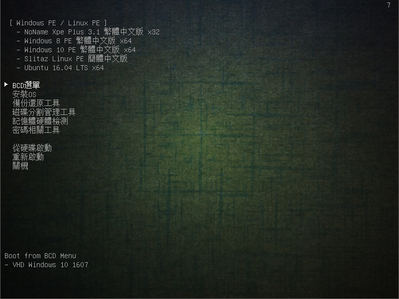
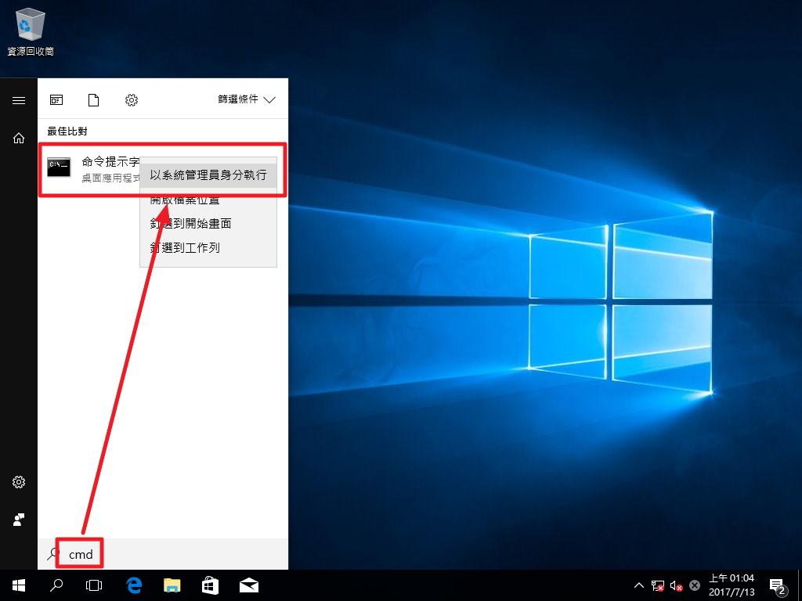
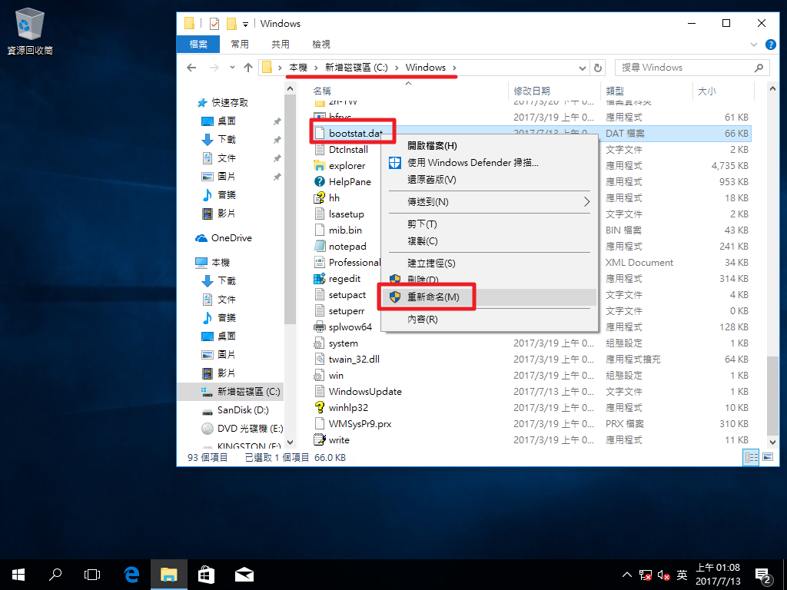
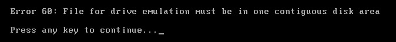

+++
title = "多重開機 USB 製作及開機選單修改(下) - 加入 Windows To Go 系統"
description = "多重開機 USB 製作及開機選單修改(下) - 加入 Windows To Go 系統"
date = 2017-07-12T17:56:00.005Z
updated = 2020-11-24T14:56:53.459Z
draft = false
aliases = [ "/2017/07/usb3.html" ]

[taxonomies]
tags = [ "System Admin" ]
licenses = [ "GFDL 1.3" ]

[extra]
card = "preview.png"
+++

[](preview.png)

[](2017-07-12%2022%2041%2045.png)

## 步驟大綱

本系列分成上下兩篇，請先閱讀上篇

[上篇 - 建立開機 USB](@/SystemAdmin/creating-multi-boot-usb-and-modifying-boot-menu/index.md):

1. 處理磁碟分割及引導
2. 安裝 Base 模式 (8G)
3. 安裝 Add 模式 (16G)
4. 安裝 Add\_xp 模式 (32G)
5. 安裝 Tools
6. 測試成果
7. 注意事項

[下篇 - 加入 Windows To Go 系統](@/SystemAdmin/creating-multi-boot-usb-and-modifying-boot-menu3/index.md):

1. 製作 Win10 VHD
2. 設置 BCD 引導
3. 安裝 EWF 影子系統
4. TroubleShooting

## 前言

使用 PE 的時候一直有點困擾

> "就缺了這個軟體呢"
> "想要可以保存這個文件啊"

這時候就會想，何不在 USB 裡面灌個一般系統呢? →得到的解答: {{cg(body="Windows To Go")}}  
WTG 本身是不難做，但是要跟我們的多重開機合併就會遇到幾個瓶頸
<!-- more -->
1. Windows C 槽結構固定，無法安裝在特定資料夾
   * 灌進 VHD 裡面，然後使用 Grub4Dos→BCD 引導
2. 灌起來以後效能不佳
   * 安裝 EWF 把系統載入 RAM
   * 使用 USB3.0 提升速度
   * 盡量保持系統輕量化  
     →實測載入系統{{cg(body="約 30 秒")}}
     另外，因為 Windows10 在開機的時候會掃描硬體並安裝驅動，Win7 跟 XP 不會。雖然 Linux 會，但是還是 Windows 系統通用性高，所以系統選擇 **Windows10**

## 步驟大綱

系列分成兩篇敘述，上篇老少皆宜，下篇屬於困難級，請適當斟酌

[上篇 - 建立開機 USB](@/SystemAdmin/creating-multi-boot-usb-and-modifying-boot-menu/index.md):

1. 處理磁碟分割及引導
2. 安裝 Base 模式 (8G)
3. 安裝 Add 模式 (16G)
4. 安裝 Add\_xp 模式 (32G)
5. 安裝 Tools
6. 測試成果
7. 注意事項

[下篇 - 加入 Windows To Go 系統](@/SystemAdmin/creating-multi-boot-usb-and-modifying-boot-menu3/index.md):

1. 製作 Win10 VHD
2. 設置 BCD 引導
3. 安裝 EWF 影子系統
4. TroubleShooting

## VHD (Virtual Hard Disk)

> Windows 7 中 VHD 檔案格式其實是虛擬硬盤 (virtual machine hard disk) 的檔案格式。Windows 7 內建對 VHD（Virtual Hard Disk）的原生支持，可以很容易的將 VHD 文件掛載到系統中，看起來就像一個真實的硬碟分區 (partition) 般。
>
> VHD 是一部虛擬硬盤，不同於傳統硬盤的盤片、磁頭和磁道，VHD 硬盤的載體是文件系統上的一個 VHD 檔案。如果大家仔細閱讀 VHD 文件的技術標準，就會發現標準中定義了很多 Cylinder、Heads 和 Sectors 等硬盤特有的術語，來模擬針對硬盤的 I/O 操作。既然 VHD 是一塊硬盤，那麼就可以跟物理硬盤一樣，進行分區、格式化、讀寫等操作。
>
> ──[Windows 7 中的 VHD 檔案格式到底是什麼 ? :: ezone.hk :: 一站式即時科技新聞](http://ezone2.ulifestyle.com.hk/tips.php?tipsid=3142)

> 詳細介紹:  
> [把 Windows 7 灌進 VHD 虛擬磁碟（上） | T 客邦 - 我只推薦好東西](http://www.techbang.com/posts/3910-invincible-vhd-virtual-disk-on)

## EWF (Enhanced Write Filter)

> EWF（Enhanced Write Filter，增強型寫入過濾器）是 XP Embedded 嵌入式系統中的一個強大組件，它被稱為微軟牌的「影子系統」。
>
> EWF 是什麼？簡單的說它就是讓磁碟變成「唯讀」、「防寫」狀態。EWF 可以安裝在一般的硬碟上，讓你目前的作業系統變成唯讀保護。
>
> EWF 的工作原理，就是把系統的變動都記錄在 RAM 上，而不寫入硬碟（除非使用者要求），所以能讓 XP 變成防寫的狀態。但是如果 RAM 本身不足夠的話，對於效能會有反效果。
>
> ──[微軟的 EWF 影子系統 @ 更高境界．願景 :: 痞客邦 PIXNET ::](http://texhello.pixnet.net/blog/post/21429774-%E5%BE%AE%E8%BB%9F%E7%9A%84ewf%E5%BD%B1%E5%AD%90%E7%B3%BB%E7%B5%B1)

下載 EWF: [MEGA](https://mega.nz/#!R5RnkR4S!lkx8tW4bb%5FgaEGnueyxWpciUpC5KS0EO6Sv7SsfWV9M)

## 正文

### 製作 Win10 VHD

第一步，建立空白 VHD

Win+R 打開執行，輸入 "**diskmgmt.msc**" 打開磁碟管理員  
動作→建立 VHD

[](2017-07-12%2020%2004%2039.png)

大小給 15G，Win10 裝到能用下限差不多是這樣

[](2017-07-12%2020%2006%2000.png)

建立完成後應該會自動連結 VHD，會出現未初始化 VHD

[](2017-07-12%2020%2009%2005.png)

對著其左半邊右鍵→初始化磁碟

[](2017-07-12%2020%2009%2052.png)

選擇 MBR

[](2017-07-12%2020%2010%2019.png)

對著黑色右半部右鍵→新增簡單磁碟區

[](2017-07-12%2020%2011%2013.png)

將 Windows10 安裝光碟用 WinRAR 打開，找到 "\x64\sources\install.esd"，解壓縮出來

[](2017-07-12%2023%2026%2045.png)

以系統管理員開啟 cmd 命令提示字元

[](2017-07-12%2020%2016%2053.png)

先 cd 到 install.esd 所在目錄: cd C:\Users\jim60\Desktop\working (視你的檔案位置而定)  
然後解開映像到 VHD 所在磁區: dism /apply-image/imagefile:install.esd/index:1 /applydir:E:\ (替換成你的 15G VHD 掛載盤符)

[](2017-07-12%2020%2020%2043.png)

接下來要建立 BCD 引導: bcdboot.exe E:\windows /s E: /f ALL (替換成你的 15G VHD 掛載盤符)

[](2017-07-12%2020%2026%2002.png)

完成以後 VHD 裡應該長這樣

[](2017-07-12%2023%2047%2005.png)

把以下三項複製到隨身碟根目錄下

* Boot 資料夾
* bootmgr
* BOOTNXT

[](2017-07-12%2020%2030%2015.png)

卸載 VHD，對著 VHD 左半邊右鍵→中斷連結

[](2017-07-12%2020%2032%2024.png)

在 USB 根目錄下建立一個資料夾 "VHD"，將 15G VHD 檔複製進去

[](2017-07-12%2020%2040%2017.png)

### 設置 BCD 引導

開啟 BOOTICE→BCD 編輯→其他 BCD 檔案→...→選擇到 USB:\Boot\BCD

[](2017-07-12%2020%2054%2057.png)

選擇 "智慧編輯模式"

[](2017-07-12%2020%2056%2018.png)

把原有的 Win10 項目砍掉，重新添加 VHD 啟動項

[](2017-07-12%2021%2000%2005.png)

所有欄位設定如圖，然後紅框處兩個按鈕都點一下 (**兩個一定都要按**)，然後關閉退出 BOOTICE

[](2017-07-12%2020%2056%2050.png)

建立 Grub4Dos 引導至 BCD  
編輯 USB:\List\menu.lst，在中間加入這段

```
title  BCD選單\n Boot from BCD Menu\n - VHD Windows 10 1607
chainloader /bootmgr
```

[](2017-07-12%2021%2007%2007.png)

至此，多重開機 USB 建立完成  
接下來要進到 VHD 做設定了

這時候要做一件事  
**拔網路線!!!!!**  
**拔網路線!!!!!**  
**拔網路線!!!!!**  
很重要說三次，自動更新會把 15G 弄炸掉

BIOS 開機進 USB，選擇 "BCD 選單"

[](preview.png)

然後就是漫長的等待  
......  
然後終於出來啦!

[](2017-07-12%2021%2050%2048.png)

叫你連線到網路的時候**跳過**

[](2017-07-13%2000%2040%2045.png)

建立使用者，使用者名稱 "User"，密碼空著直接下一步

[](2017-07-12%2021%2053%2006.png)

這裡全部不選，然後下一步到底

[](2017-07-12%2021%2054%2002.png)

開進桌面第一件事，關更新

左下角工具列右鍵→設定→更新與安全性→進階選項

[](2017-07-12%2022%2009%2047.png)

把它全部延到最長

[](2017-07-12%2022%2010%2038.png)

然後是關防毒

[](2017-07-13%2000%2047%2048.png)

把所有盤符都加到例外清單

[](2017-07-13%2000%2049%2025.png)

可以看到，剛灌好就吃掉了 8G

[](2017-07-13%2000%2051%2055.png)

然後開始清理系統，把常用的東西裝上去  
這部分請按照喜好自己處理 \~

以下直接秀我的調教成果

(圖內的 EWF 先無視，我是拿了另一個完成的 source 來截圖)

※注意不要裝太多軟體，盡量使用 Portable 版，放在 "USB:\\\Data\\" 資料夾下，不要占用 VHD 的空間

[](2017-07-12%2022%2041%2045.png)

可以看到基本上接近吃滿了

主要是 Office 吃很大

[](2017-07-12%2022%2039%2005.png)

防毒會報毒的東西都放在 VHD 裡面  
免得開其他系統時跳出殺毒

[](2017-07-12%2022%2040%2022.png)

[](2017-07-12%2022%2041%2011.png)

### 安裝 EWF 影子系統

在安裝 EWF 以前請把 win10.vhd **複製一份備份起來**  
免得萬一安裝失敗了要重做系統

請下載 EWF: [MEGA](https://mega.nz/#!R5RnkR4S!lkx8tW4bb%5FgaEGnueyxWpciUpC5KS0EO6Sv7SsfWV9M)

把下載的 EWF 解壓縮，放進 VHD 內的文件底下

[](2017-07-12%2023%2008%2038.png)

把 "\EWF for x86 + x64\EWF for x86 + x64\EWF-W7 (x64)" 資料夾下的 "System32"、"SysWOW64" 兩個資料夾複製到 "C:\Windows" 下

[](2017-07-13%2000%2055%2017.png)

"ewf.reg" 登錄檔右鍵→合併

[](%25E6%259C%25AA%25E5%2591%25BD%25E5%2590%258D.png)

**重新啟動**

開起來後，系統管理員開啟 cmd

[](1.png)

執行 "ewfcfg -install"，看到 completed 即可

[](2017-07-13%2001%2006%2037.png)

到 C:\WINDOWS 下將 "bootstat.dat" 重新命名為 "bootstat.dat.old"

[](2.png)

**再次重新啟動**

再次系統管理員開啟 cmd，執行 "ewfmgr C: -enable"

[](2017-07-13%2001%2016%2056.png)

回到我的文件，將圖中四個 cmd 檔案傳送捷徑到桌面

[](2017-07-13%2001%2018%2052.png)

對著捷徑右鍵→內容→進階→以系統管理員身分執行→確定套用，四個捷徑都要分別做

[](2017-07-13%2001%2021%2041.png)

> 以下補充四個捷徑的用法:  
> **SAVE.bat** 是保存本次數據並重啟。  
> (就是對系統做出修改設置後，點擊這個會重啟保存你的設置，  
> 因為 EWF 不許對保護的系統盤 - 做任何修改，只有通過這種方式  
> 保存你的修改，否則你裝進任何軟體 - 重啟之後就沒有了，但是  
> 點擊這個重啟後，設置會被保存。)  
> **TurnOff.bat** 是保存本次數據. 並重啟動及關閉 EWF 覆蓋層。  
> (簡單來說就是關掉 EWF)  
> **TurnOn.bat** 就是開啟覆蓋層並重啟。(就是再次啟用了)  
> **Status.bat** 查看當前 EWF 設定狀態。(查看現在是否有啟用)

這樣 EWF 就設定完成拉\~

可以放心地連上網路了\~

### TroubleShooting

Q: Grub4Dos 畫面有出來，但是有些功能開不進去，顯示 Error 60  
[](2013%5F01%5F21%5F14%5F02%5F49.jpg)

A: 所有 ISO 跟 VHD 檔案在磁碟上必須連續

1. 用 WinContig 程式檢查是否有碎片
2. 將有碎片之檔案移出，用 SmartDefrag 的 Free Space Defrag 功能把空間重組到一起，再複製回去
3. 再不行，將整支隨身碟內容複製出來，格式化掉，再複製回去 (**注意勿遺漏隱藏檔案及重作 BOOTICE 引導**)
