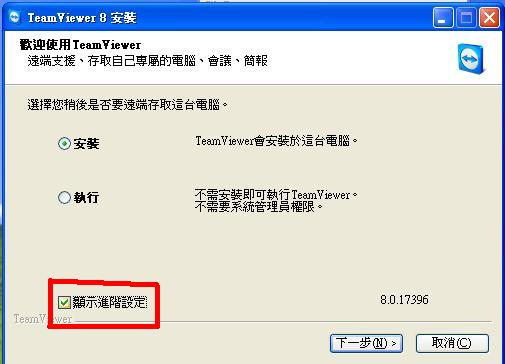
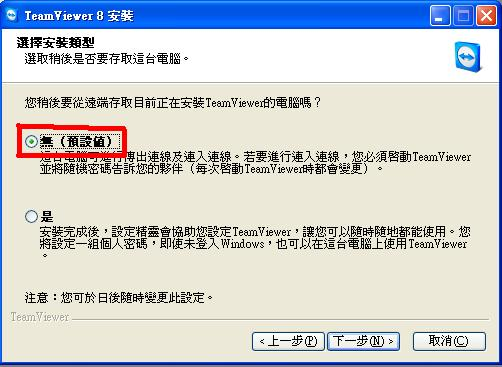
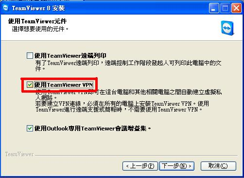
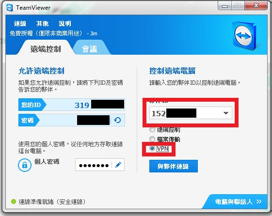
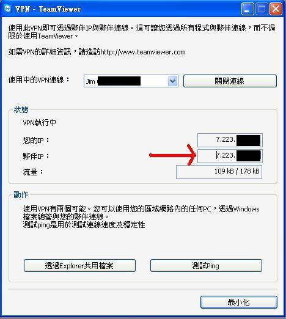

+++
title = "學網開 MC 伺服計畫 ─ Teamviewer 開 VPN"
description = "學網開 MC 伺服計畫 ─ Teamviewer 開 VPN"
date = 2013-04-01T11:45:00.005Z
updated = 2013-04-01T11:45:00.005Z
aliases = [ ]
extra = { }

[taxonomies]
tags = [ ]
+++

## 學網開 MC 伺服計畫 ─ Teamviewer 開 VPN

{{ch(body="最後我用了 HAMACHI...")}}

學網開伺服沒什麼困難的，這個部分是為了讓外網的也能連進來所做的。故跟伺服器同一區網 (同學校) 的不用這麼做。**XP 小畫家難用之傷眼注意!!wwwww**
<!-- more -->
1. 下載 Teamviewer:  
   <http://download.teamviewer.com/download/TeamViewer%5FSetup%5Fzhtw.exe>

2. 安裝他 (注意不要一直下一步!)  

    **注意按照圖中紅框點選，遇到問你用途的選 "個人用途"**

    

    

    

3. 向對方 (也就是我 ww) 索取伺服器端 ID，填入下圖上方紅框  
4. 選擇 VPN  
5. 連線:

    

6. 然後會出現下圖，將箭頭所指處 ID 填入 minecraft 多人伺服器 IP 位置

    

7. 完成拉!!
