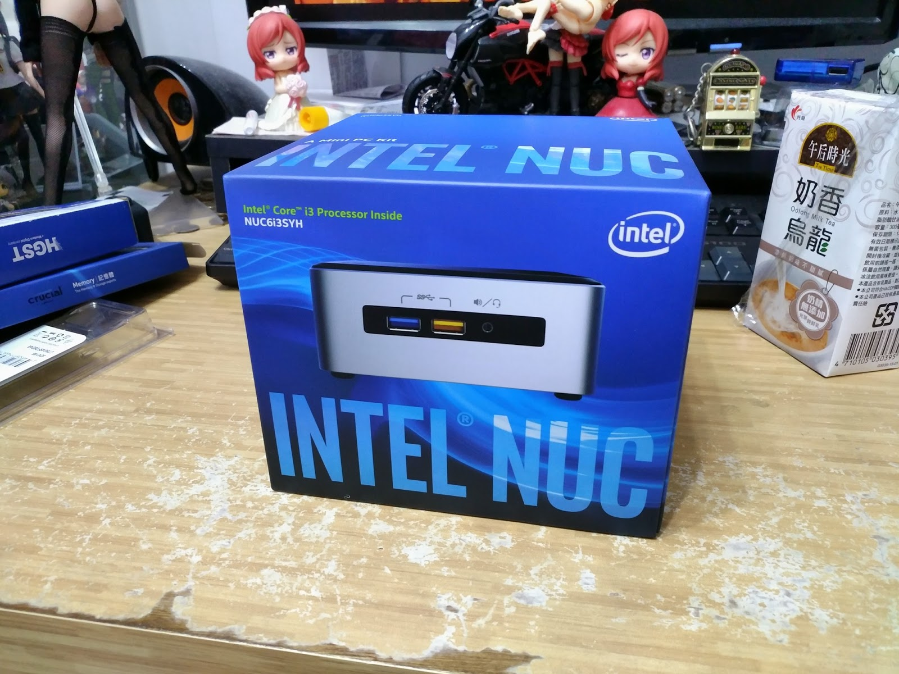

+++
title = "灌Win7時滑鼠鍵盤無法使用"
description = "灌Win7時滑鼠鍵盤無法使用"
date = 2017-02-04T12:48:00.006Z
updated = 2021-01-24T09:44:25.863Z
draft = false
aliases = [ "/2017/02/win7.html" ]

[taxonomies]
tags = [ "System Admin" ]

[extra]
card = "16462979_1440769079276032_4799561238389875984_o.jpg"
+++

跑去買了一台 Intel 便當盒準系統，照往常作法準備灌 Win7 → 啟用 → 升 Win10，結果發現 USB 鍵鼠插上去沒跑出來.....

Google了一下，貌似是Win7沒有USB3.0驅動，而這台又沒有USB2.0插

> Intel 從Brasewell, Skylake起將不支援EHCI,  
> Win7由於沒有預載USB3.0驅動程式，版端上所有USB Port都無法使用.  
> 可安裝Win7,但裝好後USB Port與USB鍵盤/滑鼠都無法使用而已,要自己想辦法裝USB3.0驅動程式.  
> 驅動程式你會裝就可以用WIN7.  
>
> ── [拉杜紫 2015-08-21 14:07](https://www.mobile01.com/topicdetail.php?f=488&t=4506766&p=1#57140035)

以下直接放解答

> 其實可以用USB安裝拉....也不用去看那個複雜的教學笑  
> 去下載這個就好了...  
> [ASRock-在Intel N3000 系列SoC 與100 系列平臺上安裝](http://www.asrock.com.tw/microsite/Win7Install/index.tw.html)<<<資料來源ASRock  
>
> 然後隨便選一個系列然後按下"透過USB隨身碟及任何一種滑鼠鍵盤。"  
> 然後手先插你原本的WIN7 USB..打開軟體...選製ISO...  
> 資料來源選你的WIN7 USB, 之後大約等七八分鐘"看你的電腦多快, 感覺很像當機, 等就對了"...  
> 好了之後就有個ISO擋在你的桌面..."之後就存起來吧永遠支援skylake平臺ISO擋"  
> 然後再打開軟體...選擇製USB....資料來源選那個ISO擋....  
> 等一下子....你就有一個完全支援skylake平臺的WIN7 USB了大笑....  
> 反正有教學影片..如果看不是很懂得話, 看教學影片簡單又直接...  
>
> 感謝ASRock讓我的腦袋變聰明了含情  
>
> 家中的ASUS Maximus VIII HERO就是這樣裝的笑  
>
> ── [chousport 2015-10-19 08:18](https://www.mobile01.com/topicdetail.php?f=488&t=4506766&p=2#57867377)
