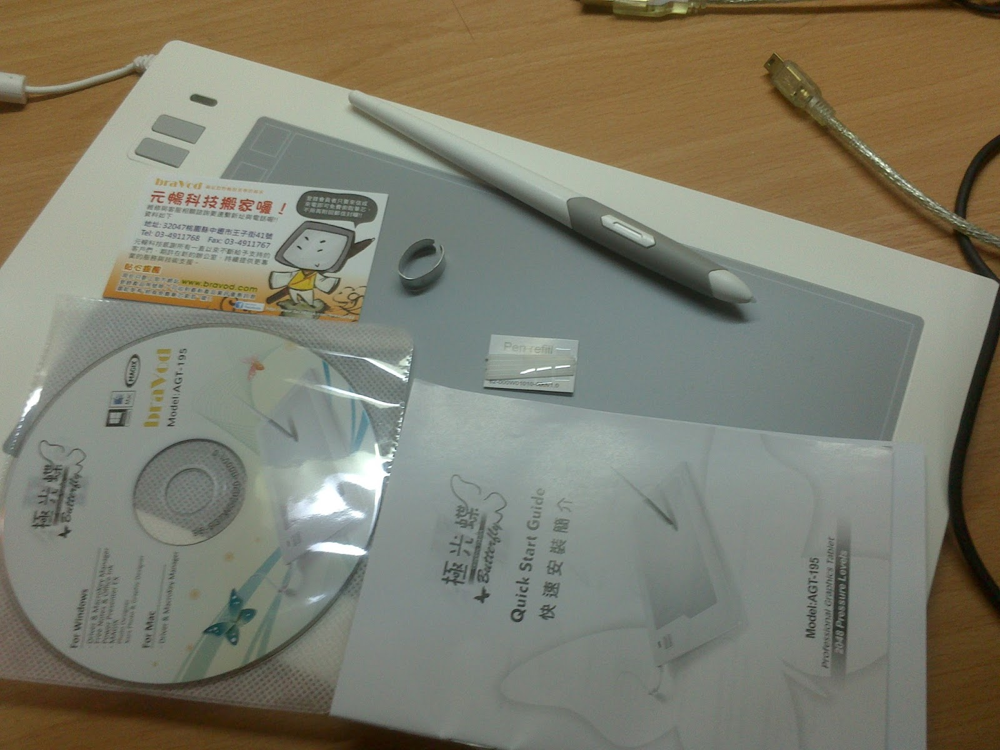

+++
title = "極光蝶 AGT-195 繪圖板"
description = "極光蝶 AGT-195 繪圖板"
date = 2013-11-25T10:10:00.003Z
updated = 2013-11-25T10:10:00.003Z
draft = false
aliases = [ ]

[taxonomies]
tags = [ "開箱文" ]

[extra]
card = "DSC_0138.jpg"
+++
昨天去巨匠報名了JAVA+Android APP+IOS APP課程  
然後周年慶送了這個w  
但是我不會畫畫所以就OSU(ry  
官網:<http://www.bravod.com/product/agt195%5Fzh.html>  
  
不廢話上圖/  
外盒  
  

  
打開來就放在正中間  
  

原來繪圖板這麼薄嗎ww  
5元厚  
  

所有內容物  
  

  
替換芯  
  

這是筆芯夾的樣子@@

筆有快捷鍵  
分成上跟下  
預設是左鍵雙擊跟右鍵  

接頭不能拔掉  
  

以上(｢･ω･)｢  
然後下禮拜就第一次上課了  
  
\=\_=）你這傢伙有認真過嗎  
⊂彡☆))Д´)<要好好認真了阿
