+++
title = "FOGIM 夾桌懸臂式液晶螢幕支架 開箱"
description = "FOGIM 夾桌懸臂式液晶螢幕支架 開箱"
date = 2014-10-28T14:02:00.003Z
updated = 2014-10-28T14:02:00.003Z
aliases = [ ]

[taxonomies]
tags = [ "開箱文" ]

[extra]
card = "IMG_20141028_192213.jpg"
+++
[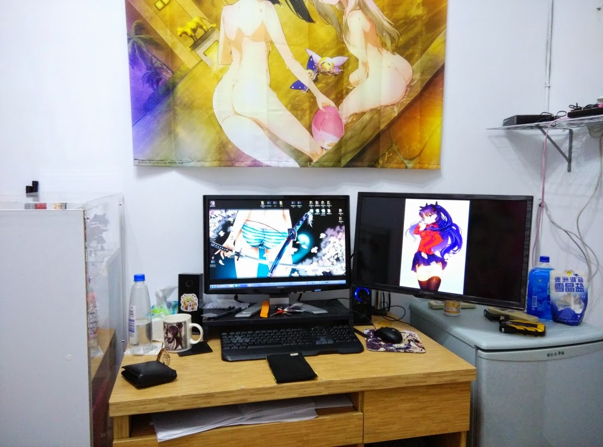](IMG%5F20141028%5F192213.jpg)

雙螢幕超爽拉wwwwwwwwww  
  
## 開箱開始
  
[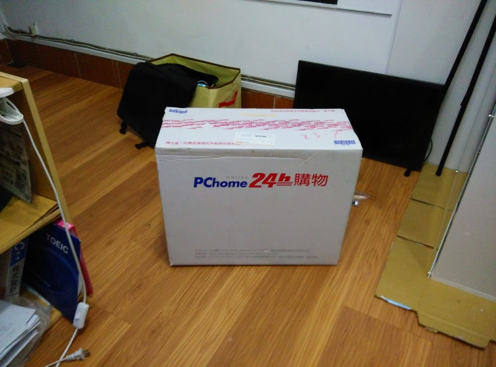](IMG%5F20141028%5F162424.jpg)

超神速的PChome 24h\~\~  
  
[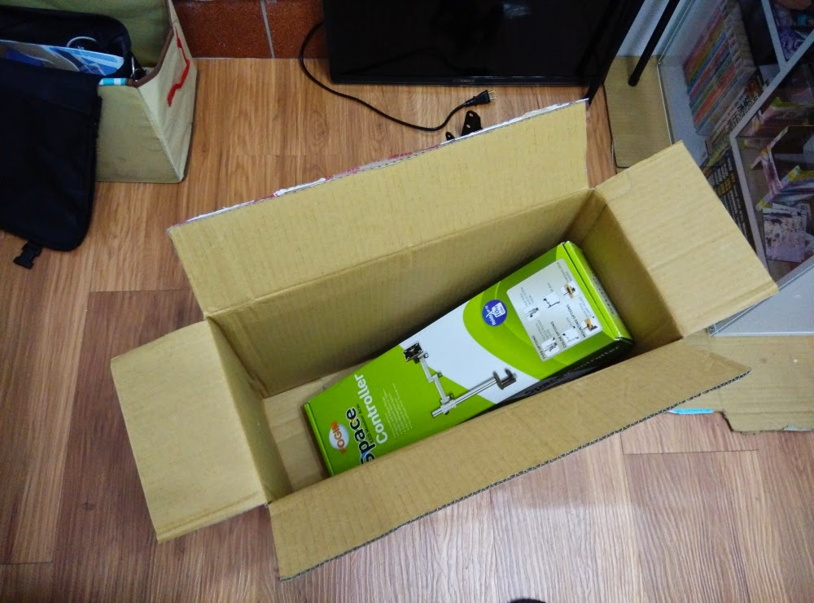](IMG%5F20141028%5F162526.jpg)

超大一個箱子裡面只放這一樣  
  
[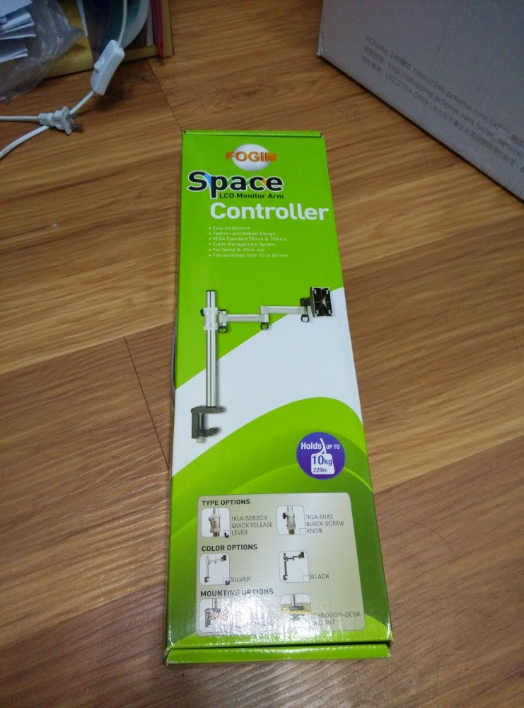](IMG%5F20141028%5F162658%5F2.jpg)

箱子正面  
  
[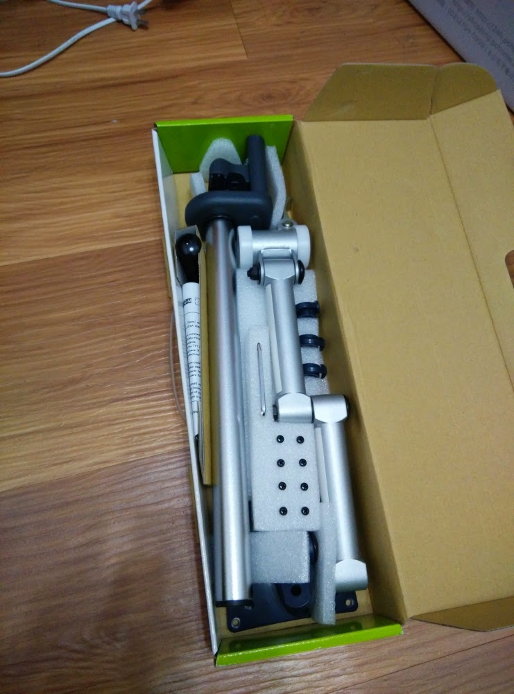](IMG%5F20141028%5F162728.jpg)

防震做的很不錯  

## 組裝

[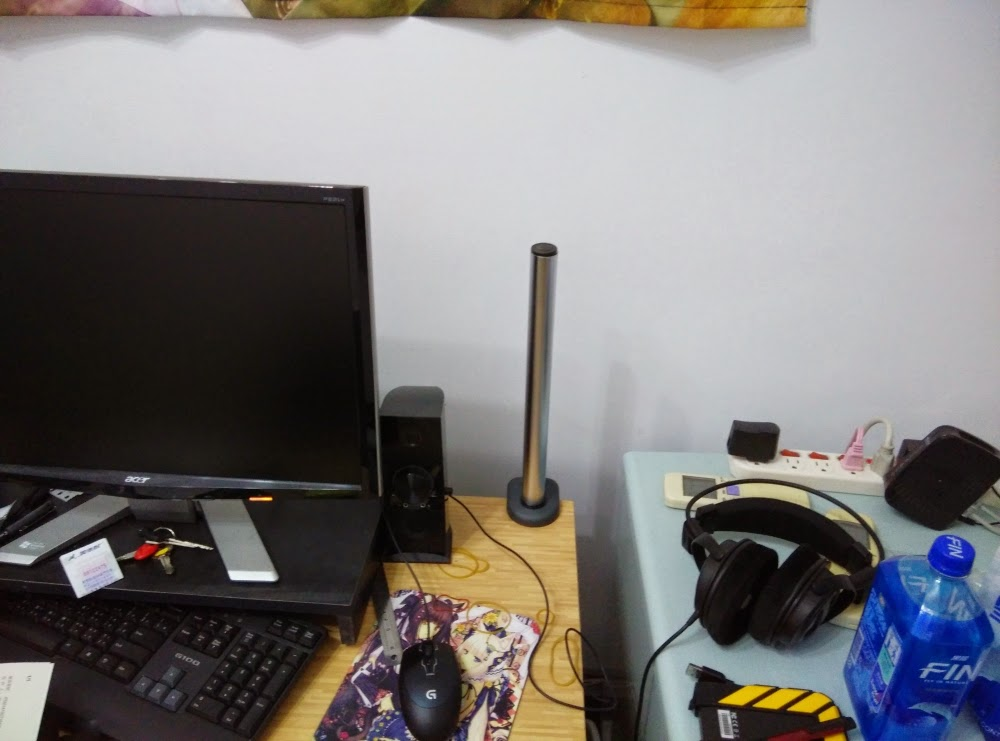](IMG%5F20141028%5F163704.jpg)

首先把桿子固定在桌上要鎖到最緊\~\~  
盒子裡有附簡易工具組，完全不需要其他工具就可安裝喔  
  
[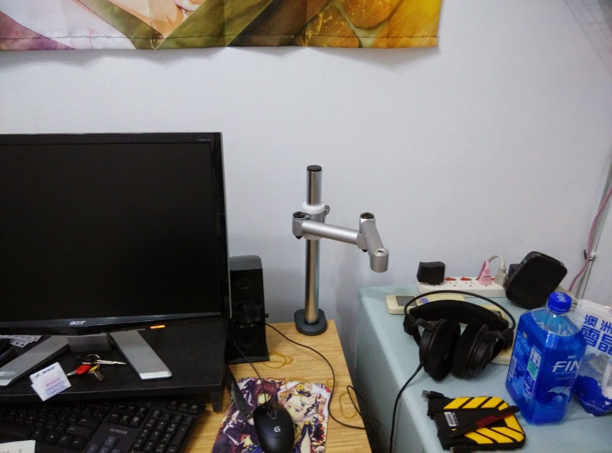](IMG%5F20141028%5F163831.jpg)

裝上懸臂看一下
  
[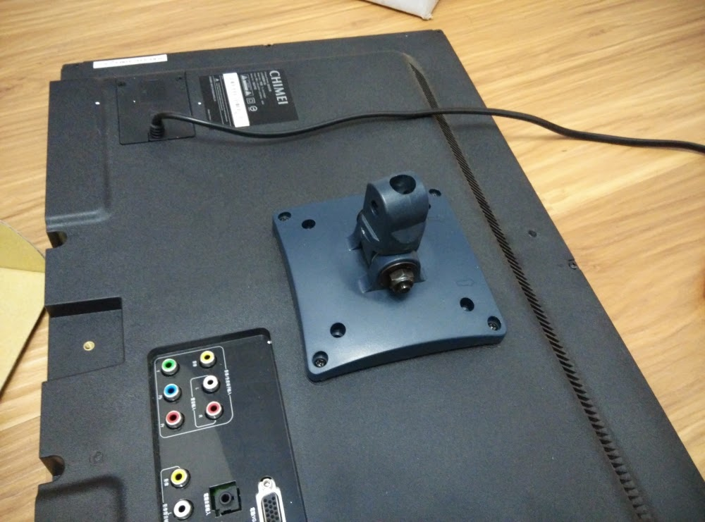](IMG%5F20141028%5F164915.jpg)

把螢幕後面這個固定好  
我瞧墊片瞧了半天=w=
  
[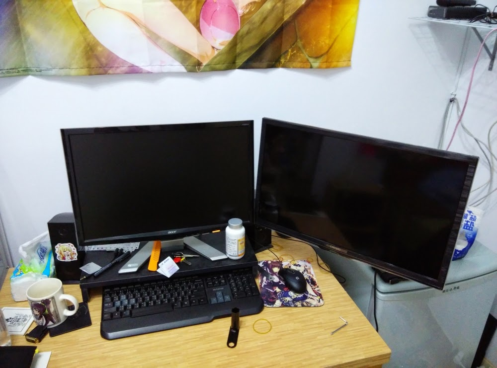](IMG%5F20141028%5F171117.jpg)

裝上去以後試擺看看，然後把他所緊
  
[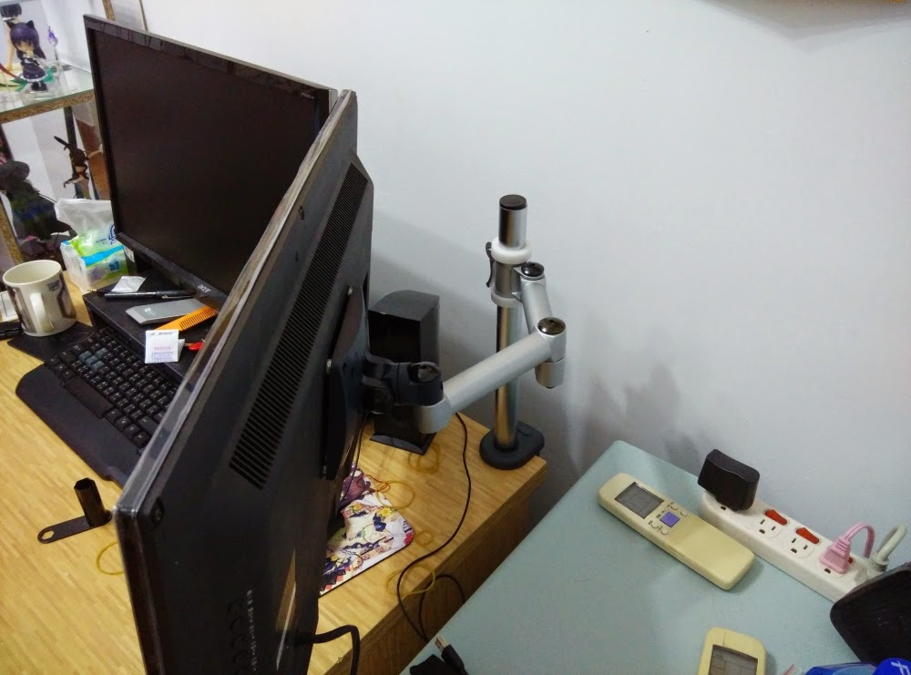](IMG%5F20141028%5F171132.jpg)

後面的樣子
  
[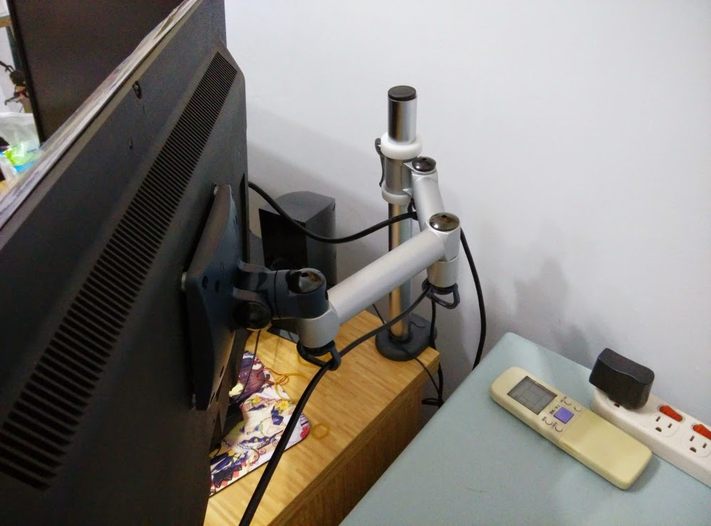](IMG%5F20141028%5F172125.jpg)

有附整線配件
  
[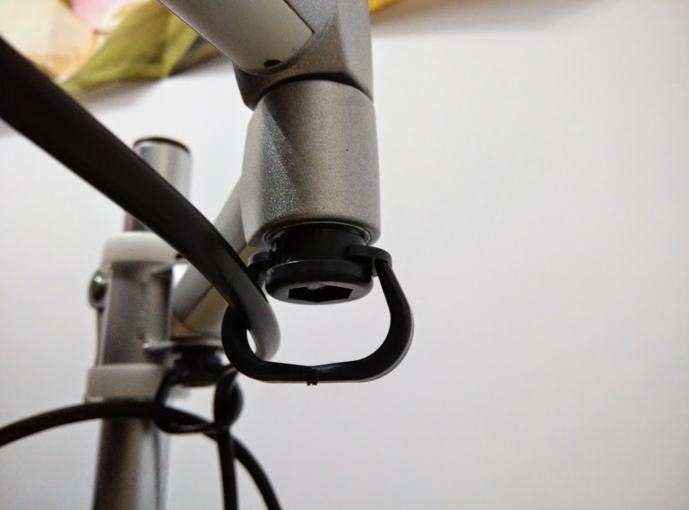](IMG%5F20141028%5F172204.jpg)

這是卡在六腳螺絲上面，很緊  
  
## 結論

大推\~  
整個設計得十分牢固，價格也可接受  
24" 螢幕裝上去完全沒問題  
  

最後我要說  
  
雙螢幕超爽的拉wwwwwwwwww
