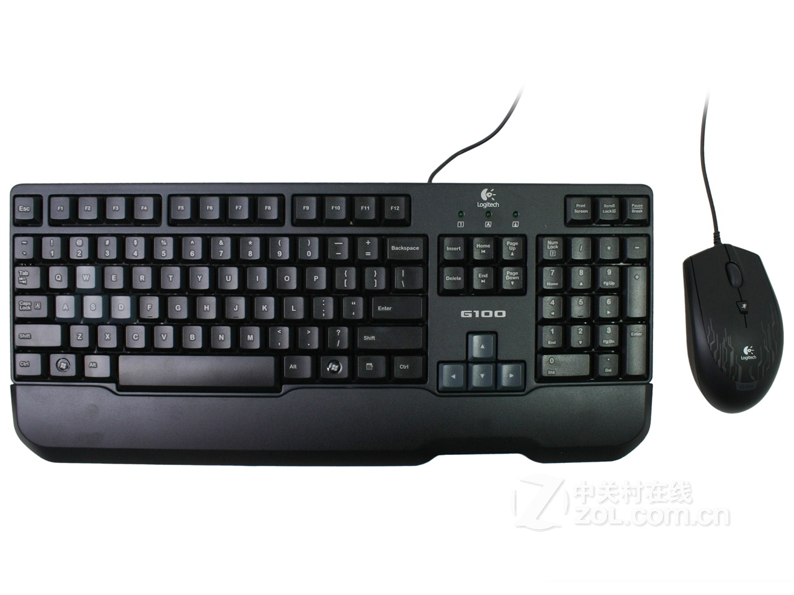
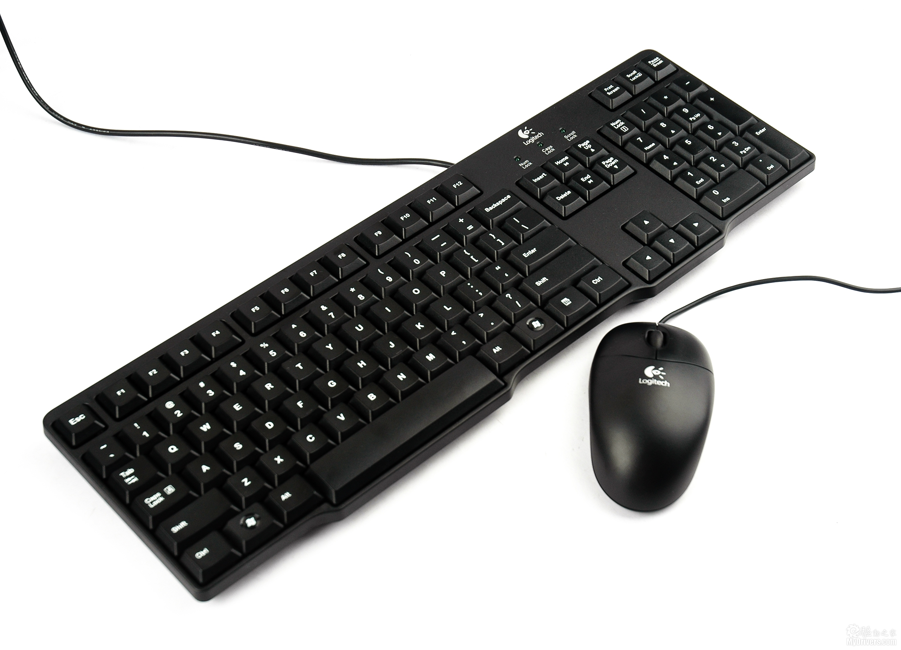

+++
title = "曬物~"
description = "曬物~"
date = 2011-11-12T06:46:00.001Z
updated = 2011-11-12T06:46:00.001Z
draft = false
aliases = [ "/2011/11/blog-post.html" ]

[taxonomies]
tags = [ ]
+++
Yes!曬物!曬鍵盤!曬滑鼠!曬鍵鼠組!!  
今日入手:**羅技G100遊戲鍵盤滑鼠組**&**羅技MK100鍵盤滑鼠組**

**G100**

**MK100**

  
就是如此。  <!-- more -->
  
恩，我還是解釋下好了..  
  
今天日本橋有辦活動  
"購買任意羅技商品，即可加1元購買..."  
其中的...有:腳踏車、鍵盤(有線跟無線)、滑鼠、鍵鼠組、USB(4G)、喇叭，還有雜七雜八一大堆  
  
本來我是想拿無線鍵鼠組的，結果...  
排我前面的拿走了最後一組!!(好像大家都是相中這個來的..)  
明明還有很多其他的!!  
明明我還想說有很多不用怕的!!  
為什麼!!!  
  
所以我就"勉為其難"地拿了有線的。  
  
後來上網查了它值多少錢...  
  
500元!!!  
小子，還不賴嘛...(拍肩)  
  
就是這樣，又小小的興奮了一下  
  
順便說一下"G100套裝"要1260元。  
  
什麼?你嫌太貴?我可是覺得物超所值呢!  
這是經過我 網路比價,找開箱文,貨比三家,深思熟慮，才下定決心,選擇了它,在日本橋,買了下去的啊!  
G1套裝可是一面倒的負評呢  
如果我沒找開箱文的話可能就要買到它了勒...  
  
說說我選G100的原因吧:  
鍵盤鍵位衝突支援到9鍵  
滑鼠有DPI切換鍵(滾輪下面那個):1000,1750,2500可快速切換  
符合人體工學  
羅技大廠  
看起來滿帥的  
  
恩，理由充分啊\~  
還有，這篇文章是用MK100打的  
不捨得G100在外面積灰塵呀\~

---

最後，幫日本橋宣傳一下:  
現在是15周年慶(2011/11月)  
辦會員卡免費  
很多東西優惠  
還有很多1元加購  
數量有限，要買要快!  
地點在:台南市東區北門路一段218號2樓  
<http://tw.mall.yahoo.com/store/jpgame>  
  
我已經去辦了，你還在等什麼!!  

---

咱抓到精髓了...  
  