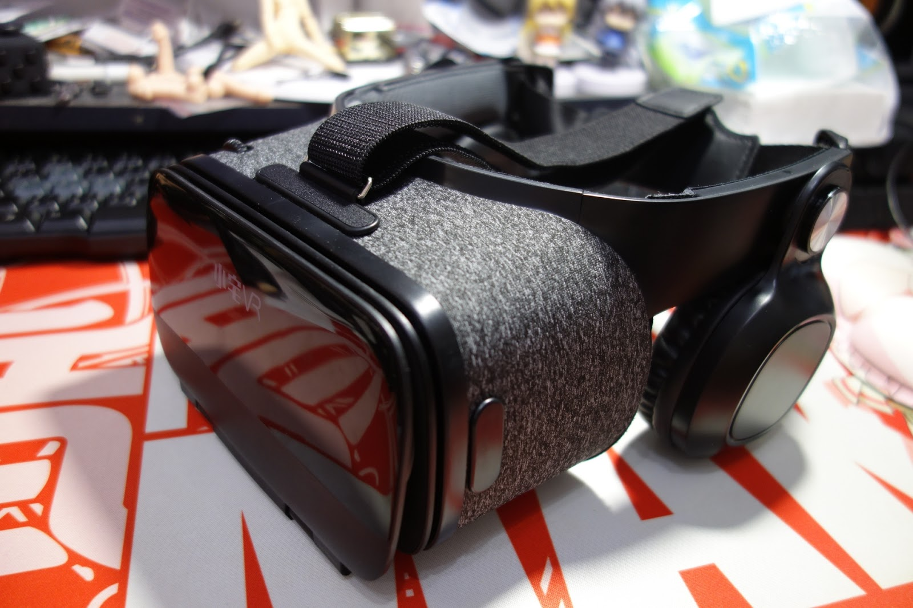

+++
title = "[開箱] VR 眼鏡小宅 Z5 青春版 2018 新款"
description = "[開箱] VR眼鏡 小宅Z5 青春版2018新款"
date = 2018-08-27T13:42:00.003Z
updated = 2018-08-27T13:42:00.003Z
draft = false
aliases = ["/2018/08/vr.html"]

[taxonomies]
tags = ["開箱文"]

[extra]
banner = "DSC06969.JPG"
+++

## 前言

最近迷上了一款幻影社的新遊戲──コイカツ！(Koikatu)，實在很想要看立體版的妹子跳舞，於是開始物色 VR 眼鏡 {{ch (body="(結論是手機 VR 眼鏡不能玩此遊戲)")}}。查了一下正規的 VR 設備都是數萬元起跳，窮肥宅實在是負擔不起，轉而看向了便宜實惠的手機 VR 眼鏡。想說就算不能玩 Koikatu，體驗看看也好，畢竟真的很便宜。玩不到 Koikatu 也有現成的影片能看嘛。<!--more-->

<figure>
{{ image(url="12.JPG")}}
<figcaption>結果畫面是有，只是沒手柄無法操作</figcaption></figure>

## 小宅 Z5 青春版 2018 新款

上網查了發現這種 VR 眼鏡款式很多，方便挑選就列出了目標條件:

* 有 T 字頭帶，聽說沒有上面那條會壓鼻子
* 有耳機
* 價位在 NT 千元以下

找著找著就發現了這款小宅 Z5 符合我的條件，而且台灣有代理商在各大網購販售，就手滑下去了 ww

<figure>
{{ image(url="DSC07004.JPG")}}
<figcaption>不理解為什麼代理商的價格比淘寶官方店鋪還便宜</figcaption></figure>

<figure>
{{ image(url="DSC06970.JPG")}}
<figcaption>質感棒棒der</figcaption></figure>

<figure>
{{ image(url="DSC06971.JPG")}}
<figcaption>附有瞳距調節及焦距調節功能</figcaption></figure>

<figure>
{{ image(url="DSC06972.JPG")}}
<figcaption>調整簡便的T字頭帶</figcaption></figure>

<figure>
{{ image(url="DSC06974.JPG")}}
<figcaption>軟墊摸起來類似安全帽內襯，不會有不透氣感</figcaption></figure>

<figure>
{{ image(url="DSC06975.JPG")}}
<figcaption>耳機音質一般般，觸感可，略夾耳</figcaption></figure>

<figure>
{{ image(url="DSC06976.JPG")}}
<figcaption>銀色圓圈是可動的，不會有對不上耳朵的問題</figcaption></figure>

<figure>
{{ image(url="DSC06977.JPG")}}
<figcaption>底下有音量+-和播放鍵</figcaption></figure>

<figure>
{{ image(url="DSC06979.JPG")}}
<figcaption>手機夾具算穩固，但是不會很難開，音源線從這裡接出來這裡補充一下，小宅Z5有做藍芽版的，只是台灣沒看到在販售，不然我是想買藍芽版</figcaption></figure>

<figure>
{{ image(url="DSC06985.JPG")}}
<figcaption>放入手機(小米5S Plus 5.7吋)尺寸正好</figcaption></figure>

<figure>
{{ image(url="DSC06986.JPG")}}
<figcaption>棒棒der</figcaption></figure>

<figure>
{{ image(url="DSC06983.JPG")}}
<figcaption>買眼鏡附贈的遙控器</figcaption></figure>

<figure>
{{ image(url="DSC06984.JPG")}}
<figcaption>橫看長這樣</figcaption></figure>

<figure>
{{ image(url="DSC06991.JPG")}}
<figcaption>附上說明書，功能很多，只是我不會用(點圖放大)</figcaption></figure>

<figure>
{{ image(url="DSC06992.JPG")}}
<figcaption>這是Z5的說明書</figcaption></figure>

## 結語

簡單的一句評語:「這東西可以買，八百多花的完全不後悔」，強烈推薦花點小錢體驗看看

<figure>
{{ image(url="DSC06988.JPG")}}
<figcaption>「好棒的奶......揉不到？！(#\`Д´)ﾉ」</figcaption></figure>
