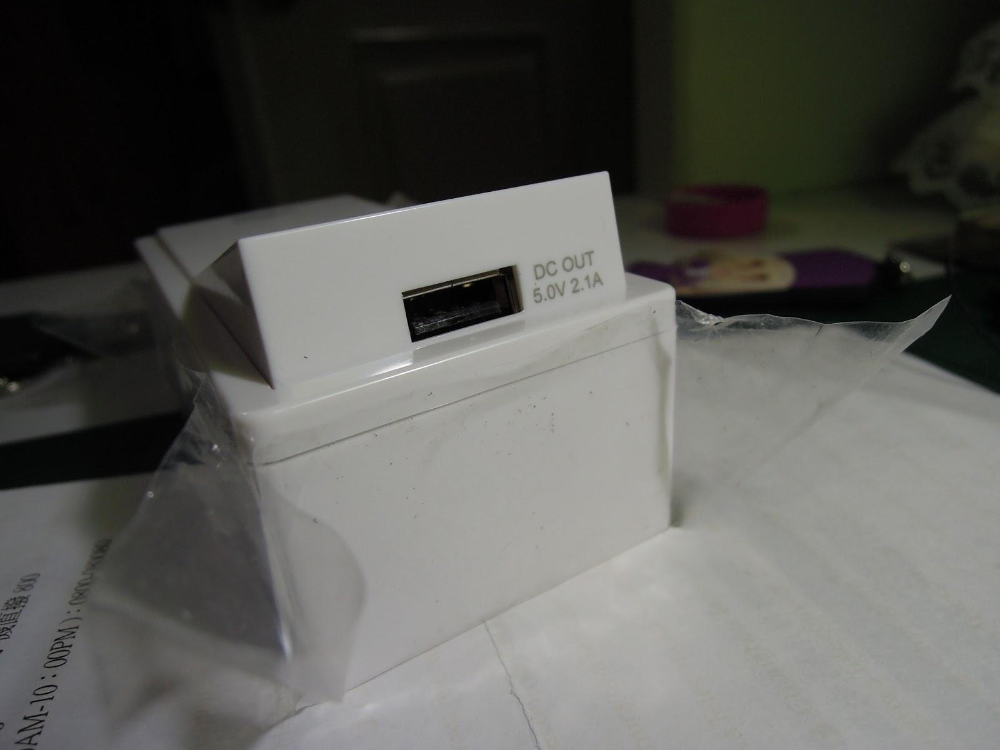
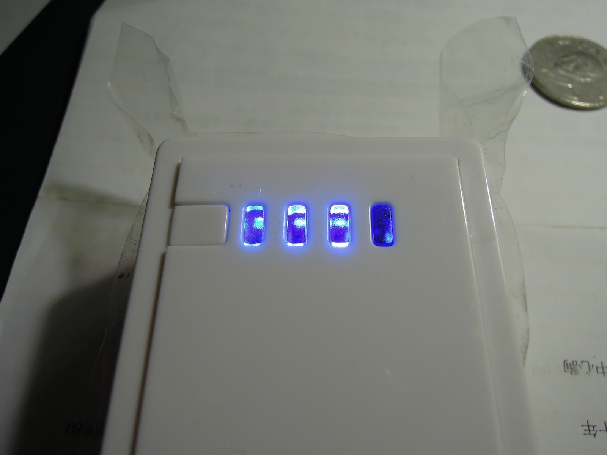

+++
title = "YADI MEL-06W 行動電源 6000mAh開箱照"
description = "YADI MEL-06W 行動電源 6000mAh開箱照"
date = 2013-05-11T14:08:00.001Z
updated = 2013-05-11T14:08:00.001Z
aliases = [ ]

[taxonomies]
tags = [ ]
licenses = [ "All Rights Reserved" ]

[extra]
card = "preview.jpg"
+++
**首先，我買這個沒有做過功課，而且還是網購。((←根本找死www**

直接上圖，這是我在良興購物網上看到的角度(的另一側)  
<http://www.eclife.com.tw/payeasy/moreinfo%5F69049.htm>

<!-- more -->
塑膠膜別在意我怕之後要退沒有撕

**申明:這東西NT299，感覺"不愧是299。"的樣子**

然而，我拆開後發現它之所以用那個角度拍是別有用心

各位看看側面:

真是驚煞我也www

正面  
我中班的弟弟看到後說:"門鈴!!"

還可以按下去這樣ww

這邊是Input↓

這邊Output↓

指示燈只是燈

背後的規格((包裝背後寫重量147g

它附的線材配件((兩個盒子裡的頭我個人用不到懶得拿出來

就這樣。

---

題外話

結果入手的隔天我阿姨就說:"我那邊有一個多的行動電源你要不要，是1000多塊的\~"
