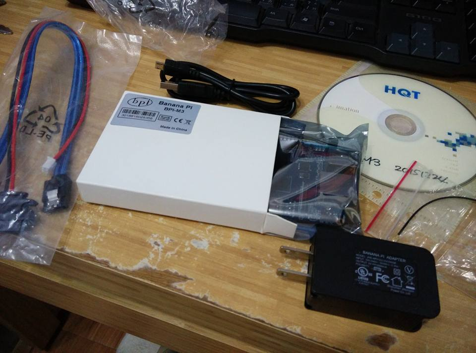
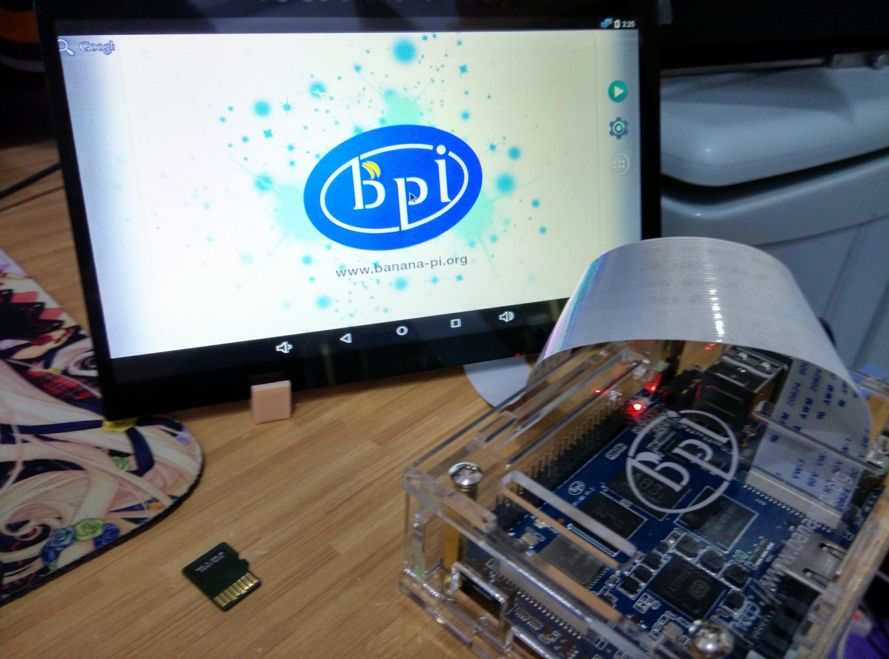

+++
title = "[開箱] Banana Pi 香蕉派 M3 各種體驗感想"
description = "[開箱] Banana Pi 香蕉派 M3 各種體驗感想"
date = 2016-03-07T21:53:00.003Z
updated = 2016-03-07T21:53:00.003Z
draft = false
aliases = [ "/2016/03/banana-pi-m3.html" ]

[taxonomies]
tags = [ "開箱文", "bananapi" ]

[extra]
card = "preview.jpg"
+++

## 先講結論

* 有買 [Bpi 官方 7 吋 LCD 螢幕](http://www.banana-pi.com/acp%5Fview.asp?id=83)?  
  → [BPI-M3\_Android\_LCD\_V2.img](http://forum.banana-pi.org/t/bpi-m3-new-image-android-5-1-vsersion-v2/1141)
* 沒有 [Bpi 官方 7 吋 LCD 螢幕](http://www.banana-pi.com/acp%5Fview.asp?id=83)?  
  → [BPI-M3\_Android\_HDMI\_V2.img](http://forum.banana-pi.org/t/bpi-m3-new-image-android-5-1-vsersion-v2/1141)
* 只要指令不要 X 介面?  
  → 除了 Android，所有 [Linux 鏡像](http://www.banana-pi.org/download.html)都行 (個人推 Arch)
* 想裝 Windows、OSX、Linux (含 X 介面)?  
  → 請按叉叉，另外去買台筆電。
<!-- more -->
---

## 感想

[香蕉派 M3 介紹](https://www.banana-pi.com/zh-banana-pi-sbcs/51.html)，詳情介紹自己看，請容我跳過。以下是詳細心得:

### [Android\_V2 版](http://forum.banana-pi.org/t/bpi-m3-new-image-android-5-1-vsersion-v2/1141)

1. 播放影片流暢: 25 分鐘的 mkv，大小 1.6G 的動畫可以撥放不 LAG
2. 不時會自己死當
3. 不能燒到記憶卡，必須直接燒進 emmc (詳見: <http://wiki.banana-pi.org.cn/cn/index.php?title=Burn%5FNanoM3>)
4. 3.5mm 音源輸出，必須在開機時就連接上。開機完成再連接他會抓不到，開完拔掉再插也抓不到
5. 沒有 Google 相關 Apps，安裝方法詳見:  
   <http://forum.banana-pi.org/t/installing-google-play-services-on-banana-pi-m3-android-l/1114/5>

<figure>
{{ image(url="2016_03_08_04.01.33.png") }}
<figcaption>GAPPS是我另外安裝的: <http://forum.banana-pi.org/t/installing-google-play-services-on-banana-pi-m3-android-l/1114/7> </figcaption></figure>

<figure>
{{ image(url="2016_03_08_04.01.50.png") }}
<figcaption>爽度爆表的Octa+5.1.1，只是會當機  </figcaption></figure>

<figure>
{{ image(url="2016_03_08_04.37.48.png") }}
<figcaption>Youtube可以正常撥放</figcaption></figure>

<figure>
{{ image(url="IMG_20160308_034016_HDR.jpg") }}
<figcaption>相機拍不太出來，不過有達到一般平板的水準。只有達到一般平板的水準。</figcaption></figure>

### [Android LCD\_V2 版](http://forum.banana-pi.org/t/bpi-m3-new-image-android-5-1-vsersion-v2/1141)

1. HDMI 輸出只有 720p，且畫質比 "HDMI\_V2 版" 的 720p 還糟
2. 用 bpi 官方的 7 吋電容觸控螢幕時，畫面還不錯，~~強烈建議買一塊~~ (後來用兩三下就壞掉了...)

<figure>
{{ image(url="IMG_20160305_171857_HDR.jpg") }}
<figcaption>LCD版可以兩邊同時輸出，不過HDMI的畫面不敢恭維 </figcaption></figure>

[Android HDMI\_V2 版](http://forum.banana-pi.org/t/bpi-m3-new-image-android-5-1-vsersion-v2/1141):

1. HDMI 輸出可調整 1080p/720p，畫質比 "LCD\_V2 版" 強一點，不過看起來還是很糟
2. 沒有支援 LCD 螢幕

<figure>
{{ image(url="IMG_20160308_030601.jpg") }}
<figcaption>左:一般電腦；右:Android HDMI 1080p輸出</figcaption></figure>

[Raspbian Jessie 1.0 HDMI 版](http://forum.banana-pi.org/t/bpi-m3-new-image-raspbian-jessie-debian-8-2015-11-21-mate-for-bpi-m3-20151208/849):

1. 基本上可運作，預設灌了 mate
2. 超 LAG
3. 影片撥放起來超超超超 LAG，估計是 GPU 沒支援
4. [Chromium 裝不起來](https://archlinuxarm.org/forum/viewtopic.php?f=60\&t=9109)
5. 玩了一會我果斷洗掉了。

<figure>
{{ image(url="IMG_20160304_184714_HDR.jpg") }}
<figcaption>記憶卡個人推薦Sandisk Extreme系列</figcaption></figure>

### [ArchLinuxARM Lite for BPI-M3](http://forum.banana-pi.org/t/bpi-m3-new-image-archlinuxarm-lite-for-bpi-m3-20151209/850)

1. 在一開始的 console 會被系統訊息洗頻，輸入 "dmesg -n 1" 可以停掉
2. 嘗試裝 Gnome 是我的失誤，3D 特效各種跑不動
3. [packer 掛了](https://aur.archlinux.org/packages/packer/) (好像是 2 月底的事)，不過這不是系統的錯
4. 改裝 LXDE 以後還是很 LAG，跟 Raspbian 不相上下
5. 後來我重裝了一次，並且沒有裝 x 介面，當成備援 Linux 系統

<figure>
{{ image(url="IMG_20160305_112401_HDR.jpg") }}
<figcaption>大LAG祭典(ﾉ>ω<)ﾉ  </figcaption></figure>

[Berryboot and GPU (PowerVR SGX544) included in Ubuntu Mate 15.10](http://forum.banana-pi.org/t/bpi-m3-new-image-berryboot-and-gpu-powervr-sgx544-included-in-ubuntu-mate-15-10/1133)

1. 我沒試
2. 雖說支援 GPU 了，不過看下面留言似乎少一個 HW video decoder
3. ↑我才知道其他版本的 Linux 原來都不支援 GPU↑  
   (╯‵□′)╯︵┴─┴

<figure>
{{ image(url="IMG_20160308_022412.jpg") }}
<figcaption>用dd備份的時候，發現加上bs=10M速度可以快6倍左右..  </figcaption></figure>

## 結論

目前我留下來的系統有兩個: Android LCD\_V2 版 + ArchLinux (純 console)。Android 拿來普通使用，Arch 做備援 Linux 系統，畢竟 Android 不方便下 command。期待官方繼續更新系統，讓其他 Linux 系統也能吃好吃滿\_(:3 」∠ )\_

<figure>
{{ image(url="IMG_20160307_132539_HDR.jpg") }}
<figcaption>用行動電源驅動，拍完照的瞬間就電壓不穩shut-down了..Orz </figcaption></figure>

## 你會想看

1. Banana Pi 创客社区 - Powered by Discuz! <http://forum.banana-pi.org.cn/forum.php>
2. 蕉友社 Banana Pi 同好會 <https://www.facebook.com/groups/274014402781734/>
3. 香蕉廚坊 | 用一個 Pi 翻轉世界 <http://www.bananapi.com.tw/>
4. Banana Pi 香蕉派开源硬件单板计算机 <http://www.banana-pi.com/index1.asp>
5. 传承与突破 —— 八核开源开发板 BananaPi-M3 评测 - 21IC 中国电子网  
   <http://www.21ic.com/evaluation/MCU/201512/657245.htm>
6. 頭城國小資訊組 | Banana Pi 測試 - ArchLinux 篇  
   <http://blog.ilc.edu.tw/blog/blog/25793/post/84386/514334>
7. \[BPI-M3 ]How to burn linux images to eMMC Storage on your BPI-M3 - Banana Pi BPI-M3 - banana pi single board computer official forum SinoVoip BPI team  
   <http://forum.banana-pi.org/t/bpi-m3-how-to-burn-linux-images-to-emmc-storage-on-your-bpi-m3/1214?u=sinovoip>
8. Burn NanoM3 - BANANA PI WIKI  
   <http://wiki.banana-pi.org.cn/cn/index.php?title=Burn%5FNanoM3>
9. Banana Pi BPI operating system downloads <http://www.banana-pi.org/download.html>
10. Installing Google Play Services on Banana Pi M3 Android L - Banana Pi BPI-M3 / Android - banana pi single board computer official forum SinoVoip BPI team  
    <http://forum.banana-pi.org/t/installing-google-play-services-on-banana-pi-m3-android-l/1114/5>
11. Bananapi 系列开发板使用 3.7V 锂电池供电工作 - Banana PI 的个人页面 - 开源中国社区  
    <http://my.oschina.net/Bananapi/blog/604392?fromerr=F904yn3F>
12. \[Linux 安裝篇 #5] 上路吧！展開雙手歡迎 Arch Linux！ - iT 邦幫忙::IT 知識分享社群  
    <http://ithelp.ithome.com.tw/question/10158495>
