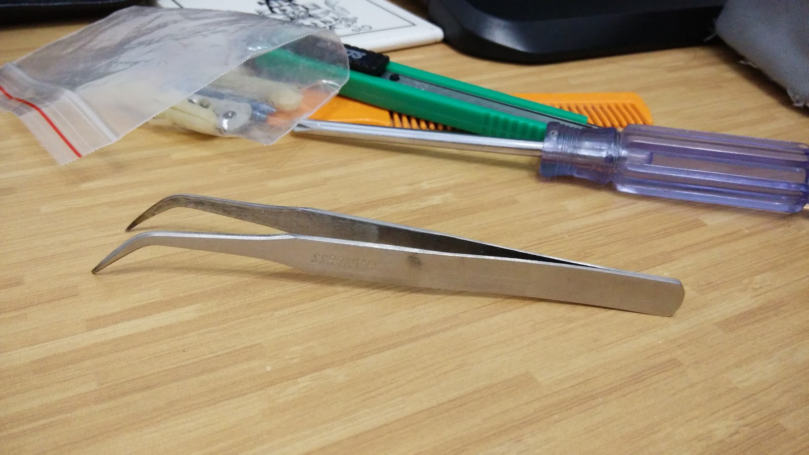
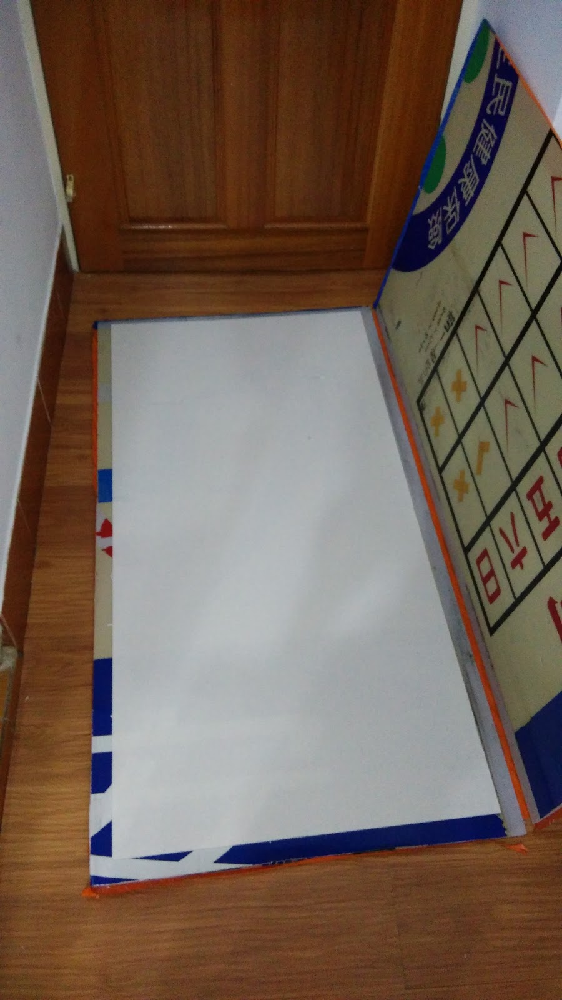
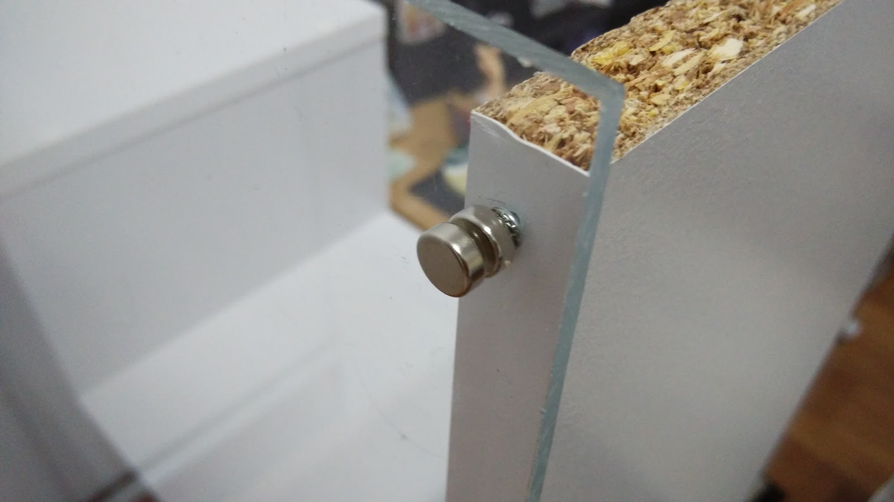
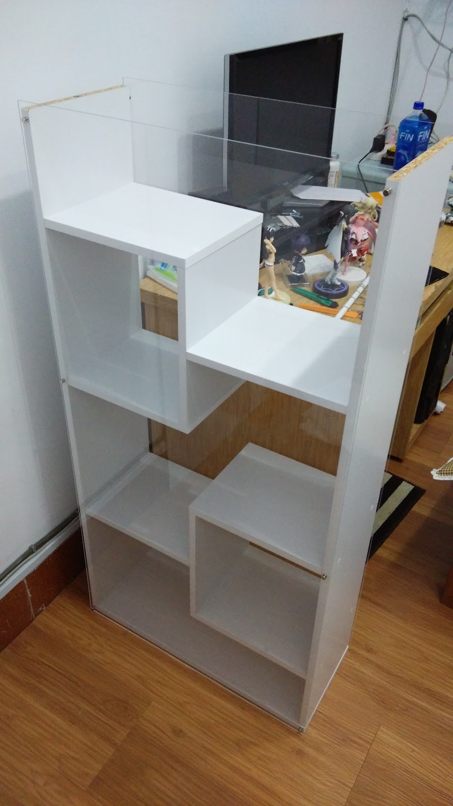
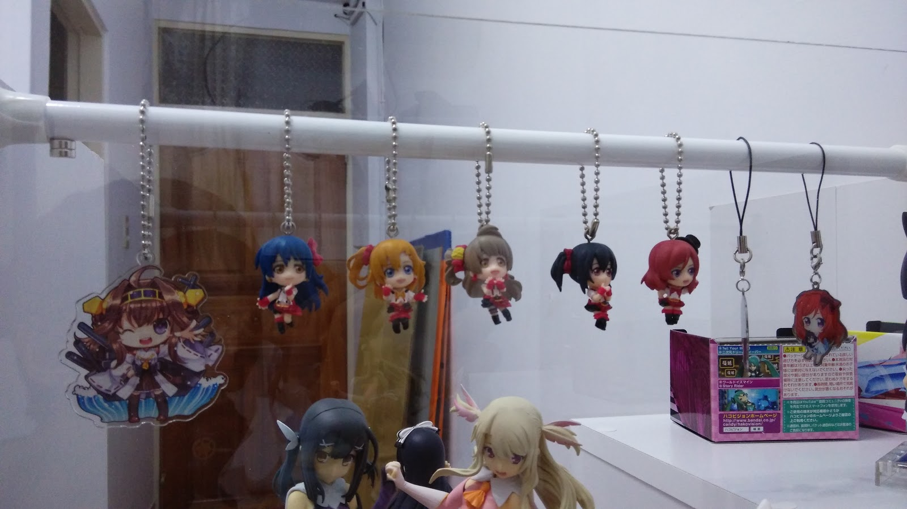
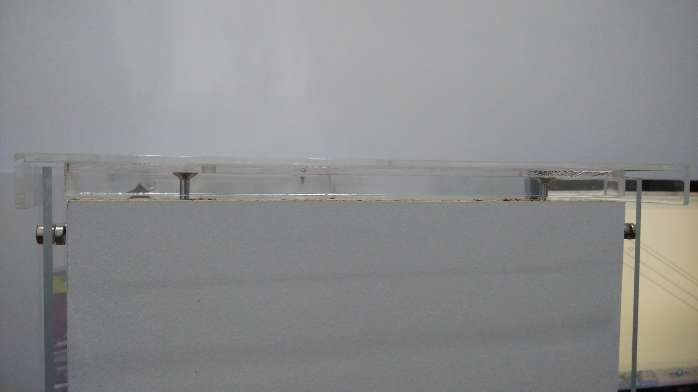

+++
title = "我的展示櫃~~(圖多殺貓)"
description = "我的展示櫃~~(圖多殺貓)"
date = 2014-10-13T00:36:00.003Z
updated = 2016-03-12T11:29:27.212Z
draft = false
aliases = [ ]

[taxonomies]
tags = [ ]
licenses = [ "All Rights Reserved" ]
+++

## 製作動機

有一個自己的櫃子是所有 PVC 收藏者的夢想吧w

之前跟家人住時我家一直是 "超" 擁擠狀態，我家弟妹多，老媽又是不丟東西的個性 (ry  
前兩年雖說搬出來了，不過是住在學校宿舍，跟室友一起住沒辦法弄櫃子阿\_(:3」∠)\_  
現在來到台中在外面租房子，這就是圓夢的時刻惹wwwww ヽ (・̀ω・́) ゝ
<!-- more -->
## 製作過程

因為是一部份一部份漸漸完成的，所以依照日期來寫

### 2014/09/18

首先是尋找適合的本體  
重頭做也是 OK，不過拿現成的來改比較簡單\~  
現役大學生預算比較少，直接砸數位藍色小朋友買現成的先排除 Orz

結果我找到了這個  
<http://24h.pchome.com.tw/prod/DEAB6C-A90054J92>  
櫃子本體 649 元

就決定是你惹 wwwwwwww

隔天到貨

照著圖組裝開始\~

貼貼紙的時候由於手指太粗  
於是我請出了神器ww

最後一步驟的背板我沒有釘起來  
本來就是想要兩面都可以看的效果  
試擺如下:

**截至目前花了 649 元**  
**成員新增: 黑貓、伊莉亞、黑貓 ver. 泳裝、LL 吊飾小黏土人**

### 2014/09/20

靈機一動把他拉成橫的

### 2014/09/22

網購了伸縮桿一根  
加運費 70 元

**截至目前花了 649+70=719 元**

### 2014/09/23

如果不蓋起來會積一堆灰塵\~\~  
就找壓克力場做了兩片壓克力板  
兩片加起來含運 1200 元

**截至目前花了 719+1200=1919 元**

### 2014/09/25

看伊莉亞好孤單，還是決定把美遊帶回家陪她 ww  
詳細開箱就不附了

拍的時候覺得採光很差，打檯燈也不是長久之道  
靈機一動就把上面拆掉惹\~\~  
果然整個超讚  
不過又有積灰塵問題....

~~什麼? 你問鏡子? 我什麼都不知道喔呵呵呵呵呵呵 wwww~~

**成員新增: 美遊**

### 2014/09/26

磁鐵來拉 wwwwwwwwwwwwwwww  
終於可以把壓克力板固定上去了開馨 (・∀・)

擺進去

細部:

幫別人代購的 LL PSV 遊戲也到了  
跟他單獨買了這隻小的 Maki 醬  
Maki 醬 prprprprprprprprprprprprprprpr\~

~~哇\~ 是純白胖次欸\~~~

**成員新增: 小 Maki 醬**

### 2014/10/04

受到上面的鏡子衝擊就跑去附近的玻璃行訂做了明鏡  
10/04 收到以後試擺

果然鏡子超讚阿 (///ω///)

訂做清單  
15.5cm\*24cm\*1  
26.5cm\*24cm\*2  
28cm\*24cm\*4  
29.5cm\*24cm\*3  
33cm\*24cm\*1  
明鏡 + 光邊共 2000 元

**截至目前花了 1919+2000=3919 元**

### 2014/10/05

之前看到這個覺得超有才就手滑了

<http://mh.5652.com/news/info/id/9867>

今天收到貨，立刻把他披在兩位蘿莉身上... ⊂彡☆))Д´)

**成員新增: 莉雅絲的歐派**

### 2014/10/10

小插曲  
訂做了關東旗 199 元

### 2014/10/11

壓克力頂棚來了\~\~\~

拆開以後我疑惑了 (´・ω・｀)  
這兩根小柱子跟我訂的不一樣欸，應該是實心柱子才對  
跟廠商溝通以後發現有誤會  
說是之後再補我實心柱子

這家邊緣沒有黏合的很好  
其中一邊輕輕一掰就開了...

放上去\~\~\~\~\~

壓克力頂棚 + 小柱子含運 850 元  
**截至目前花了 3919+850=4769 元**

## 最終狀態

目前到這，就是各位看到的樣子了  
算是大功告成於是上來發了一篇心得文自爽 (O  
一開始沒想到會這長來著，也沒想到會噴這麼多錢  
早知道直接買個貴一點的櫃子就好了說\_(-ω-\`\_)⌒)\_

感謝各位的收看，我們等我錢包滿一點再見\~
