+++
title = "ドラゴンマガジン11月号 + 「ハイスクールD×D」おっぱいブックカバー 開箱"
description = "ドラゴンマガジン11月号 + 「ハイスクールD×D」おっぱいブックカバー 開箱"
date = 2014-10-05T08:17:00.000Z
updated = 2014-10-05T08:17:00.000Z
aliases = [ ]

[taxonomies]
tags = [ ]
licenses = [ "All Rights Reserved" ]

[extra]
card = "BxzVHrqCQAAlUym.jpg"
+++
[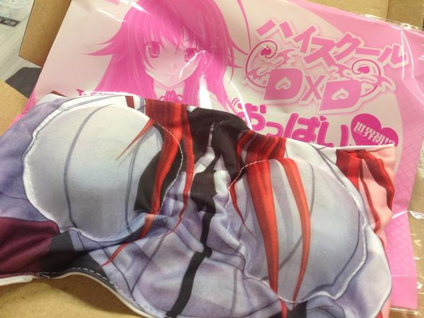](BxzVHrqCQAAlUym.jpg)

標題這行日文直翻就是  
DRAGON MAGAZINE 11月號 +  
"惡魔高校D×D"歐派書套  
  
歐派書套呢wwwwwwwwwwwwwwwwwwwwwww  
上個月看到覺得超有才就手滑了，這還是我第一次購入日文雜誌  
  
不廢話上圖  
  <!-- more -->
---

[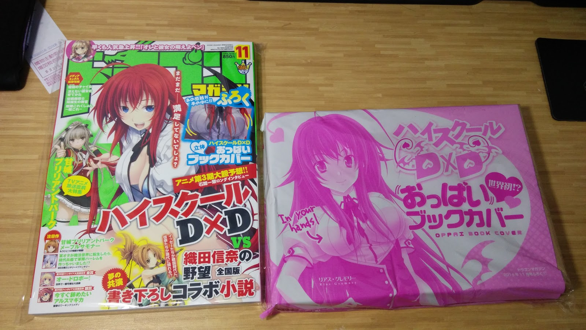](IMG%5F20141005%5F145522.jpg)

[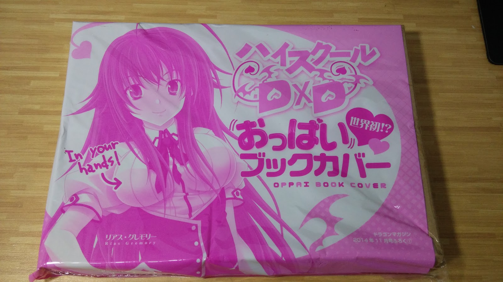](IMG%5F20141005%5F145534.jpg)

[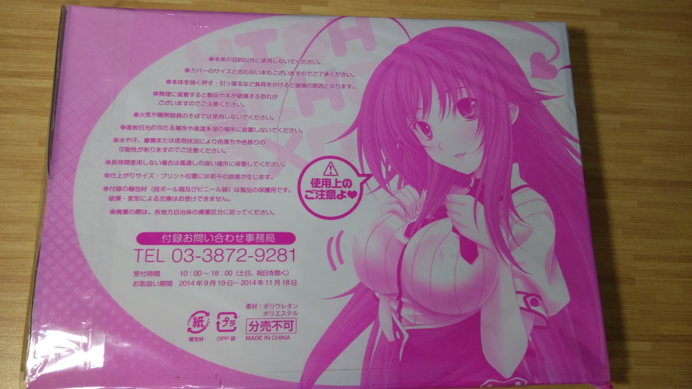](IMG%5F20141005%5F145543.jpg)

[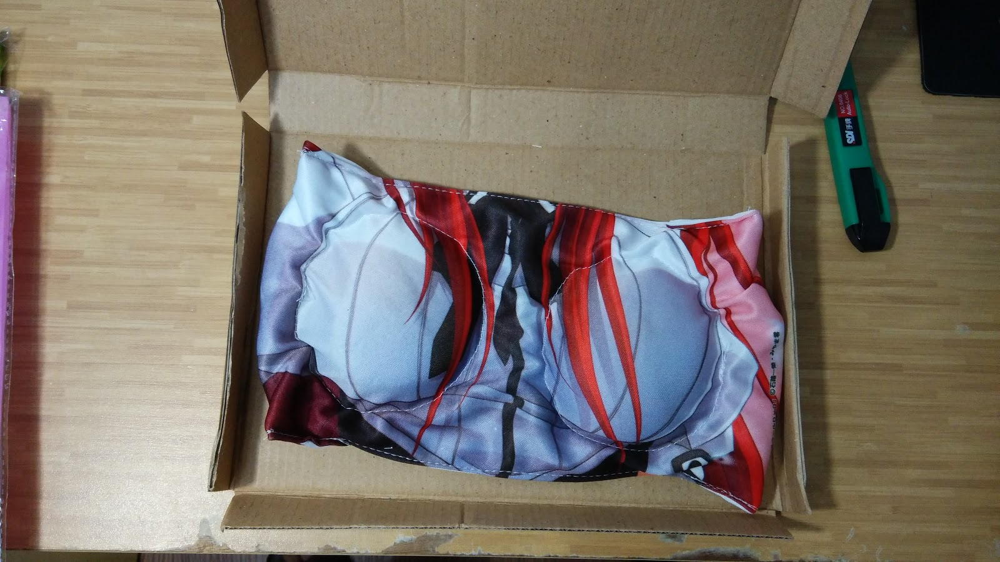](IMG%5F20141005%5F145658.jpg)

[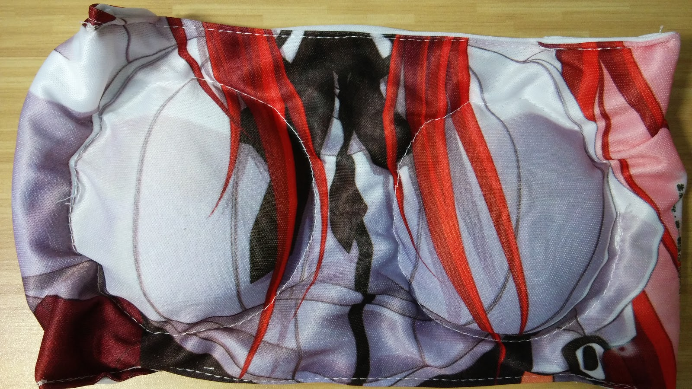](IMG%5F20141005%5F145710.jpg)

[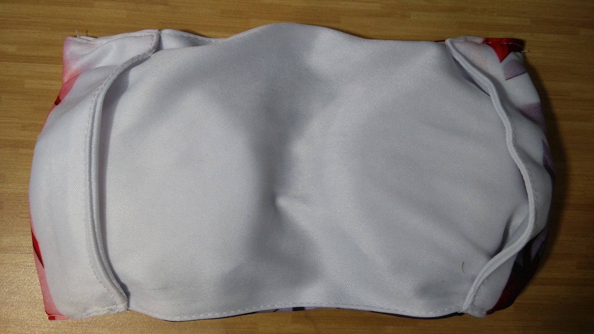](IMG%5F20141005%5F145721.jpg)

[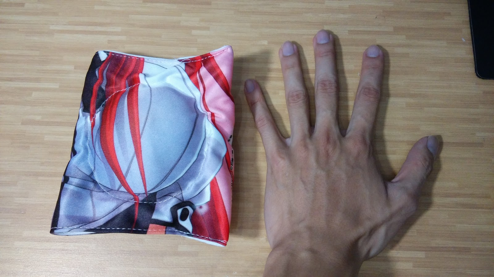](IMG%5F20141005%5F145851.jpg)

原來日本的文庫本這麼小((爆  
我手上沒有書可以套，下面放幾張[富士見官方twitter的圖](https://twitter.com/fantasia%5Fbunko/status/512518787761840128) (若不妥請告知我立即移除)  
  
[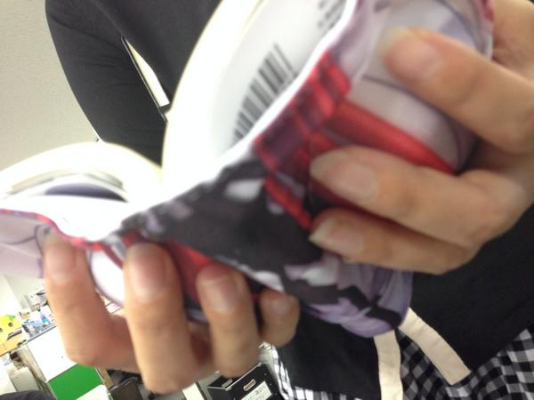](BxzVHjKCMAElG0L.jpg)

[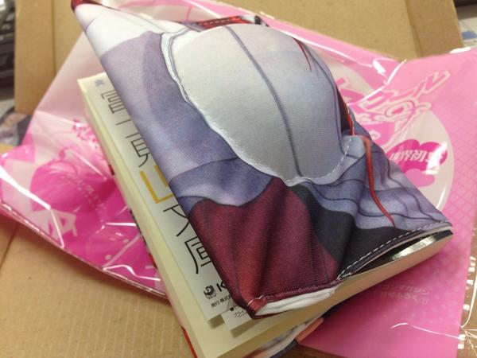](BxzVHpECEAE23bP.jpg)

  
最後來一張~~喪心病狂的~~比較圖:  
.  
.  
.  
.  
.  
.  
.  
.  
.  
.  
.  
.  
.  
.  
.  
.  
.  
.  
.  
.  
.  
.  
.  
.  
.  
.  
.  
.  
.  
.  
.  
.  
.  
.  
.  
.  
.  

[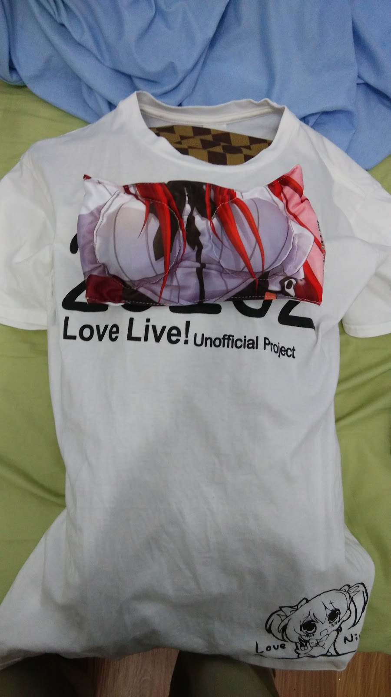](IMG%5F20141005%5F151222.jpg)
