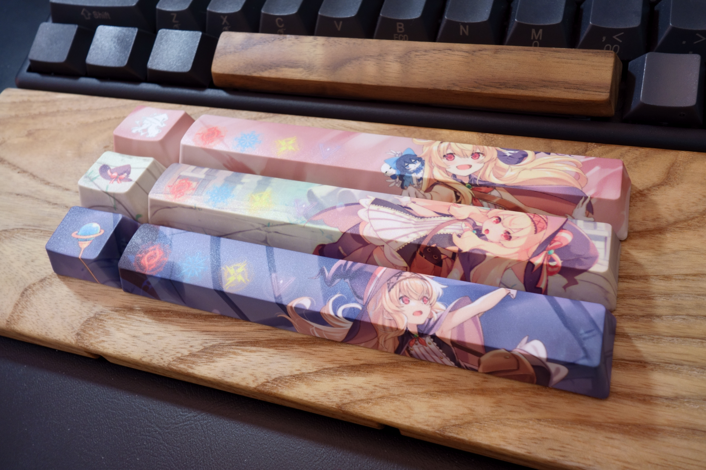
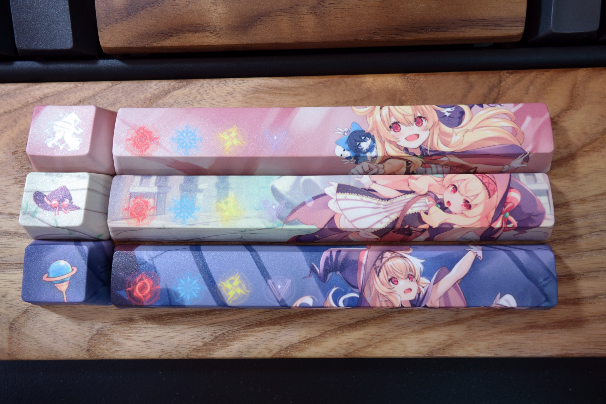
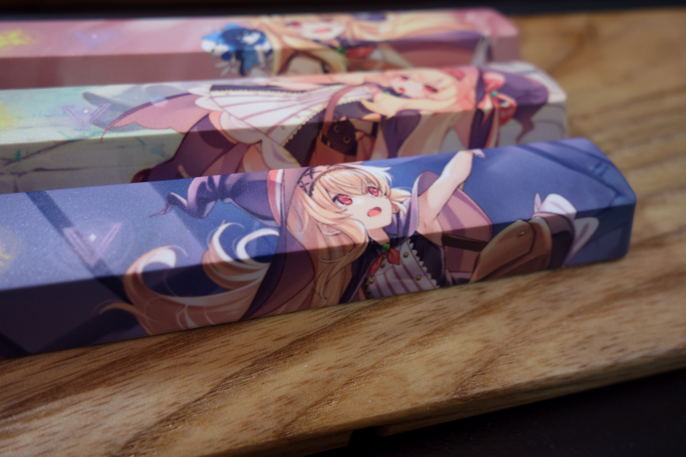
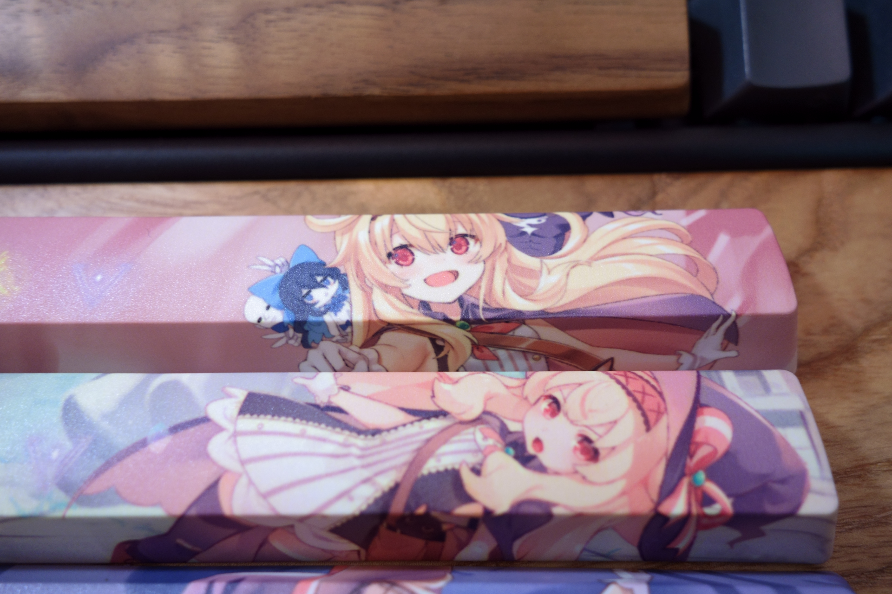
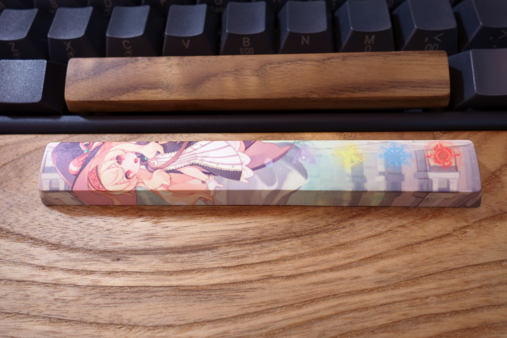
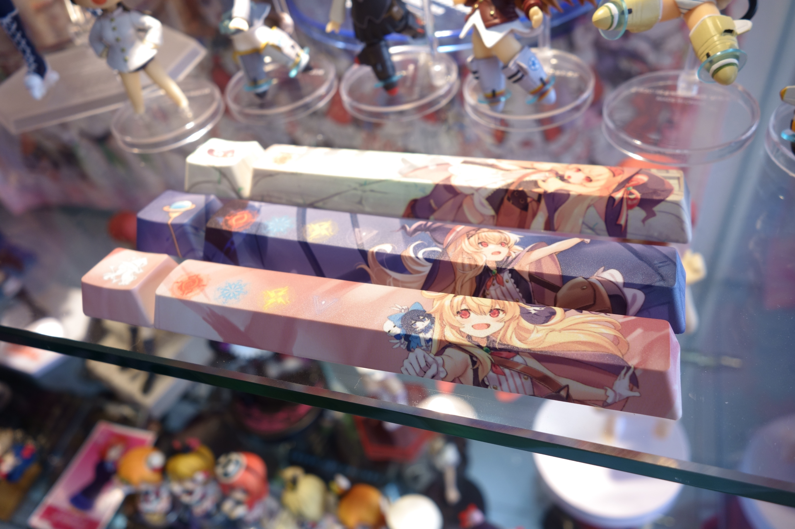

+++
title = "[開箱] iRocks x 小魔女諾貝塔 PBT熱昇華鍵帽組"
description = "[開箱] iRocks x 小魔女諾貝塔 PBT熱昇華鍵帽組"
date = 2020-08-31T04:31:00.017Z
updated = 2021-10-31T11:08:01.812Z
draft = false
aliases = ["/2020/08/irocks-keycaps-little-witch-nobeta.html"]

[taxonomies]
tags = ["開箱文"]

[extra]
banner = "preview.PNG"
+++

前幾天看到 iRocks 的推文，ㄌㄌ真香  
整組 NT599，在[這裡](https://www.pcstore.com.tw/i-rocks/M70788634.htm)賣  
真心不貴，手刀下單

PBT 質感不用贅述，表面的些微顆粒感摸起來很棒  
耐磨度不明也不在意，反正我是要進收藏的

圖案稍嫌模糊  
PBT 磨砂表面，在印刷後是有點霧  
總之不會很嚴重，不做負面評價

<iframe allow="encrypted-media" allowtransparency="true" frameborder="0" height="734" scrolling="auto" src="https://www.facebook.com/plugins/post.php?href=https%3A%2F%2Fwww.facebook.com%2FIROCKS.HQ%2Fposts%2F5030420573650370&amp;width=500" style="border: none; max-width: 500px; overflow: hidden; width: 100%;"></iframe>

這張拍給反裝鍵帽參考

放進我的展示櫃w

