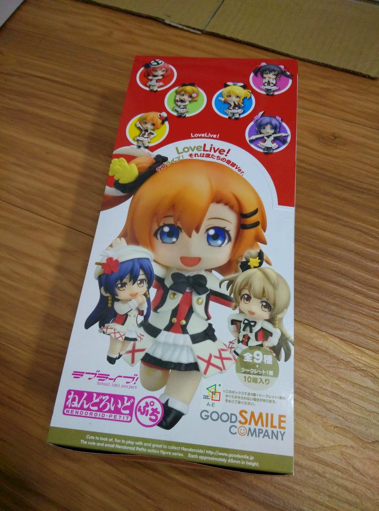
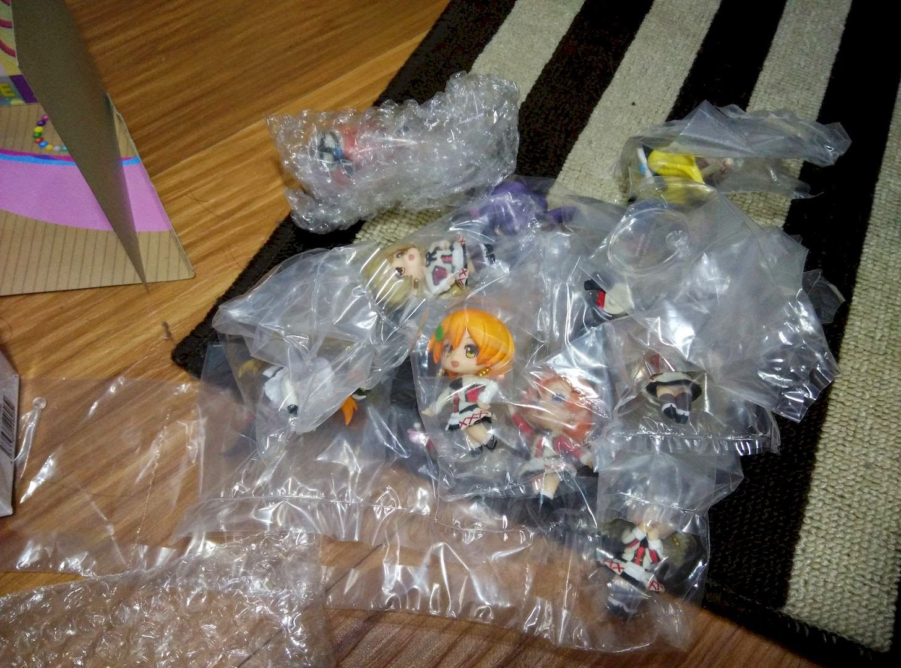

+++
title = "ねんどろいどぷち ラブライブ！ それは僕たちの奇跡Ver. 正統開箱"
description = "ねんどろいどぷち ラブライブ！ それは僕たちの奇跡Ver. 正統開箱"
date = 2015-02-07T22:17:00.000Z
updated = 2020-08-30T16:59:12.015Z
aliases = [ ]

[taxonomies]
tags = [ "開箱文" ]

[extra]
banner = "preview.jpg"
+++

## 購入緣由

自從成為LLer以後，緣由神馬的就（ry  
  
## 詳細資訊

GSC官網：[ねんどろいどぷち ラブライブ！ それは僕たちの奇跡Ver.](http://www.goodsmile.info/ja/product/4567/%E3%81%AD%E3%82%93%E3%81%A9%E3%82%8D%E3%81%84%E3%81%A9%E3%81%B7%E3%81%A1+%E3%83%A9%E3%83%96%E3%83%A9%E3%82%A4%E3%83%96+%E3%81%9D%E3%82%8C%E3%81%AF%E5%83%95%E3%81%9F%E3%81%A1%E3%81%AE%E5%A5%87%E8%B7%A1Ver.html)

ねんどろいどぷち ラブライブ！ それは僕たちの奇跡Ver. 10個入りBOX
  
製品仕様

【1BOX】10個入り

【1個あたり】ABS＆ATBC-PVC塗装済み可動フィギュア入り

【スケール】ノンスケール

【サイズ】各・全高：約65mm

【セット内容一覧】

＜1個あたり＞

フィギュア本体

専用台座
  <!-- more -->
## 開箱START

※圖片點開皆有大圖

所謂正統開箱w

打開拉\~\~國父們是店家特價退款

中盒外盒

喔喔好多果果臉

一中盒有十小盒

附贈的STAGE

說實話滿小的

小盒近照

這是代理版

拆開來裏面有用啵啵啵包著

好長一條wwwwww

總之先全部拆開

經過一陣奮戰..

  

  
妮可最長w

  
※以下按照隨機開箱順序※

  

  

  

  

  

  

  

  

  

試擺\~\~  

全部塞進去整個超擠Orz  

## 感想

以景品來說，原型設計出色，裝配也不錯

就是塗裝品質有點可惜((畢竟還是景品Orz

幾個要手動組裝的頭飾十分緊，捏的我手好痛OAQ

STAGE 有點略小，之後考慮把妹抖 (‧8‧) 分開放

整體來說令人滿意

---

## 同場加映

老婆撲街

這是一隻手指頭。  

這是五隻手指頭。  

什麼時候會有休假呢？  

  
該考慮買台好相機拍她們了恩=w=
