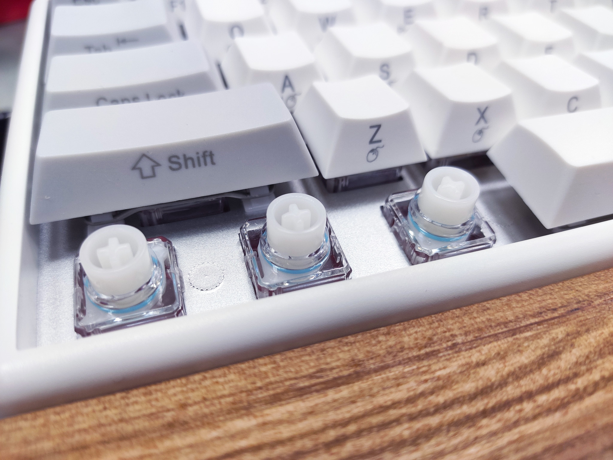
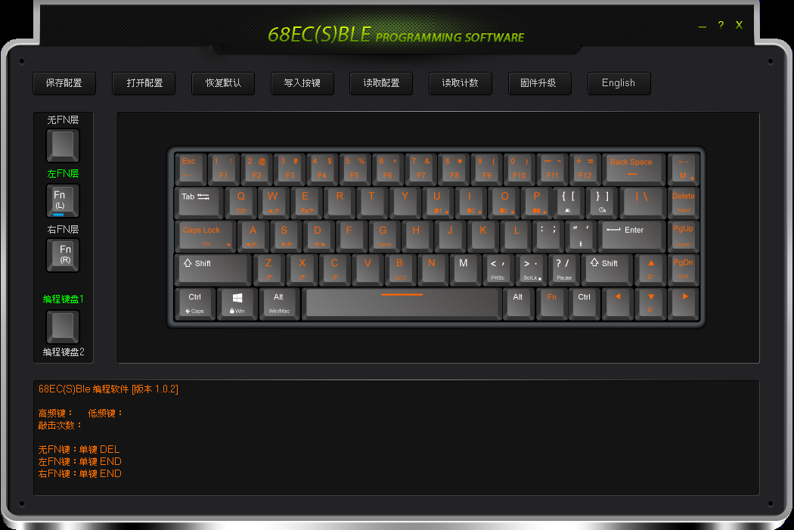

+++
title = "[開箱] NIZ ATOM68 MICRO82 靜電容鍵盤 - CP 值高的靜電容軸選擇"
description = "一起來看看我的主力鍵盤吧!"
date = 2020-09-11T09:27:00.033Z
updated = 2021-10-31T11:06:23.550Z
draft = false
aliases = [
  "/2020/03/niz-atom68-micro82.html",
  "/2020/03/niz-atom68.html"
]

[taxonomies]
tags = [ ]
licenses = [ "All Rights Reserved" ]

[extra]
banner = "preview.JPG"
featured = true
+++
<figure>
{{ image(url="preview.JPG") }}
<figcaption>NIZ MICRO82 靜電容鍵盤 + SA 午夜鍵帽</figcaption></figure>

我身為程式設計師，每天會在電腦前坐 12 小時以上，敲著鍵盤累積指關節的疲勞  
滑鼠換成軌跡球，擺脫了腕隧道症候群的困擾，那麼手指關節怎麼辦呢?  
答案就是 ── 靜電容軸!  
一起來看看我的主力鍵盤吧! ‹‹\\(´ω\`)/››‹‹\\( ´)/››‹‹\\( ´ω\`)/››

<!-- more -->

## 前言

今年年初突然跌進了鍵盤大坑，起因是因為我買了 logi K580...... 逆向推坑

我在辦公室有在桌電↔筆電間切換的需求，所以想找支援藍芽切換的鍵盤，結果就是 logi K580  
(我的 DEFT PRO 已支援跨裝置切換，故沒考慮 KVM)

<figure>
{{ image(url="k580-2.jpg") }}
<figcaption>logi K580 和 ELECOM DEFT PRO</figcaption></figure>

買了一個月後發現薄膜...... 打到手指會痛  
我為什麼從來沒有想到要買機械鍵盤 \_(┐「ε:)\_  
作為一個一天摸十幾小時鍵鼠的資訊人，買三千多的軌跡球 OK，買把好點的鍵盤當然也 OK

這是必要投資 (?) (・∀・) つ**⑩**

第一把買了鴨鴨 SF {{color(color="#b45f06", body="茶軸")}}，確信了我喜歡 6X% 尺寸，並且影響到我的習慣配列  
去掉數字鍵區是為了讓滑鼠和主鍵區更靠近，減少右手的移動  
另外外接數字鍵盤放右前方，要用再拉過來就行  
而編輯鍵區無法完全捨棄，只留下一排，搭配 Fn 使用也足夠了

<figure>
{{ image(url="duckySF.jpg") }}
<figcaption>Ducky One 2 SF 鍵盤 + Ducky 英文側刻鍵帽混個性鍵帽 + Zenzo 原木手托</figcaption></figure>

第二把買了 NIZ ATOM68 靜電容...... 自此回不去機械軸惹 (((ﾟДﾟ;)))

<figure>
{{ image(url="niz_ori.jpg") }}
<figcaption>NIZ ATOM68 (原裝側刻鍵帽)</figcaption></figure>

第三把是 NIZ MICRO82 靜電容  
被黑色鍵盤燒到，但 ATOM68 沒出黑色，於是就買了最相近的 MICRO82  
這把除了: 「上面多一排 F 列」「有 Num Lock 模式」兩點外和 ATOM68 沒有區別  
其實 F 列是挺有用的，不考慮攜帶的話就買 82 吧

<figure>
{{ image(url="IMG_20200709_135941.jpg") }}
<figcaption>NIZ MICRO82 (原裝側刻鍵帽)</figcaption></figure>

## 軸體

<figure>
{{ image(url="switch2.jpg") }}
<figcaption>官宣</figcaption></figure>

NIZ 鍵盤最大的特色就是 **NIZ 靜電容軸**

靜電容軸體的龍頭是日本的 Topre，使用他家軸體的鍵盤 ([Realforce](https://www.realforce.co.jp/products/index%5Fgaming.html#anchorFul) 和 [HHKB](https://www.pfu.fujitsu.com/hhkeyboard/lineup.html)) 一把要價八千一萬，我這窮逼實在買不起  
除此之外的選擇都是大陸廠商，而 NIZ 就屬於其中不錯的一家

> 【键谈】带你深层次了解 NIZ 静电容键盘 — 与 A 大的直面对话（转自 Reddit） - 哔哩哔哩  
> <https://www.bilibili.com/read/cv251039/>

## 打感

打感跟所有的 Cherry MX 軸都不一樣，最接近的應該是{{color(color="#cccccc", body="銀軸")}}、{{color(color="red", body="紅軸")}}。  
和朋友的 {{color(color="#f4cccc", body="RF 靜電容")}}比較，感覺 RF 更加彈彈，而 NIZ 較為線性  
(不過朋友的 RF 是全域 45g，我的 NIZ 是全域 35g，這部份也是有影響)

我買的是 35g 版本，感覺是比銀軸再更輕手，但並不會容易誤觸。  
喜歡重手的人可加彈簧調整或購買 45g 版本。 (彈簧買鍵盤有送一些)

**個人認為，靜電容軸可以當成線性軸的進階選擇**  
讓我比喻的話： {{ch(body="若紅銀黑是矽膠奶子；那靜電容就是真奶子")}}

<iframe src="https://www.facebook.com/plugins/video.php?href=https%3A%2F%2Fwww.facebook.com%2Fjim60105%2Fvideos%2F3394305090589078%2F&show_text=true&width=734&appId=1580838158850020&height=412" width="734" height="505" style="border:none;margin:0px auto;background-color:white" scrolling="no" frameborder="0" allowTransparency="true" allow="encrypted-media" allowFullScreen="true"></iframe>

## 聲音

{{ youtube(id="-1vwM_PBqck", start=612) }}

軟綿綿\~\~

具體請見老外的影片，確實就是這個聲音，不像 RF 一般版那樣大聲

壓到底時鍵帽不會打到底板，推測這是軸體和板子的敲擊聲  
我更換 PBT NP 鍵帽後聽起來並沒有改變 (原裝是 PBT OEM 鍵帽)

## 鍵位編程

6X% 鍵盤的精髓就是 Fn 組合鍵和自訂配列，~~把她變成你的形狀~~  
NIZ 提供的軟體非常棒，可視化介面比鴨鴨的硬體 Macro 簡單太多了

分享我的個人配列 d (\`･∀･) b

> Caps Lock → 左 Fn
>
> **無 Fn 層**  
> 左下角之 Ctrl、Win、Alt → Win、Alt、Ctrl  
> 右邊之 \` \~ 、Delete、PgUp、PgDn → PrintScreen、Insert、Delete、Pause
>
> **左 Fn 層**  
> IJKL → 方向鍵↑←↓→  
> 空白鍵 → 數字鍵 0  
> 以 G 為中心的九宮格 → 數字鍵 1\~9
>
> **右 Fn 層**  
> Delete → Home  
> PgUp → End  
> UIOP → 藍芽功能

無 Fn、左 Fn、右 Fn，每個鍵有三層設定，左右 Fn 都可以換位置  
編程鍵盤有兩組可以儲存，長按最右上角的Ⓜ (Programmable Keyboard) 鍵可以切換

像我的配列在 I 會跟藍芽鍵打架，把左右 Fn 分開真的是 100 分設計

<figure>
{{ image(url="software2.png") }}
<figcaption>Fn 鍵和各特殊鍵都可以自訂位置，像我是把左 Fn 放在 Caps Lock</figcaption></figure>

<figure>
{{ image(url="software3.png") }}
<figcaption>也可以設定巨集等，功能豐富</figcaption></figure>

## 藍芽雙模

<figure>
{{ image(url="bluetooth.jpg") }}
<figcaption>官宣</figcaption></figure>

我買的兩把都是雙模版本，就是說支援有線、無線藍芽兩種連線方式

有線是可拆 Type-C 接頭，附一條帶磁環的編織線 (白鍵盤配送白線、黑鍵盤送黑線)；藍芽 4.0 支援記憶三個裝置，可說是市面最優的配置

藍芽有倆模式可調: 遊戲模式、節能模式  
我個人只用遊戲模式，在日常打字使用感覺不出來延遲  
電池續航沒有測試過，我幾乎都插著電使用  
那是因為，這鍵盤可以{{cg(body="「插著有線供電的同時以藍芽輸入」")}}，這特別適合我這種在辦公室定點切換著用的情境

特別提醒: **藍芽版本帶有電池，買到台灣空運要走特貨**

## 相關網站

* niz 宁芝 68 静电容键盘 - 淘宝网  
  <https://item.taobao.com/item.htm?id=602511887157>  
  我在這買到 68
* niz 宁芝静电容键盘 1024 程序员版双模侧刻 66 68 82 84 87 108 防水 - 淘宝网  
  <https://item.taobao.com/item.htm?id=592544221579>  
  我在這買到 82
* 键多识广 - 淘宝网  
  <https://shop34461539.taobao.com/>  
  老闆 A 大自己的店舖
* NIZ 宁芝 - 淘宝网  
  <https://shop365926581.taobao.com/>  
  專賣店舖容易有折扣 (?)
* firmware\&upgrade – NIZ Store  
  <https://www.nizkeyboard.com/pages/order>  
  編程軟體、說明書、韌體下載，見裡面的 GoogleDrive 鏈結

## 曬圖


請特別注意，下圖不是原裝鍵帽和預設配列


### ATOM68

<figure>
{{ image(url="1.jpg") }}
<figcaption>NIZ ATOM68 靜電容鍵盤 + 世界之旅鍵帽 + Zenzo 原木手托</figcaption></figure>

<figure>
{{ image(url="2.jpg") }}
<figcaption>NIZ ATOM68 靜電容鍵盤 + 世界之旅鍵帽 + Zenzo 原木手托</figcaption></figure>

<figure>
{{ image(url="3.jpg") }}
<figcaption>Zenzo 原木手托</figcaption></figure>

<figure>
{{ image(url="4.jpg") }}
<figcaption>NIZ ATOM68 靜電容鍵盤 + 世界之旅鍵帽 + Zenzo 原木手托</figcaption></figure>

<figure>
{{ image(url="5.jpg") }}
<figcaption>NIZ ATOM68 靜電容鍵盤 + 世界之旅鍵帽 + Zenzo 原木手托</figcaption></figure>

<figure>
{{ image(url="6.jpg") }}
<figcaption>NIZ ATOM68 靜電容鍵盤 + 世界之旅鍵帽 + Zenzo 原木手托</figcaption></figure>

<figure>
{{ image(url="7.jpg") }}
<figcaption>Zenzo 原木手托</figcaption></figure>

<figure>
{{ image(url="switch.jpg") }}
<figcaption>NIZ ATOM68 靜電容鍵盤 + NIZ 原裝側刻鍵帽 + Zenzo 原木手托</figcaption></figure>

<figure>
{{ image(url="niz_ori.jpg") }}
<figcaption>NIZ ATOM68 靜電容鍵盤 + NIZ 原裝側刻鍵帽 + Zenzo 原木手托</figcaption></figure>

### MICRO82

<figure>
{{ image(url="preview.JPG") }}
<figcaption>NIZ MICRO82 靜電容鍵盤 + SA 午夜鍵帽</figcaption></figure>

<figure>
{{ image(url="DSC07209.JPG") }}
<figcaption>NIZ MICRO82 靜電容鍵盤 + SA 午夜鍵帽 + Zenzo 原木手托</figcaption></figure>

<figure>
{{ image(url="DSC07212.JPG") }}
<figcaption>NIZ MICRO82 靜電容鍵盤 + SA 午夜鍵帽 + Zenzo 原木手托</figcaption></figure>

<figure>
{{ image(url="DSC07215.JPG") }}
<figcaption>NIZ MICRO82 靜電容鍵盤 + SA 午夜鍵帽 + Zenzo 原木手托</figcaption></figure>

<figure>
{{ image(url="DSC07219.JPG") }}
<figcaption>NIZ MICRO82 靜電容鍵盤 + SA 午夜鍵帽 + Zenzo 原木手托</figcaption></figure>

<figure>
{{ image(url="DSC07225.JPG") }}
<figcaption>NIZ MICRO82 靜電容鍵盤 + SA 午夜鍵帽 + Zenzo 原木手托</figcaption></figure>

<figure>
{{ image(url="IMG_20200709_135941.jpg") }}
<figcaption>NIZ MICRO82 靜電容鍵盤 + NIZ 原裝側刻鍵帽</figcaption></figure>
