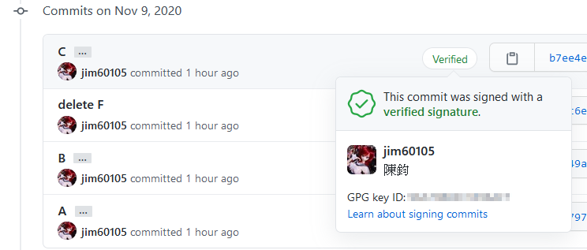

+++
title = "GitHub Verified 之 GPG 金鑰設定"
description = "記錄如何對 git commit 做 gpg 簽章，在 GitHub 上顯示酷炫的 Verified 標誌。"
date = 2020-11-09T18:25:00.037Z
updated = 2022-06-14T11:04:54.863Z
draft = false
aliases = [ "/2020/11/github-verified-gpg-commit.html" ]

[taxonomies]
tags = [ ]

[extra]
card = "preview.png"
+++

[](preview.png)

最近我重新深入學習了 git，並好好檢視了自己的 GitHub 頁面  
以前就注意到了這個酷炫的 Verified 標誌，在 GitHub 線上改 README 時會被自動加上，在本地 commit 就沒有  
這個標誌能顯示此 commit 確實是由我做出，並不是別人冒名而做

這次我好好研究了下 gpg 金鑰的設定方法，並把流程記錄在此
<!-- more -->
## 安裝 GPG 軟體

> Chocolatey GnuPG `choco install gnupg`

在 [GnuPG 網站](https://gnupg.org/download/#binary)下載軟體  
請往下拉到 binary releases，並下載第二項「Gpg4win - Simple installer for the current GnuPG」

「Gpg4win - Full featured Windows version of GnuPG」內含 Gui 金鑰管理器，我覺得並不好用  
如果只是要對 git 操作簽章，直接從 command line 設定會比較單純  
(這和是否使用 Gui 工具做 git 並無關係，但請於設定完成後確認運作)

## 確認現有金鑰

```bash
gpg --list-secret-keys --keyid-format LONG
```

## 產生金鑰

> 注意: GitHub 要求 Key Size 必須是 **4096** bits 以上

```bash
gpg --full-generate-key
```

## 登錄公鑰至 GitHub

先確認剛產生的金鑰

```bash
gpg --list-secret-keys --keyid-format LONG
```

以純文字產出公鑰，將之複製

```bash
gpg --armor --export 你的金鑰 ID
```

至 [GitHub 的 keys 設定頁面](https://github.com/settings/keys)，將 GPG key 加入

## 設定使 git 預設執行簽章

```bash
git config --global gpg.program "C:\Program Files (x86)\GnuPG\bin\gpg.exe"
git config --global user.signingkey 你的金鑰ID
git config --global commit.gpgsign true
git config --global tag.gpgSign true
```

## 備份金鑰

金鑰產生後請妥善離線保管，這兩個檔案可用於複製金鑰至其它電腦上

### Output

```bash
gpg --output mygpgkey_pub.gpg --armor --export 你的金鑰ID
gpg --output mygpgkey_sec.gpg --armor --export-secret-key 你的金鑰ID
```

### Input

```bash
gpg --import ./mygpgkey_pub.gpg
gpg --allow-secret-key-import --import ./mygpgkey_sec.gpg
```

> 參考連結 <https://www.debuntu.org/how-to-importexport-gpg-key-pair/>

## 延長金鑰快取驗證之有效期

我不希望每次 commit 都要輸入密碼，在每次重開機後的第一次使用時問我就足夠了

1. 首先找到 gpg home  

   ```bash
   gpg --version
   ```

   Windows: `%AppData%\gnupg\`  
   Linux: `~\.gnupg\`
2. 在此路徑中建立 gpg-agent.conf 檔案，並寫入以下設定 (這是一年)  

    ```config
    default-cache-ttl 34560000
    max-cache-ttl 34560000
    ```

## Troubleshooting

### Windows 啟動後，首次驗證時對話框不會彈出，並驗證失敗

我最近重灌了 Windows，改以 choco 直接安裝 gnupg，並遇到了此問題  
重開機後的第一次 commit 必定失敗，不會跳出 gnupg 輸入框  
我不確定和前次安裝的具體差異為何，但有找到解法如下  
請只在遇到此問題後才做這個

1. <kbd>Win</kbd>+<kbd>R</kbd>，輸入 `shell:startup`，以開啟 _Start Menu\Programs\Startup_
2. 建立捷徑，路徑填入以下內容，完成  

    ```bash
    gpgconf --launch gpg-agent
    ```

3. 右鍵捷徑修改內容: 捷徑頁籤 → 執行: **最小化**

## 參考連結

* [Managing commit signature verification - GitHub Docs](https://docs.github.com/en/free-pro-team@latest/github/authenticating-to-github/managing-commit-signature-verification)
* [如何使用 GPG (GnuPG) 對 Git Commit 與 Tag 進行簽章 - Will 保哥](https://blog.miniasp.com/post/2020/05/04/How-to-use-GPG-sign-git-commit-and-tag-object)
