+++
title = "LoveLive 大型控制器 (ver.教學文)"
description = "LoveLive 大型控制器 (ver.教學文)"
date = 2014-05-28T21:15:00.001Z
updated = 2014-05-28T21:15:00.001Z
draft = true
aliases = [ ]

[taxonomies]
tags = [ ]

[extra]
featured = true
+++

首先  
這篇文章是教學文  
經過修改後的較佳的製作流程  
想要看我的製作流程的人請參考我的另一篇文章  
踩著我的屍體前進吧\~\~\~  
</2014/05/lovelive.html>

---

前幾天半夜看到了這位大大的影片

{{youtube(id="GMdS6m_vSYg")}}

接著偶然又看到了這位大大的文章  
<http://blog.udn.com/andy840119/12915121?f%5FUA=pc>  
於是就 (ry

---

基本上是按照上面那篇文章來製作  
差別在於按鍵數量跟位置不同  
還有不需要旋鈕  
建議各位都先把他的文章看過一次  
有一些原理講解的部分我這篇並沒有描述

按鈕數量為 10 個，多的那個是暫停鍵

光華所有材料都有  
不一定要跟我一樣，用你喜歡的材料就好  
今華電子除了木板什麼都有  
位置在這: 台北市中正區新生南路一段 12 巷 2 號  
↑只是方便各位沒有廣告意圖如果不妥我會撤除謝謝

材料:  
盒子 \* 1

按鈕 \* 10

微動開關 \* 10

[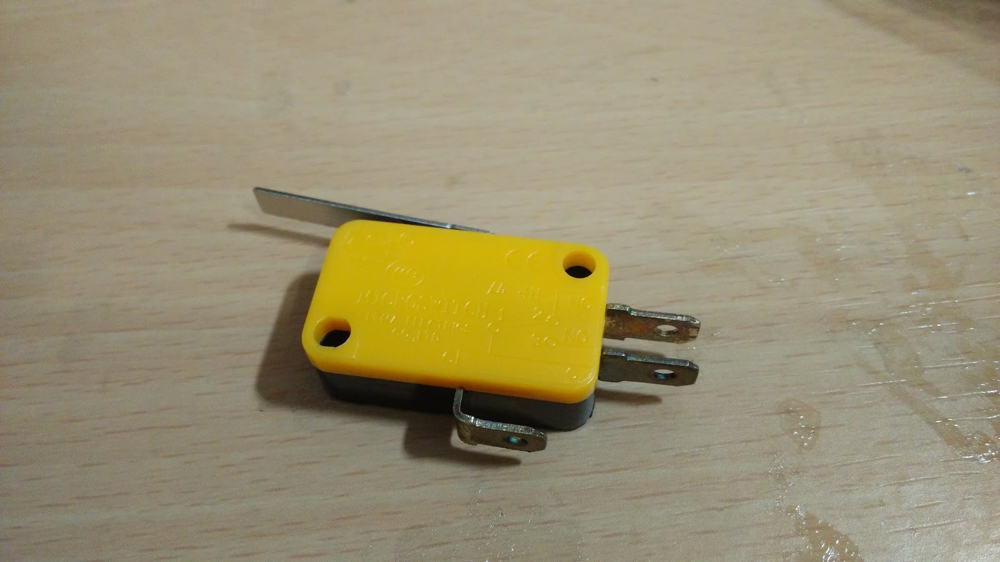](IMG%5F20140525%5F232210.jpg)

閃電精靈 \* 1 (不一定要這款，不過他有開放式焊點比較好處理)

[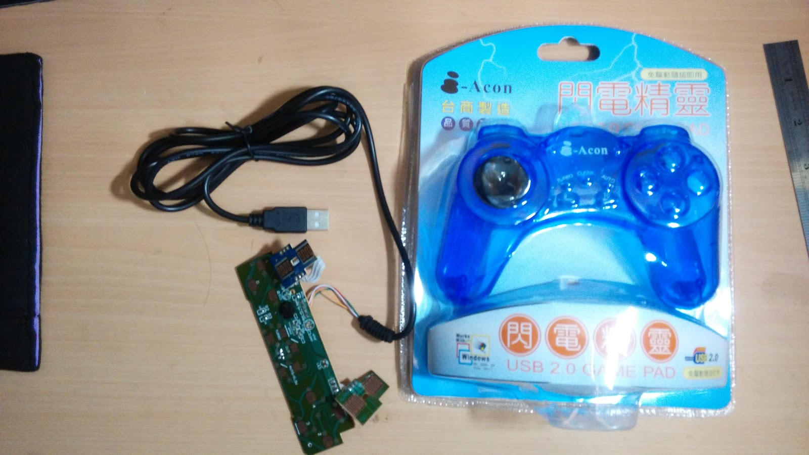](IMG%5F20140525%5F233502.jpg)

木板 \* 1 (金興發購入雕刻用木板)

其他:  
電線 3m 以上、60mm 銅柱 \* 4、各式工具

\--  
**開工**  
**按鈕**

首先把按鈕拆開

這傢伙裡面有一個彈簧  
那個彈簧跟白色雨傘狀可以拿掉  
請跟微動開關組合起來按按看  
照自己喜好來決定是不是要拿掉

[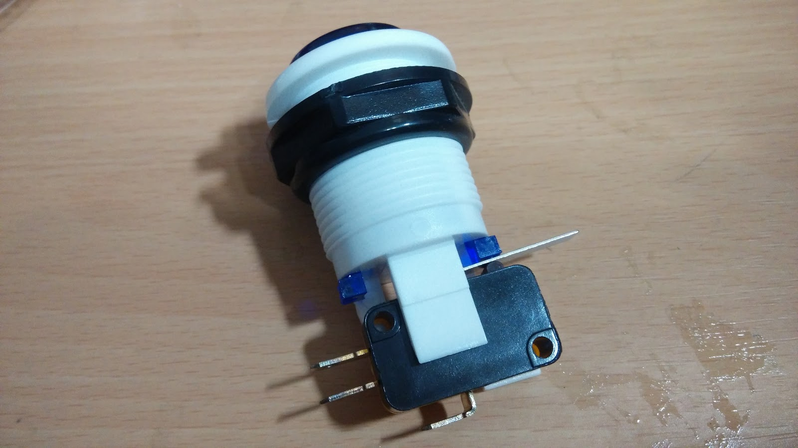](IMG%5F20140525%5F232627.jpg)

全部處理好以後把垃圾包起來收好  
~~隨便亂丟你媽會罵你~~

(我當時很開心的把它全部組合好了，後來要組裝的時候還一個一個把他拆開...)

\--  
**面板**  
接著處理木板  
我上網找到了這個盒子的 dwg 檔案:<http://goo.gl/pXpuwd>  
不愧是五百多塊的盒子..

然後是進遊戲截圖參考  
在 BS 隨便裝了台版創新帳 ((測試不想浪費本尊體力

有了圖片以後把他丟進 AutoCAD 處理

~~機械本科弄起來得心應手~~

1:1 印出來\~\~

[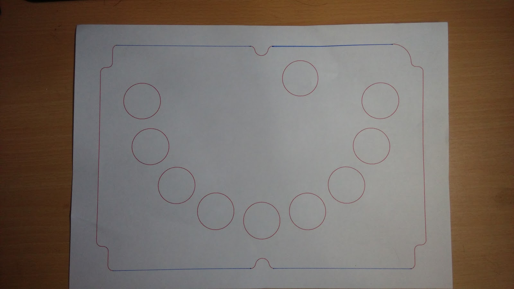](IMG%5F20140525%5F233744.jpg)

把這個畫到木板上  
可以用鐵尺來戳

[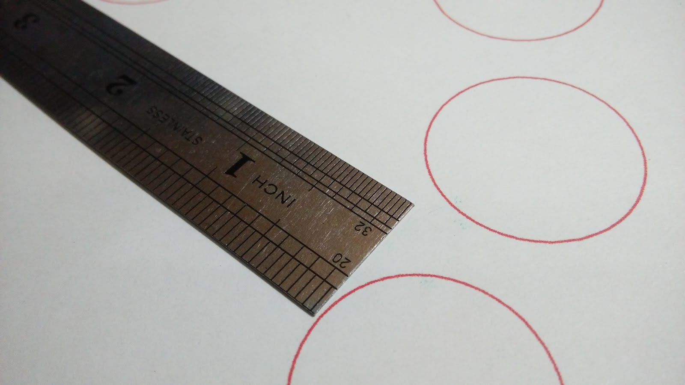](IMG%5F20140525%5F235844.jpg)

使用戳洞洞 + 連連看來刻上去  
不用很精確，差不多就好

[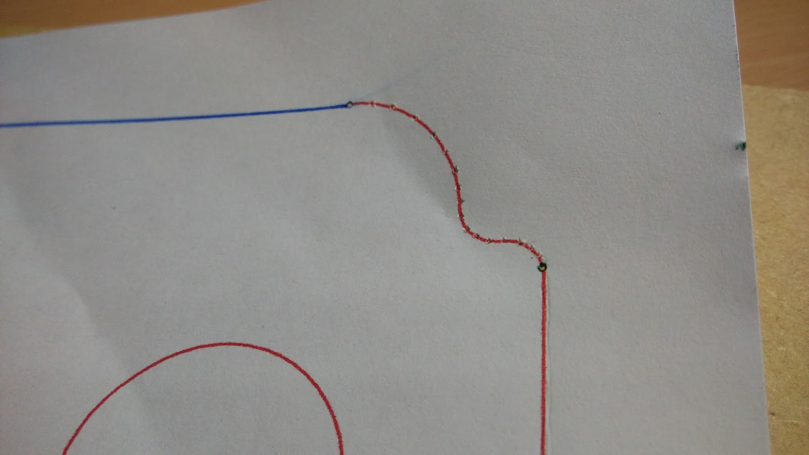](IMG%5F20140526%5F000658.jpg)

[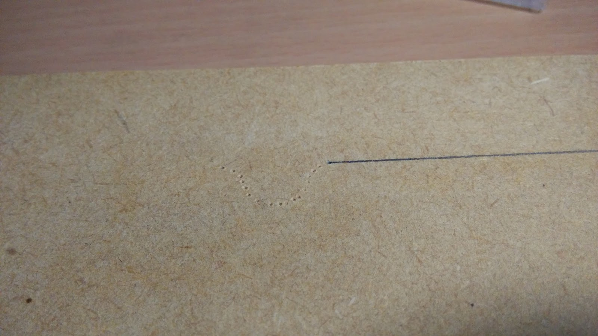](IMG%5F20140526%5F000820.jpg)

畫好以後就是切木板  
\--  
**切木板**  
想辦法弄到這種東西  
不然其他替代品也可

[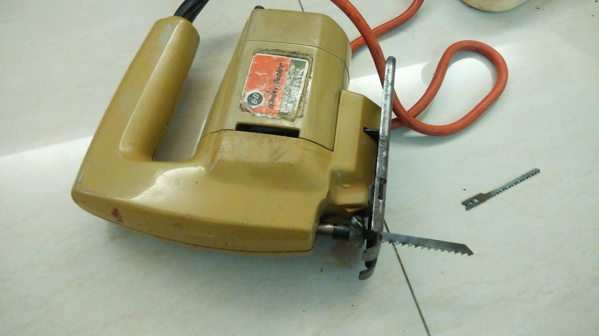](IMG%5F20140526%5F161243.jpg)

先把邊邊鋸好

鑽數個小洞再用大鑽頭挖  
建議搭配砂輪磨頭會很圓

**這東西根本神器**

[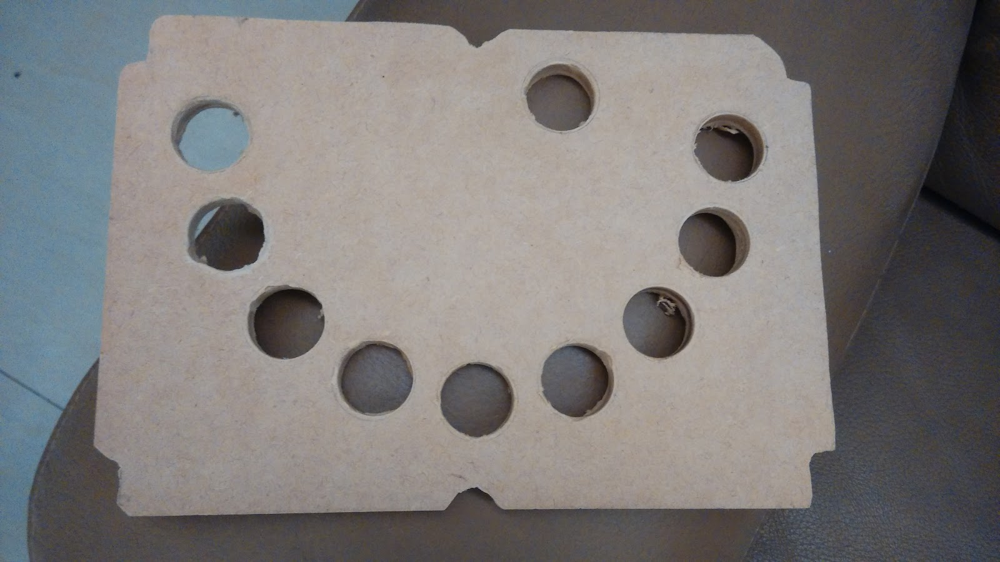](IMG%5F20140526%5F202629.jpg)

按鈕內圈直徑是 30mm 不包含螺紋  
不過塑膠螺紋沒辦法攻螺紋  
為了要能夠插入要再稍微擴孔

放進盒子前把支撐弄好  
盒子裡面有四個鎖點可以鎖上 60mm 銅柱支撐  
你沒看錯，就是鎖主機板的那個銅柱的 60mm 版本  
忘了拍照  
圖片從良興借來:<http://goo.gl/kG2S1Q> (若不妥我會移除)

內部洞洞挖好以後修整一下外圍使之可以放入盒子

[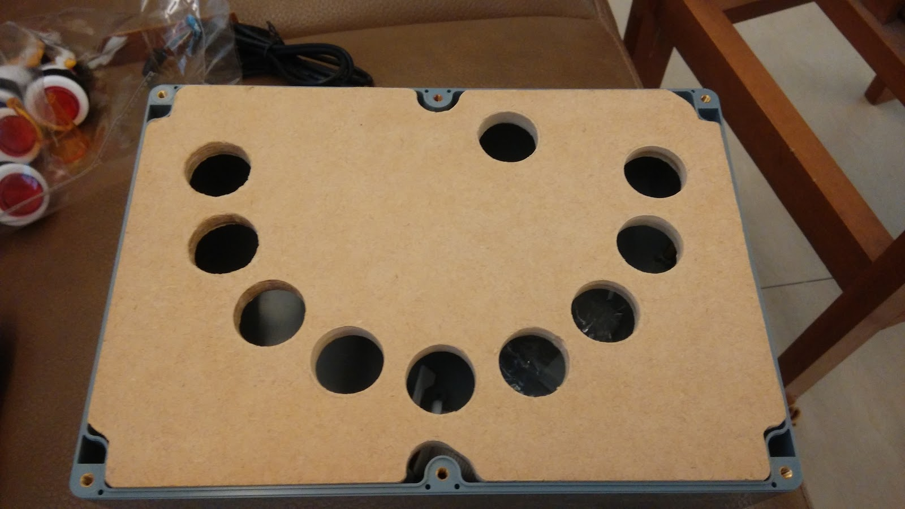](IMG%5F20140527%5F144954.jpg)

裝上按鈕看看  
右上角開一個洞不然會拿不起來  
也作為 USB 出線孔

下面有點醜醜的不過我不想再搞了\_(:3」∠)\_  
木工各種累

再來就把按鈕裝上去吧\~\~

\--  
**電線**

先剪電線 20cm\*20 條  
並把微動開關焊好

[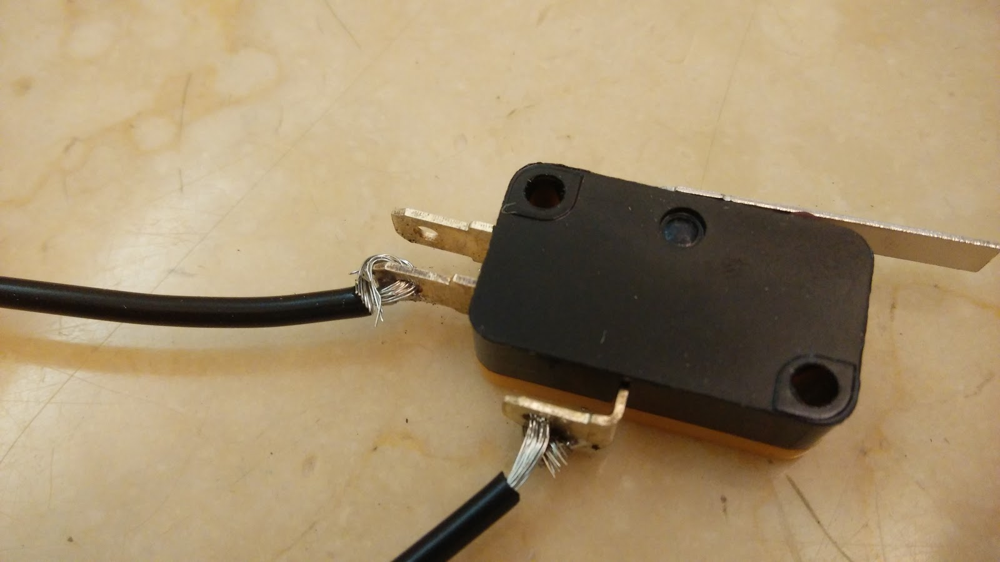](IMG%5F20140527%5F163115.jpg)

焊好以後最好可以接三用電表測試一下有沒有反應

另一頭焊在 PCB 上  
把手把拆開來吧\~\~

[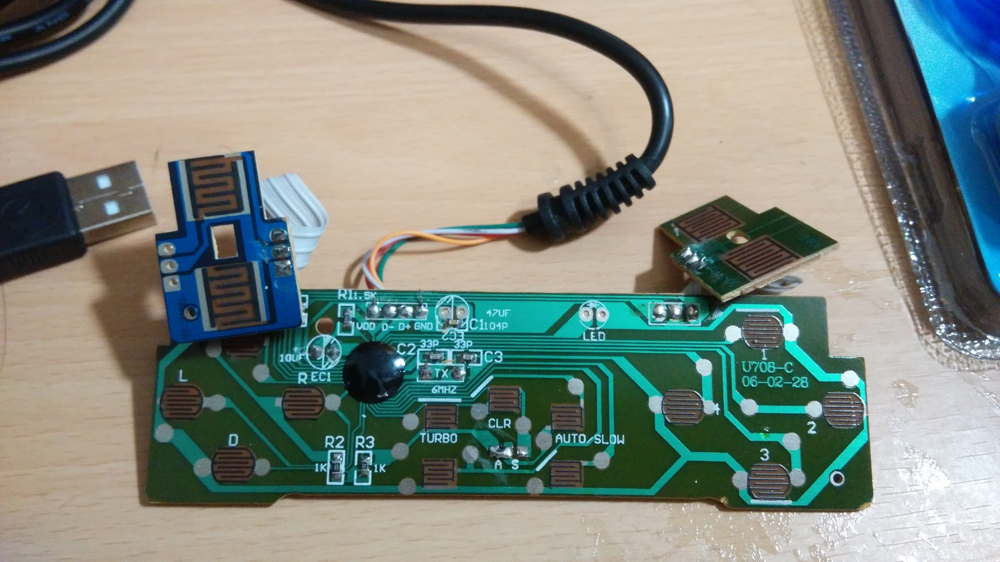](IMG%5F20140525%5F233518.jpg)

看到大大的焊點沒有  
把他跟微動開關焊在一起就好了  
接在一起因為很難拍照所以 PASS

我是照著這個順序來焊

(如果順序不同的話後面設定記得要改)

在焊接的時候把 USB 接上電腦測試一下  
如果電路有通的話燈會亮  
可以確定沒有不小心短路的狀況發生  
(小心不要觸電，如果短路燒掉了就再買一支吧 wwwwwwwwwwwwww)

最後硬體部分完成圖:

[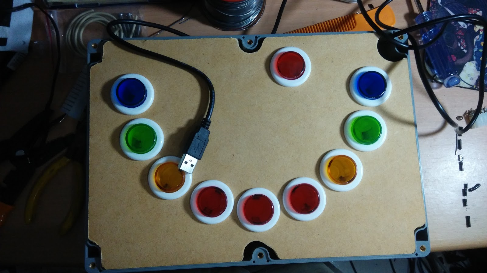](IMG%5F20140528%5F015340.jpg)

可以自己把面板鎖在銅柱上面

\--  
**電腦設定**  
1\. 裝 BS:<http://www.bluestacks.com/>  
最新版即可  
安裝教學 PASS

2.LoveLive  
台:<https://play.google.com/store/apps/details?id=net.gamon.loveliveTW>  
日:<https://play.google.com/store/apps/details?id=klb.android.lovelive>  
VPN 啥的我不講  
那是你要會的基本功

3\. 都裝好以後參考這邊的 13 樓:<http://tieba.baidu.com/p/2441241082>  
把此檔案載下來:<http://pan.baidu.com/share/link?shareid=1807318477&uk=1864007892>  
檔案用記事本打開加一條，把按鍵 Q 設定在 (96,2) 附近 ((確切位置我還沒找到，誰有試出來了跟我講下  
檔名台版:net.gamon.loveliveTW\.cfg  
日版:klb.android.lovelive.cfg  
存檔丟進 C:\ProgramData\Bluestacks\UserData\InputMapper

4\. 在同資料夾下找到 GamePads.db 這個檔案，刪除之  
(他會自動定義手把按鍵，並且覆蓋下一步的 JoyToKey 功能)

5\. 下載 JoyToKey:<http://joytokey.net/en/download>  
安置在適當位置以後把.exe 拖個捷徑到桌面  
以後再接上大控以後必須運行他

6\. 打開設定 JoyToKey  
設定如圖

7\. 進遊戲調整延遲  
我是設定在 - 5，不過如果要照節奏的話應該會在 - 20 幾才對  
不過數字如果設定距離 0 太遠會很悲劇 (ry

結束\~\~((灑花✧\*｡٩(ˊᗜˋ\*)و✧\*｡

---

剩下就是習慣他  
說實話不怎麼好用  
腦袋要把螢幕上的轉換到手上有難度  
要重新練習

不過爽度 100 分 wwwwwwwwwwwwwwwwwwwww

---

題外話的高二壁報  
數年前的南一中 203

其他照片:<http://on.fb.me/TUUX5C>  
