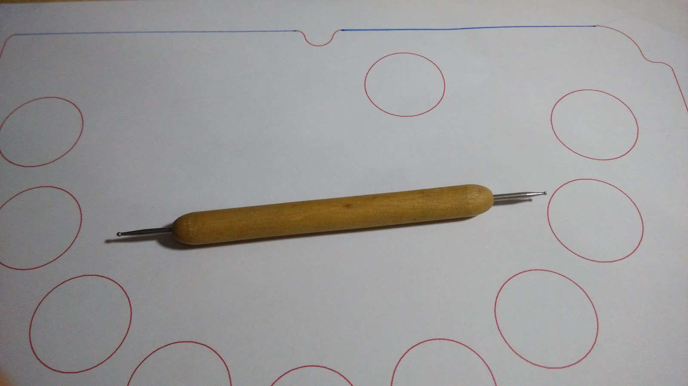
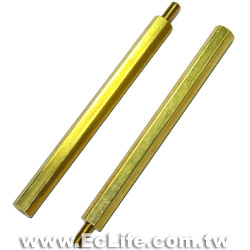
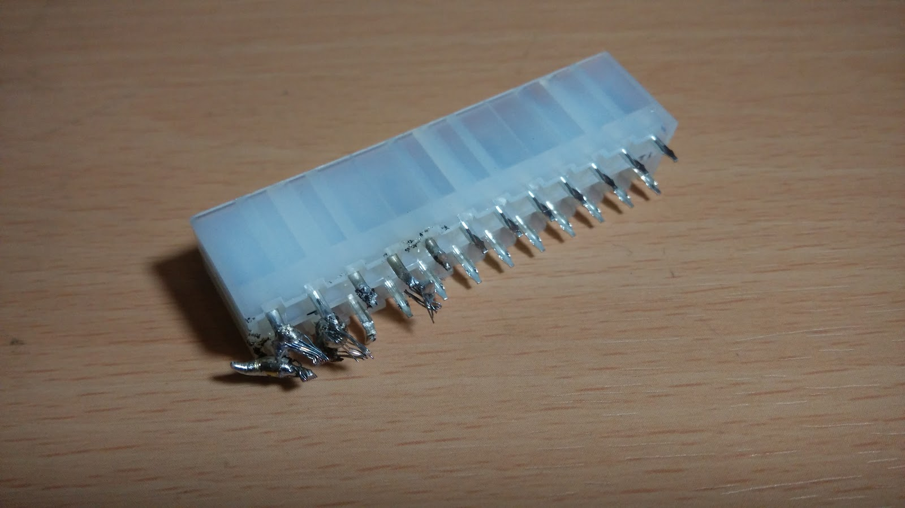

+++
title = "LoveLive 大型控制器"
description = "LoveLive 大型控制器"
date = 2014-05-28T19:16:00.008Z
updated = 2014-05-28T19:16:00.008Z
draft = false
aliases = [ "/2014/05/lovelive.html" ]

[taxonomies]
tags = [ ]

[extra]
banner = "preview.jpg"
featured = true
+++

前幾天半夜看到了這位大大的影片

{{youtube(id="GMdS6m_vSYg")}}

接著偶然又看到了這位大大的文章  
<http://blog.udn.com/andy840119/12915121?f%5FUA=pc>  
於是就 (ry  

---

基本上是按照上面那篇文章來製作  
差別在於按鍵數量跟位置不同  
還有不需要旋鈕
<!-- more -->
按鈕數量為 10 個，多的那個是暫停鍵  
本來計畫面板要做可替換式的，不過後來焊到崩潰遂直接焊死

計畫好以後，隔天就衝了一趟光華把材料買齊了  
今華電子除了木板什麼都有嚇我一大跳  
位置在這: 台北市中正區新生南路一段 12 巷 2 號  
↑只是方便各位沒有廣告意圖如果不妥我會撤除謝謝

材料:  
盒子 \* 1

按鈕 \* 10

微動開關 \* 10

閃電精靈 \* 1 (不一定要這款，不過他有開放式焊點比較好處理)

木板 \* 1 (金興發購入雕刻用木板)

24pin 接頭 (公母)

接頭用的金屬端子 \* 20

其他:  
電線：6m、60mm 銅柱 \* 4、各式工具

\--  
**開工**  
**按鈕**

首先把按鈕拆開

這傢伙裡面有一個彈簧  
那個彈簧跟白色雨傘狀我不要  
拿掉以後跟微動組合起來按按看

全部處理好以後把垃圾包起來收好  
後面~~不~~會用到

(我當時很開心的把它全部組合好了，後來要組裝的時候還一個一個把他拆開...)

\--  
**面板**  
接著處理木板  
我上網找到了這個盒子的 dwg 檔案:<http://goo.gl/pXpuwd>  
不愧是五百多塊的盒子..

然後是進遊戲截圖參考  
在 BS 隨便裝了台版創新帳 ((測試不想浪費本尊體力

有了圖片以後把他丟進 AutoCAD 處理

~~機械本科弄起來得心應手~~

1:1 印出來\~\~

本來打算直接整張貼在木板上  
不過要鋸的話果然還是不行呢  
於是請出了跟老媽借來的神器:

這傢伙叫做針筆  
高二做壁報的時候見識到了他的威力

不過完全無法刻到木頭上。  
我就去跟超用功的妹妹借了不要的原子筆

嘗試畫了第一下

感謝你的犧牲，下一位\~\~

這個可以用 (・̀ω・́)✧  
使用戳洞洞 + 連連看來刻上去  
不用很精確，差不多就好

畫好以後就是切木板  
\--  
**切木板**  
這時我跑去問我的外公  
他老人家啥都有  
\--- 系統訊息 ---  
魯蛇獲得: 電鋸組 \* 1  
魯蛇獲得: 電鑽組 \* 1  
魯蛇獲得: 電烙鐵焊組 \* 1  
魯蛇獲得: 外婆家工作環境永久使用權  
魯蛇獲得: 工作當日午晚餐 \* N

先把邊邊鋸好  
再把洞洞用小鑽頭鑽三個洞

都鑽好以後再換大鑽頭把他擴孔

但是結果不理想  
所以改鑽數個小洞再用大鑽頭挖  
這時候外公突然又冒出來惹\~\~((NPC 嗎!!?\~\~  
\--- 系統訊息 ---  
魯蛇獲得: 砂輪磨頭 Φ20mm\*1  
魯蛇獲得: 砂輪磨頭 Φ30mm\*1

**這東西根本神器**

按鈕內圈直徑是 30mm 不包含螺紋  
不過塑膠螺紋沒辦法攻螺紋  
為了要能夠插入要再稍微擴孔

放進盒子前把支撐弄好  
盒子裡面有四個鎖點可以鎖上 60mm 銅柱支撐  
你沒看錯，就是鎖主機板的那個銅柱的 60mm 版本  
忘了拍照  
圖片從良興借來:<http://goo.gl/kG2S1Q> (若不妥我會移除)

內部洞洞挖好以後修整一下外圍使之可以放入盒子

裝上按鈕看看  
右上角開了一個洞不然會拿不起來  
也作為 USB 出線孔

下面有點醜醜的不過我不想再搞了\_(:3」∠)\_  
木工各種累  
不過機械本科所以還滿好上手的就是  
跟鉗工比起來這個根本超爽

再來就把按鈕裝上去吧\~\~

\--  
**電線**

然後就是惡夢的開始。  
惡夢的開始。  
惡夢的開始。

先剪電線 20cm\*20 條  
並把微動開關焊好  
焊好以後最好可以接三用電表測試一下有沒有反應

再把另一頭焊上端子  
下圖為錯誤示範請好孩子不要學喔 揪咪♡

超醜  
再把它塞進去  
下圖也是錯誤示範請壞孩子不要學喔 揪咪♥  
也很容易短路

(只有最左邊那兩個是正確示範，其他全部不合格~~不過我懶得重新弄~~)

公座焊好了焊母座跟 PCB  
把手把拆開來吧\~\~

看到大大的焊點沒有  
把他跟母座焊在一起就好了  
不過這邊我搞到崩潰  
沒焊油 PCB 不沾錫不說  
母座那邊他媽的超級難焊

最後一怒整個剪掉直接把微動開關跟 PCB 接在一起

接在一起因為很難拍照所以就 PASS 了  
總之內部焊接各種醜  
為什麼學校教了一堆焊接卻不教電烙鐵焊拉 ((拍打

我是照著這個順序來焊  
不過 "1" 的焊點焊爆了所以改成焊在 "↓"

(如果順序不同的話後面設定記得要改)

在焊接的時候把 USB 接上電腦測試一下  
如果電路有通的話燈會亮  
可以確定沒有不小心短路的狀況發生  
(小心不要觸電，如果短路燒掉了就再買一支吧 wwwwwwwwwwwwww)

最後硬體部分完成圖:

沒有特別把面板鎖在銅柱上因為不會晃  
只要不要反著拿基本上是不會搖晃或脫落

\--  
**電腦設定**  
1\. 裝 BS:<http://www.bluestacks.com/>  
最新版即可  
安裝教學 PASS

2.LoveLive  
台:<https://play.google.com/store/apps/details?id=net.gamon.loveliveTW>  
日:<https://play.google.com/store/apps/details?id=klb.android.lovelive>  
VPN 啥的我不講  
那是你要會的基本功

3\. 都裝好以後參考這邊的 13 樓:<http://tieba.baidu.com/p/2441241082>  
把此檔案載下來:<http://pan.baidu.com/share/link?shareid=1807318477&uk=1864007892>  
檔案用記事本打開加一條:  
把按鍵 Q 設定在 (96,2) 附近 ((確切位置我還沒找到，誰有試出來了跟我講下  
檔名台版:net.gamon.loveliveTW\.cfg  
日版:klb.android.lovelive.cfg  
存檔丟進 C:\ProgramData\Bluestacks\UserData\InputMapper

4\. 在同資料夾下找到 GamePads.db 這個檔案，刪除之  
(他會自動定義手把按鍵，並且覆蓋下一步的 JoyToKey 功能)

5\. 下載 JoyToKey:<http://joytokey.net/en/download>  
安置在適當位置以後把.exe 拖個捷徑到桌面  
以後再接上大控以後必須運行他

6\. 打開設定 JoyToKey  
因為我 "1" 的焊點焊爆了改成是焊在 "下"  
故設定如圖

7\. 進遊戲調整延遲  
我是設定在 - 5，不過如果要照節奏的話應該會在 - 20 幾才對  
不過數字如果設定距離 0 太遠會很悲劇 (ry

結束\~\~((灑花✧\*｡٩(ˊᗜˋ\*)و✧\*｡

---

剩下就是習慣他  
說實話不怎麼好用  
腦袋要把螢幕上的轉換到手上有難度  
要重新練習

不過爽度 100 分 wwwwwwwwwwwwwwwwwwwww

---

題外話的高二壁報  
數年前的南一中 203

其他照片:<http://on.fb.me/TUUX5C>  
