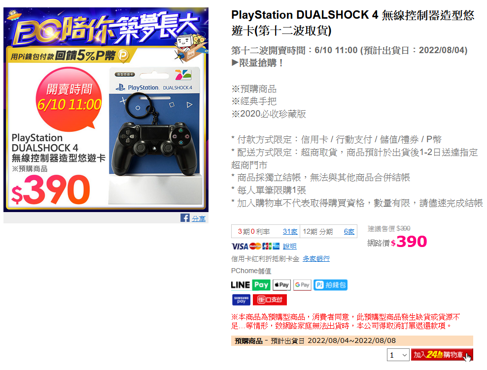

+++
title = "還在等預購? 看看我的真．DS4悠遊卡"
description = "還在等預購? 看看我的真．DS4悠遊卡"
date = 2020-06-10T08:42:00.021Z
updated = 2020-06-10T08:42:00.021Z
draft = false
aliases = [ "/2020/06/ds4.html" ]

[taxonomies]
tags = [ ]

[extra]
banner = "preview.jpg"
poor = true
+++

排到 {{cr(body="2022 年")}}出貨的悠遊卡讓你買不下手?

又不想給黃牛們扒一層皮?

你的願望我都聽到了!

現在讓我隆重介紹: **真．DS4 悠遊卡!**

材料只需要一支 DS4，和網路上能買到的悠遊卡模組

把 DS4 拆開  
{{cr(body="拆開就沒有 Sony 保固囉")}}

把悠遊卡模組固定好  
貼在最深處，以免被震動馬達打到

試一下角度

大功告成惹!!!!

拿去座捷運囉\~\~

{{ youtube(id="srol3S6qh8w") }}

悠遊卡公司接招吧ww

讓你看看買不到玩具的怨念 (☄・̀ὤ・́)☄

